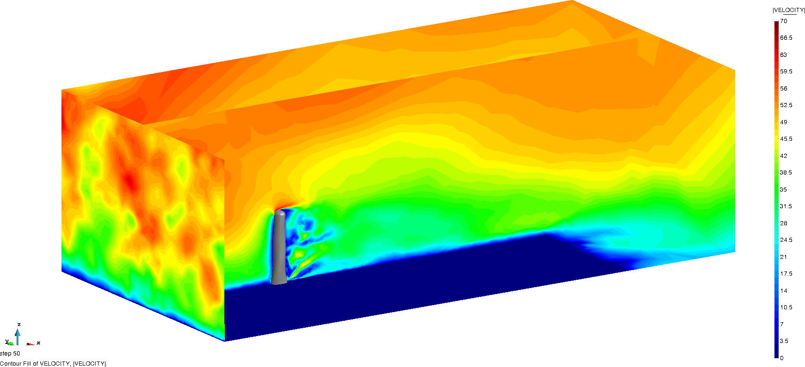
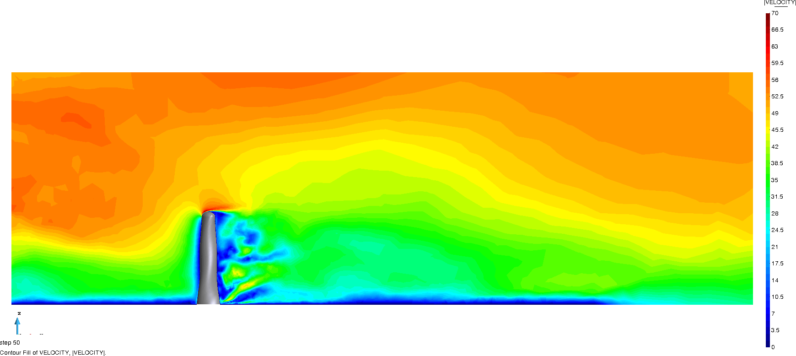
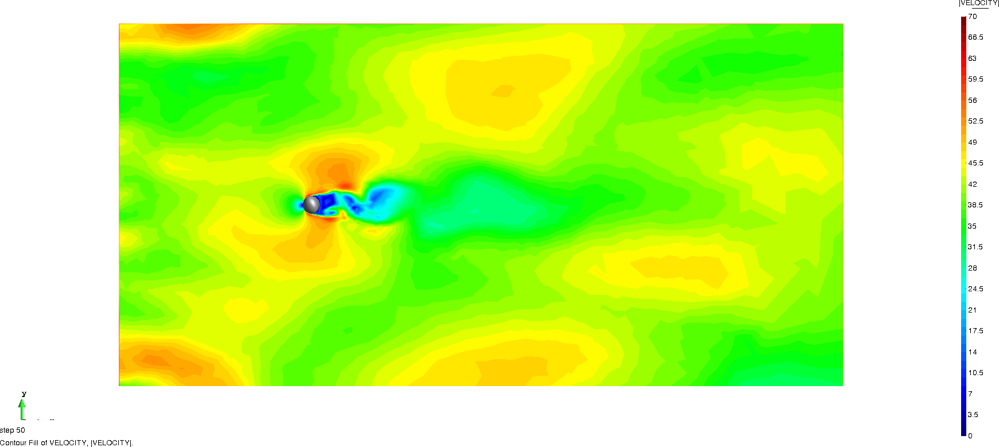
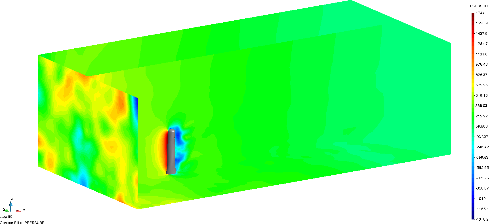
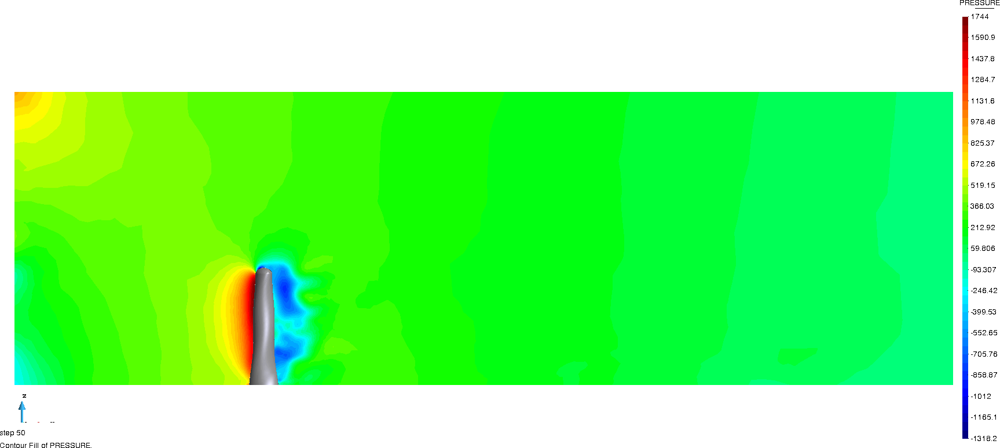
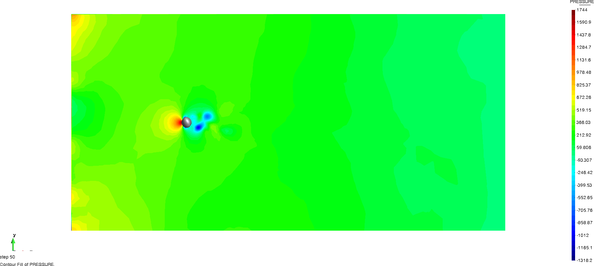

# Turbulent inlet wind engineering twisted building problem

**Author:** [Riccardo Tosi](https://riccardotosi.github.io) and [Marc Núñez](https://github.com/marcnunezc)

**Kratos version:** 8.1

**XMC version:** Kratos default version

**PyCOMPSs version:** Kratos default version to run in serial, >2.8 to run with `runcompss`

**Source files:** [Asynchronous and Synchronous Monte Carlo](source)

**Application dependencies:** `ConvectionDiffusionApplication`, `ExaquteSandboxApplication`, `FluidDynamicsApplication`, `LinearSolversApplications`, `MappingApplication`, `MeshingApplication`, `MultilevelMonteCarloApplication`, `StatisticsApplication`

## Case Specification
We solve the [fluid dynamics problem](https://github.com/KratosMultiphysics/Kratos/tree/master/applications/FluidDynamicsApplication) of a fluid passing through a building, namely the twisted building. The problem is characterized by a realistic wind inlet, where the mean velocity follows a logarithmic profile and wind gusts are considered. Two different problems can be solved, since two boundary conditions are considered:

* turbulent (wind gusts) and deterministic wind mean velocity profile inlet boundary conditions,
* turbulent (wind gusts) and stochastic wind mean velocity profile inlet boundary conditions: reference velocity and/or roughness height are random.

To reduce the time to solution, ensemble average (see [1]) can be applied to each realization with fixed boundary conditions.

The problem can be solved by running two different algorithms [2]:

* Synchronous Monte Carlo (SMC),
* Asynchronous Monte Carlo (AMC),

and by default AMC is selected. If one is interested in running SMC, it is needed to select `asynchronous = false` in the XMC settings (in `problem_settings/parameters_xmc.json`). To change the inlet boundary condition, you can set true or false the keys `random_reference_velocity` and `random_roughness_height` of Kratos settings (in `problem_settings/ProjectParameters.json`). Please observe that for running you may want to increase the number of realizations per level, the time horizon of each realization and the burn-in time (initial transient we discard when computing statistics to discard dependencies from initial conditions). All settings can be observed in the corresponding configuration file [of the problem](source/problem_settings/ProjectParameters.json) and [of the algorithm](source/problem_settings/parameters_xmc.json).

The Quantities of Interest of the problem are the drag force, the base moment and the pressure field on the building surface and their time-averaged counterparts. Statistical convergence is assessed for the time-averaged drag force.

Two different workflows are available:

* workflow is MPI parallel,
* workflow is serial, only Kratos tasks are MPI parallel and are scheduled by distributed environment scheduler.

To run the first scenario execute `mpirun -n $number_processes python3 run_mc_Kratos.py`, while to run with runcompss the second scenario execute `sh run.sh`.
In the latter case, the environment variable `EXAQUTE_BACKEND` has to be set to `pycompss`. In the former case, the environment variable `EXAQUTE_BACKEND` has to be set to local.

## Results

The velocity field of the problem is shown next, where a time window of 50 seconds is considered and the output frequency is 0.5 seconds. We first show the velocity field from an isometric view

  

and then from vertical and horizontal views.

  
  

The pressure field of the problem is shown next, where a time window of 50 seconds is considered and the output frequency is 0.5 seconds. We first show the pressure field from an isometric view

  

and then from vertical and horizontal views.

  
  

An example of power sums and h-statistics of both time averaged and time series drag force, base moment and pressure field can be found [here](source/power_sums_outputs).

## Refrences

[1] Makarashvili, V., Merzari, E., Obabko, A., Siegel, A., & Fischer, P. (2017). A performance analysis of ensemble averaging for high fidelity turbulence simulations at the strong scaling limit. Computer Physics Communications. https://doi.org/10.1016/j.cpc.2017.05.023

[2] Tosi, R., Amela, R., Badia, R., & Rossi, R. (2021). A parallel dynamic asynchronous framework for Uncertainty Quantification by hierarchical Monte Carlo algorithms. Journal of Scientific Computing, 89(28), 25. https://doi.org/10.1007/s10915-021-01598-6