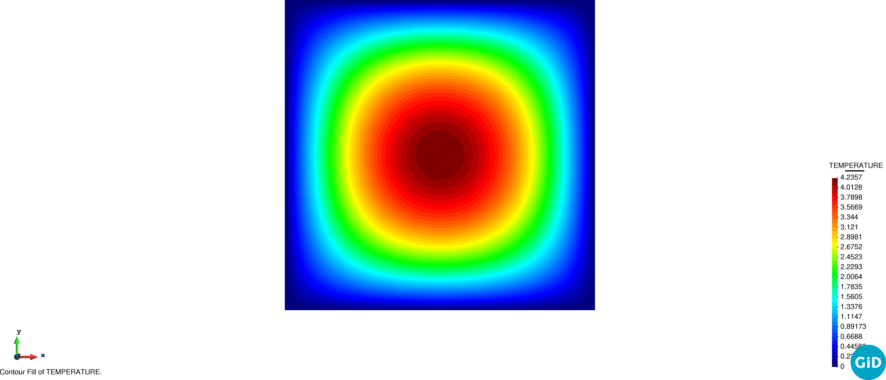
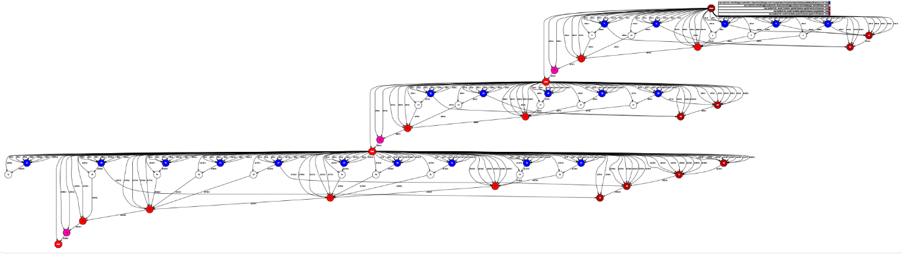
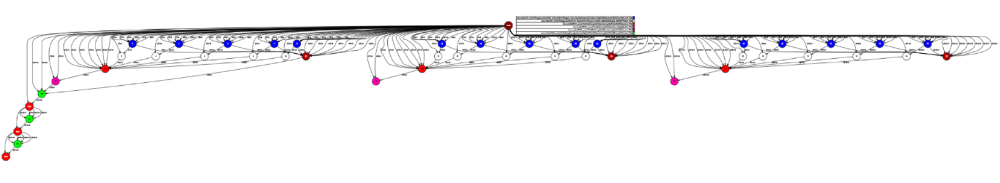

# Elliptic benchmark problem

**Author:** [Riccardo Tosi](https://github.com/riccardotosi)

**Kratos version:** 8.0

**XMC version:** 2.0

**PyCOMPSs version:** 2.7

**Source files:** [Synchronous Monte Carlo](synchronous_monte_carlo), [Asynchronous Monte Carlo](asynchronous_monte_carlo), [Synchronous Multilevel Monte Carlo](synchronous_multilevel_monte_carlo), [Asynchronous Multilevel Monte Carlo](asynchronous_multilevel_monte_carlo)

## Case Specification
Let's consider the stationary heat equation with a varying heat flux, a square two-dimensional domain and Dirichlet boundary conditions. The problem reads as:

* 
* 

where ,  and , i.e.  follows a beta distribution. The thermal diffusivity is  for simplicity. The Quantity of Interest (QoI) we are interested in is the integral over the whole domain of the temperature, meaning:

The problem can be run with four different algorithms:

* Synchronous Monte Carlo (SMC),
* Asynchronous Monte Carlo (AMC),
* Synchronous Multilevel Monte Carlo (SMLMC),
* Asynchronous Multilevel Monte Carlo (AMLMC).

Apart from the scheduling, which may be synchronous or asynchronous, similar settings are employed. We refer, for example, to: number of samples estimation, number of indices estimation, maximum number of iterations, tolerance, confidence, etc. Such settings can be observed in the corresponding configuration file of each algorithm, located inside the `problem_settings` folder.

To run the examples, the user should go inside the folder-algorithm of interest and run the `run_mc/mlmc_Kratos.py` Python file. In case one wants to use PyCOMPSs, the user should execute `sh run_with_pycompss.sh` from inside the folder of interest.

## Results

The expected result is to observe statistical accuracy and scheduling parallelism for the asynchronous algorithms.

Concerning statistical accuracy, the QoI we obtain is consistent with literature results [Pisaroni, M., Krumscheid, S., & Nobile, F. (2020). Quantifying uncertain system outputs via the multilevel Monte Carlo method — Part I: Central moment estimation. Journal of Computational Physics. https://doi.org/10.1016/j.jcp.2020.109466]. This ensures the correct implementation of XMC and its integration with Kratos Multiphysics.

We report the graph dependencies of SMC and of AMC to compare synchronous and asynchronous algorithms. The figure below shows the increased parallelism provided by the asynchronous algorithm, with respect to the synchronous one.

SMC: 
AMC: 

SMLMC and AMLMC graphs present similar behaviors, with the difference that samples are run on different accuracy levels.
