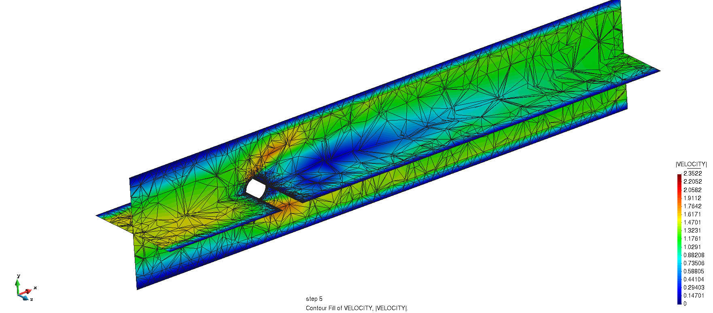
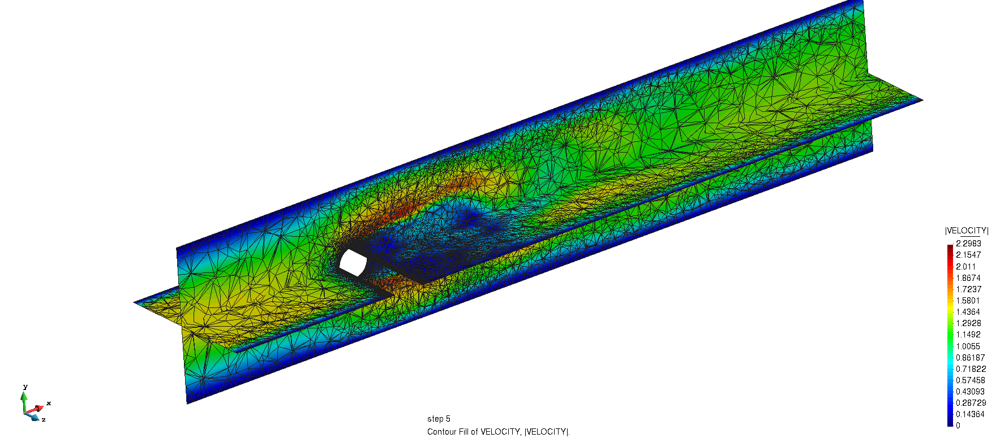

# Body-fitted cylinder 3D with MPI hessian refinement

**Author:** Marc Núñez Corbacho

**Kratos version:** 8.1

**MMG version:** 5.5.2

**ParMMG version:** 1.3.0

**Source files:** [MPI Body-fitted cylinder 3D](https://github.com/KratosMultiphysics/Examples/tree/master/parmmg_remeshing_examples/use_cases/body_fitted_hessian_cylinder3D/source)

**Application dependencies:** `FluidDynamicsApplication`, `LinearSolversApplications`, `MappingApplication`, `MeshingApplication`, `MetisApplication`,  `StatisticsApplication`, `TrilinosApplication`

To run this example execute:

    export OMP_NUM_THREADS=1
    mpirun -n nprocs python3 MainKratos.py

Where `nprocs` is the number of processors to use in the MPI run.

Initial mesh:

Final mesh after 4 iterations:

## How to use

This test case solves and remeshes and MPI parallel fluid dynamic problem iteratively using ParMMG. It uses a Hessian approach, based on:

*Frédéric Alauzet*. Metric-Based Anisotropic Mesh Adaptation. Course material, CEA-EDF-INRIA Schools. Numerical Analysis Summer School.  [https://www.rocq.inria.fr/gamma/Frederic.Alauzet/cours/cirm.pdf](https://www.rocq.inria.fr/gamma/Frederic.Alauzet/cours/cirm.pdf)

*Pascal Tremblay* 2-D, 3-D and 4-D Anisotropic Mesh Adaptation for the Time-Continuous Space-Time Finite Element Method with Applications to the Incompressible Navier-Stokes Equations. PhD thesis Ottawa-Carleton Institute for Mechanical and Aerospace Engineering, Department of Mechanical Engineering, University of Ottawa. 2007. [http://aix1.uottawa.ca/~ybourg/thesis/PhDThesis_Pascal_Tremblay_Final.pdf](http://aix1.uottawa.ca/~ybourg/thesis/PhDThesis_Pascal_Tremblay_Final.pdf)

Which allows to use the fields of previous simulations to adaptively refine the mesh by using its Hessian.

Some of the main settings to control and customize are:

In  [ProjectParameters.json](source/ProjectParameters.json):

- ["end_time"](source/ProjectParameters.json#L7) to change the total length of the simulation
- ["time_step"](source/ProjectParameters.json#L67) to change the time step used
- ["statistics_start_point_control_value"](source/ProjectParameters.json#L164), in case AVERAGE quantities are to be used, to set the inital time_step to compute statitcs

In  [RemeshingParameters.json](source/RemeshingParameters.json):

- ["number_of_iterations"](source/RemeshingParameters.json#L2) to change the total number of consecutive resolution+remeshing of the simulation.
- ["perform_mapping_between_steps"](source/RemeshingParameters.json#L3) if it is set to `True`, it will map the solution on step `n` to the mesh `n+1`. Set it to `False` to start the simulation from rest at every new step.

    If "perform_mapping_between_steps"  is `True`
    - ["search_radius"](source/RemeshingParameters.json#L8) to specify the radius that the mapper will use to perform the mapping. WARNING: setting high values of the search_radius might slow down the mapping.

- ["variables_to_remesh"](source/RemeshingParameters.json#L11) to specify the variables of the old mesh to be used to remesh the new mesh.
    - `VELOCITY`: This will use the velocity at each time step, starting from the [start_time_control_value](source/RemeshingParameters.json#L12).
    - `PRESSURE`: This will use the pressure at each time step, starting from the [start_time_control_value](source/RemeshingParameters.json#L12).
    - `AVERAGE_VELOCITY`: This will use the AVERAGE velocity across the simulation, starting from the [statistics_start_point_control_value](source/ProjectParameters.json#L164).
    - `AVERAGE_PRESSURE`: This will use the AVERAGE pressure across the simulation, starting from the [statistics_start_point_control_value](source/ProjectParameters.json#L164).

- ["start_time_control_value"](source/RemeshingParameters.json#L12) to set the starting time to start computing the metrics if `VELOCITY` or `PRESSURE` are chosen as variables to remesh the variables of the old mesh to be used to remesh the new mesh.

- ["interpolation_error"](source/RemeshingParameters.json#L21) to set the error that the remesher will prescribe on the output mesh. Lowering the interpolation error will result in more nodal presence and smaller sized elemnts.
- ["minimal_size"](source/RemeshingParameters.json#L14) to set the minimal size of the mesh. WARNING: This only works as a truncation value. It is recomended to control the size of the mesh using the ["interpolation_error"](source/RemeshingParameters.json#L21)  only.
- ["maximal_size"](source/RemeshingParameters.json#L15) to set the maximal size of the mesh. WARNING: This only works as a truncation value. It is recomended to control the size of the mesh using the ["interpolation_error"](source/RemeshingParameters.json#L21)  only.
