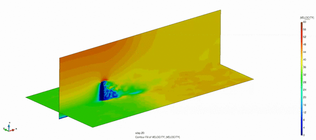
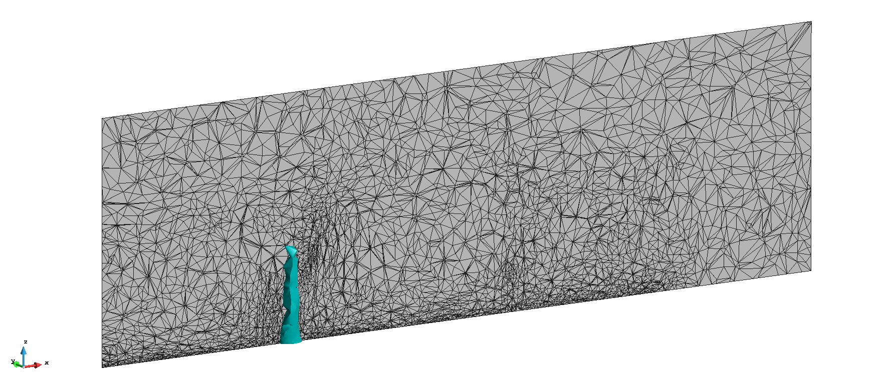
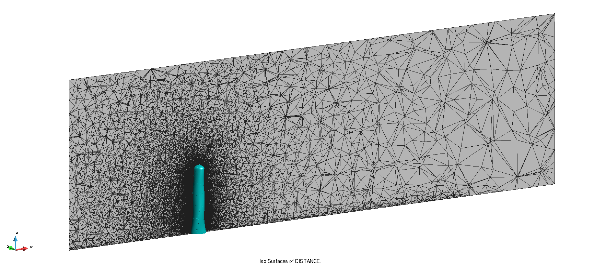
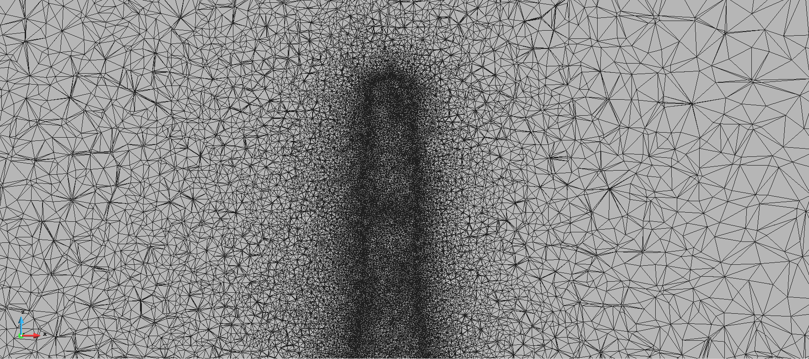

# Embedded building 3D with MPI level-set based refinement

**Author:** Marc Núñez Corbacho

**Kratos version:** 8.1

**MMG version:** 5.5.2

**ParMMG version:** 1.3.0

**Source files:** [MPI Embedded building 3D](https://github.com/KratosMultiphysics/Examples/tree/master/parmmg_remeshing_examples/use_cases/embedded_level_set_building3D/source)

**Application dependencies:** `FluidDynamicsApplication`, `LinearSolversApplications`, `MappingApplication`, `MeshingApplication`, `MetisApplication`, `TrilinosApplication`

To run this example execute:

    export OMP_NUM_THREADS=1
    mpirun -n nprocs python3 MainKratos.py

Where `nprocs` is the number of processors to use in the MPI run.

This example adaptively refines a background mesh according to the distance to a building. This considerably improves the representation of the building on the mesh. It then start a a fluid dynamic analysis with a constant logarithmic inlet, with the geometry embedded and represented by a distance field.

