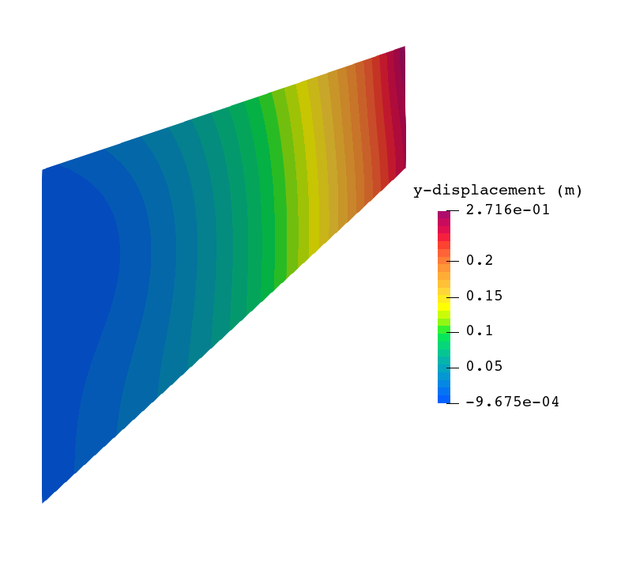
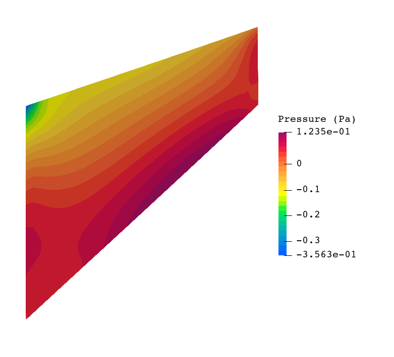

# Cook's membrane problem
**Author:** Laura Moreno

**Kratos version:** 

**Source files:** [cooks_membrane](https://github.com/KratosMultiphysics/Examples/tree/master/particle_mechanics/validation/cooks_membrane/source)

The
[Particle Mechanics Application](https://github.com/KratosMultiphysics/Kratos/tree/master/applications/ParticleMechanicsApplication) of Kratos is used to perform this example.

## Case Specification

The Cook's membrane test under the assumptions of plain strain is presented. This test is used to check the mixed element formulation (U-P) under incompressible conditions.
The material considered is the hyperelastic one and the properties are:
* Density (_&rho;_): 1000 Kg/m3
* Young's modulus (_E_):  70 Pa
* Poisson ratio (_&nu;_): 0.499

The problem geometry as well as the boundary conditions are sketched below:

  

The problem is solved with a structured mesh of triangle elements with 3 material points per cell, and with 32 elements per size.

## Results

The results shows how the U-P formulation prevent the pressure oscillation issues in the mean stress field.

  
  

## References
- Cook, R. D. (1974). Improved two-dimensional finite element. Journal of the Structural Division, 100(9), 1851-1863.
- Iaconeta, I., Larese, A., Rossi, R., & Oñate, E. (2019). A stabilized mixed implicit material point method for non-linear incompressible solid mechanics. Computational Mechanics, 63(6), 1243-1260.
