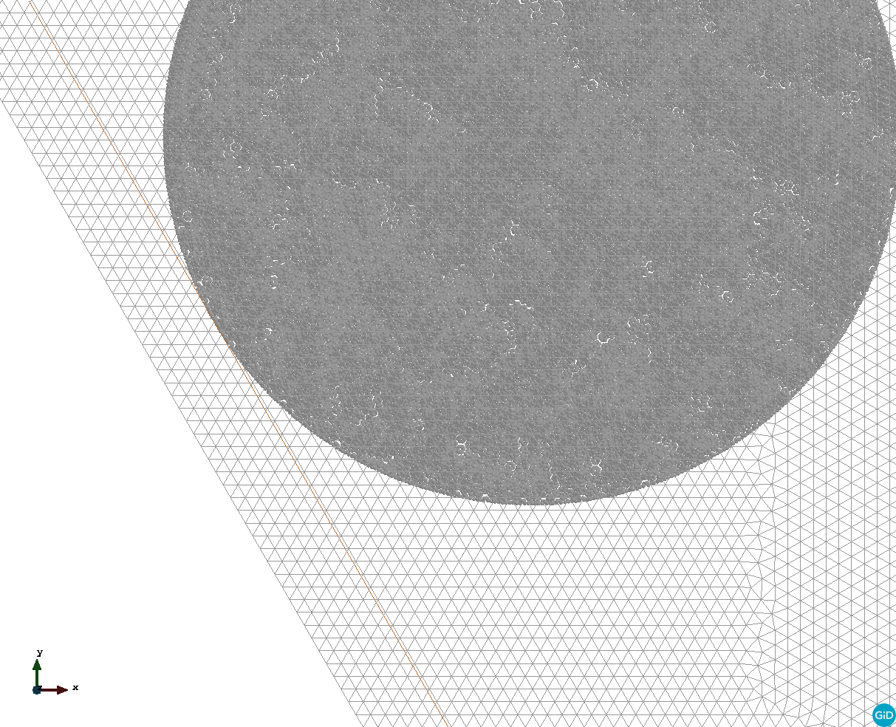
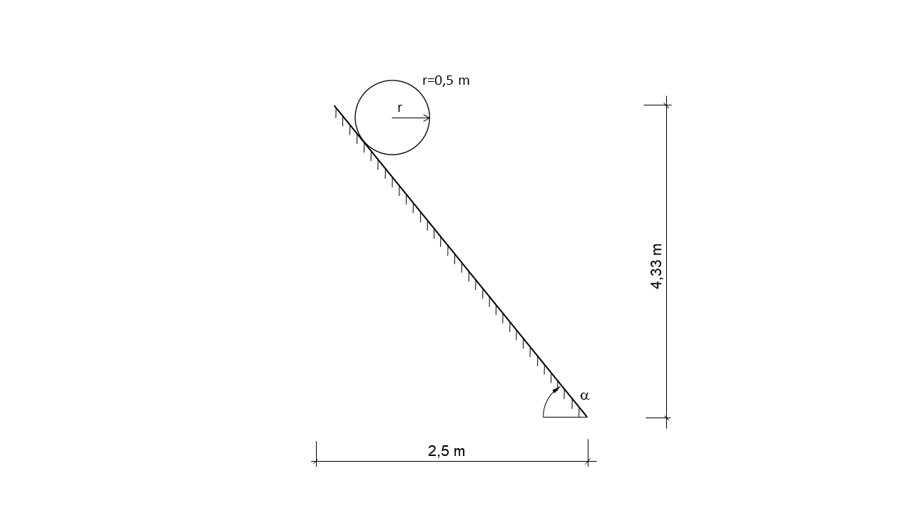

# Cylinder on inclined plane 2D - comparison between analytical and numerical solution with MPM
**Author:** Philip Franz 

**Kratos version:** Development branch. **Expected 6.0** 

**Source files:** [cylinder_on_inclined_plane_2D](https://github.com/KratosMultiphysics/Examples/tree/master/particle_mechanics/validation/cylinder_on_inclined_plane_2D/source)

## Case Specification

This is a 2D simulation of a cylinder on an inclined plane. A rotating as well as a sliding behaviour of the cylinder is regarded subsequently. The simulation is set up according to section 4.5.2 of (Iaconeta, 2019). 
Linear, unstructured, triangular elements with a size of 0.01m are used to initialize the MPs and three MPs per cell are considered. For the backgroundmesh linear, unstructured, triangular elements with a size of 0.02m are used.
However, in contrast to section 4.5.2 of (Iaconeta, 2019) the inclined plane is modelled by a line with unstructured elements with size 0.01m. On that line a non (grid) conforming Dirichlet boundary condition is imposed 
by using penalty augmentation based on (Chandra et al., 2021).  

  
The non grid conforming boundary condition is respresented by the copper coloured line.

The following application of Kratos is used:
- [ParticleMechanicsApplication](https://github.com/KratosMultiphysics/Kratos/tree/master/applications/ParticleMechanicsApplication)
- [LinearSolversApplication](https://github.com/KratosMultiphysics/Kratos/tree/master/applications/LinearSolversApplication)

The problem geometry as well as the boundary conditions are sketched below:

  

A hyper elastic Neo Hookean Plane strain (2D) constitutive law with unit thickness is considered with the following material parameters:
* Density (_&rho;_): 7800 Kg/m3
* Young's modulus (_E_):  200 MPa
* Poisson ratio (_&nu;_): 0.3

The time step is 0.001 seconds; the total simulation time is 1.0 seconds. The angle (_&alpha;_) of the inclined plane is 60°. The penalty-factor is 1e13. 

The contact between cylinder and inclined plane is modelled with the option "contact" (see line 53, file *ProjectParameters_contact.json*) in the first and with "slip" in the second case, based on (Chandra et al., 2021). Choosing "contact" leads to a rolling behaviour of the cylinder; "slip" to a sliding behaviour.

## Results
The analytical and numerical solution for the displacement function of the respective case of the above stated problem are compared afterwards:

  

Simulation of the rotating cylinder: 

  
 
  

 
## References
- Iaconeta, I. (2019). *Discrete-continuum hybrid modelling of flowing and static regimes.* (Ph.D. thesis). Universitat politècnica de Catalunya - Barcelona tech 
- Chandra, B., Singer, V., Teschemacher, T., Wüchner, R., Larese, A. (2021) *Nonconforming Dirichlet boundary conditions in implicit material point method by means of penalty augmentation*. Acta Geotech. 16, 2315–2335. https://doi.org/10.1007/s11440-020-01123-3 
