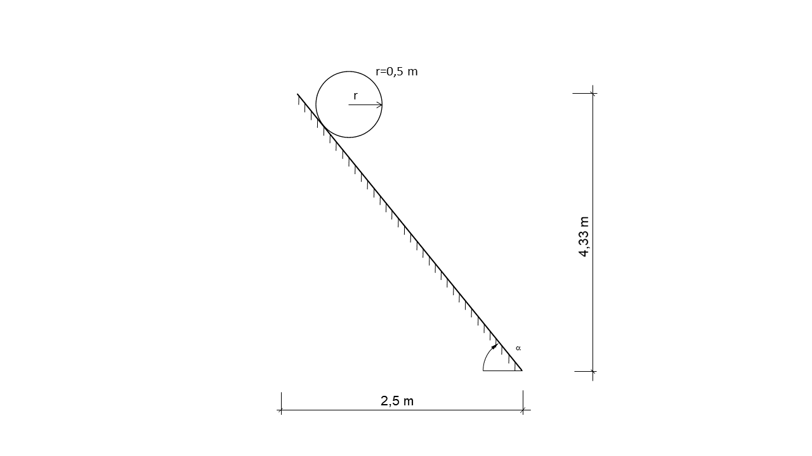

# Rotating cylinder 2D - comparison between analytical and numerical solution with MPM
**Author:** Philip Franz 

**Kratos version:** Development branch. **Expected 6.0** 

**Source files:** [rolling_cylinder_2D](https://github.com/KratosMultiphysics/Examples/tree/master/particle_mechanics/validation/rolling_cylinder/source)

## Case Specification

This is a 2D simulation of a rotating cylinder on an inclined plane. The simulation is set up according to section 4.5.2 of (Iaconeta, 2019). Linear, unstructured, triangular elements with a size of 0.01 are used to initialize the MPs. For the backgroundmesh linear, unstructured, triangular elements with a size of 0.02 are used.(Reason why unstructured mesh is chosen?)

The inclined plane is modelled by a line with unstructured elements with size 0.01. On that line a non (grid) conforming Dirichlet boundary condition is imposed by using penalty augmentation based on (Chandra et al., 2021).  (dimension of the size of elements?)

The following application of Kratos is used:
- [ParticleMechanicsApplication](https://github.com/KratosMultiphysics/Kratos/tree/master/applications/ParticleMechanicsApplication)

The problem geometry as well as the boundary conditions are sketched below:

  

A hyper elastic Neo Hookean Plane strain (2D) constitutive law with unit thickness is considered with the following material parameters:
* Density (_&rho;_): 7800 Kg/m3
* Young's modulus (_E_):  200 MPa
* Poisson ratio (_&nu;_): 0.3

The time step is 0.001 seconds; the total simulation time is 1.0 seconds. The angle (_&alpha;_) of the inclined plane is 60°. The penalty-factor is 1e13. Three material points per cell are considered.

The contact between cylinder and inclined plane is modelled by the option "contact" (see line 53, file *ProjectParameters.json*) based on (Chandra et al., 2021).  

## Results
The solutions of the displacement- and velocity function of the above stated problem are compared with the analytical solution of a rolling cylinder on an inclined plane. The following images show the results of the simulation:

## References
- Iaconeta, I. (2019) *Discrete-continuum hybrid modelling of flowing and static regimes.* (Ph.D. thesis). Universitat politècnica de Catalunya - Barcelona tech 
- Chandra, B., Singer, V., Teschemacher, T., Wüchner, R., Larese, A. (2021) *Nonconforming Dirichlet boundary conditions in implicit material point method by means of penalty augmentation*. Acta Geotech. 16, 2315–2335. https://doi.org/10.1007/s11440-020-01123-3 