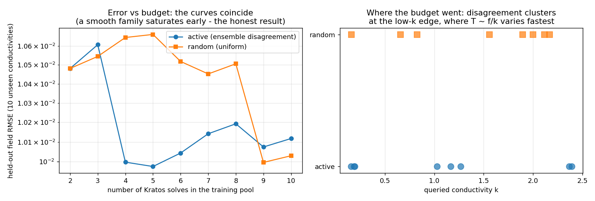

# Active learning with Kratos as the labeler

**Author:** [Vicente Mataix Ferrándiz](https://github.com/loumalouomega)

**Kratos version:** 10.4 (with `PhysicsNeMoApplication`)

**Source files:** [active_learning](https://github.com/KratosMultiphysics/Examples/tree/master/physics_nemo_application/use_cases/active_learning/source)

**Extra dependencies:** `nvidia-physicsnemo`, `torch`, `matplotlib`

## Case Specification

Kratos as the **ground-truth labeler** inside an active-learning loop: every queried design point (a conductivity) is answered by a real `ConvectionDiffusion` solve, launched through the application's active-learning components — `InProcessBackend` (imports an analysis module, templates its parameters per sample) and `CreateKratosLabelStrategy` (the label strategy `physicsnemo.active_learning`'s `Driver` consumes), with `CreateEnsembleDisagreementStrategy` scoring a candidate pool by the disagreement of a three-seed surrogate ensemble.

Eight rounds each of active vs random acquisition, from the same two initial solves, evaluated on ten held-out conductivities.

## Results — including the honest one

**The error curves coincide.** On this smooth one-parameter family a handful of solves saturates the surrogate, so *where* the budget goes cannot change the error — and the example reports that rather than a manufactured win. Probes of harder observables while building this (2D source positions, near-singular source widths) moved the data-vs-capacity balance by only ~20 %: the smoothness of the family, not the machinery, is the limiting factor.

**What the run does show** is the acquisition behavior: the disagreement strategy clusters its queries at the low-conductivity edge, where *T* ∼ *f*/*k* varies fastest — exactly the behavior that pays off when each label is expensive and the response is sharp. That is the regime this machinery is built for (crash, contact, bifurcating responses), and this example is the wiring diagram for it.

  

## References

- Settles, *Active Learning Literature Survey*, 2009.
- [NVIDIA PhysicsNeMo active learning](https://docs.nvidia.com/physicsnemo/latest/index.html)
- [PhysicsNeMoApplication documentation — Active Learning](https://kratosmultiphysics.github.io/Kratos/pages/Applications/PhysicsNeMo_Application/Active_Learning/Active_Learning.html)
