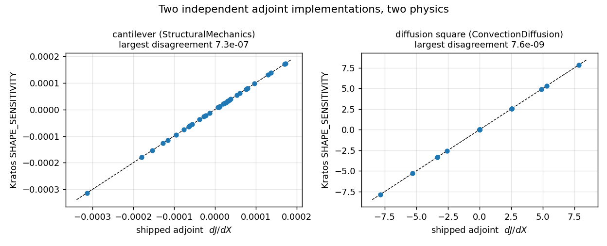
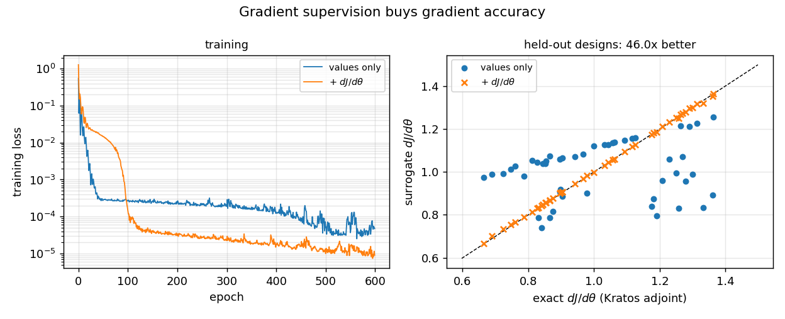
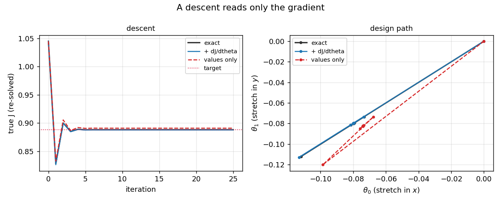
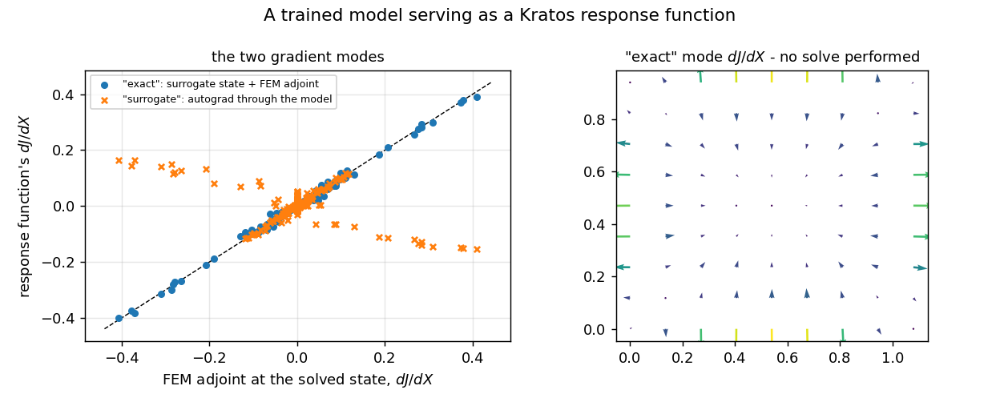

# Adjoint integration — Kratos's gradients as data, and back again

**Author:** [Vicente Mataix Ferrándiz](https://github.com/loumalouomega)

**Kratos version:** 10.4 (with `PhysicsNeMoApplication`, `StructuralMechanicsApplication` and `ConvectionDiffusionApplication`)

**Source files:** [adjoint_integration](https://github.com/KratosMultiphysics/Examples/tree/master/physics_nemo_application/use_cases/adjoint_integration/source)

**Extra dependencies:** `nvidia-physicsnemo`, `torch`, `matplotlib`

## Case Specification

Kratos computes exact design sensitivities, and so does `PhysicsNeMoApplication` — by a different route. Until `adjoint_bridge` existed the two never met, and no training path used Kratos's gradients as data at all. This case runs both directions.

The bridge consumes a **contract**, not an application: `ResponseFunctionInterface` lives in the Kratos core, so what it needs is whichever application owns the response — never a compiled optimization application. Two of them are driven here, and they could hardly be less alike: `StructuralMechanicsApplication` builds a *separate* `Kratos.Model` for its adjoint part and re-reads the mdpa (`AdjointFiniteDifferencing*` elements, `adjoint_nodal_displacement`); `ConvectionDiffusionApplication` keeps primal and adjoint in the same model (`AdjointDiffusionElement`, `point_temperature`).

The design problem for stages 2–4 is the unit square deformed by an FFD lattice with **two** parameters — a stretch in `x`, a stretch in `y` — solved as stationary heat conduction with a uniform source and `T = 0` on the boundary. The objective is the total nodal temperature, and each sample costs one solve plus one element-local adjoint pass:

    theta (2)  ->  [ J, dJ/dtheta_0, dJ/dtheta_1 ]

* `01_two_adjoints.py` — Kratos's adjoint through the bridge vs the shipped one, on both physics (seconds);
* `02_gradient_enhanced_surrogate.py` — a gradient-augmented dataset and two trainings that differ by one loss term (~1 min);
* `03_optimization_with_learned_gradients.py` — the same descent driven by each gradient (~1 min);
* `04_surrogate_as_response_function.py` — a trained model deployed *as* a Kratos response function (~2 min).

## Results

### Two independent adjoints, two physics

Kratos reports a sensitivity as a `{node_id: value}` dict — unordered, and keyed by an *adjoint* model part whose iteration order need not be the primal's. `EvaluateResponse` maps ids to rows, giving the same order every gather in the application uses. The converted array is then compared, component by component, against `sensitivity_utils.ComputeShapeSensitivityField`:

| case | J | largest disagreement |
|---|---|---|
| cantilever (StructuralMechanics) | −1.5242015408e−04 | **7.3e−07** |
| diffusion square (ConvectionDiffusion) | +2.90e+02 | **7.6e−09** |

<p align="center">
  
</p>

The cantilever's looser figure is *Kratos's*: its `semi_analytic` gradient takes a **forward** difference where the shipped field takes a central one, so it carries the larger step error of the two. The 2-D diffusion case's out-of-plane row is **exactly** zero, not merely small.

One factor is pinned rather than absorbed, because it looks exactly like a wrong adjoint and is not: Kratos's `point_temperature` response **averages** the temperature over the traced part while `MakeObjectiveWeights`' `weighted_sum` sums it. Three traced nodes, factor three. Two correct adjoints of two different objectives disagree for a reason that has nothing to do with either being wrong.

### Gradient supervision buys gradient accuracy

A surrogate fitted on values alone is graded on values alone, and its derivatives are whatever the fit left behind. Same architecture, same seed, the same sixteen designs — the only difference is one extra loss term reading the stored `dJ/dθ`:

| | value RMSE | gradient RMSE |
|---|---|---|
| values only | 0.0209 | 0.2185 |
| + `dJ/dθ` | 0.0010 | **0.0048** |

<p align="center">
  
</p>

**46×** better gradients at designs neither run saw, and the value error improves twenty-fold as a by-product — the derivative information constrains the fit between the sixteen training points, where a value-only fit is free to do anything.

Two settings carry the mechanism, and both are easy to get wrong:

* `"target_channels" : [0]` keeps the **data** loss on the column the model predicts. Without it torch does not reject a 1-channel prediction against a 3-column target — it *broadcasts*, and silently trains the model against the mean of `J` and its two derivatives, reporting a loss that looks like a fit.
* `MakeSensitivityLossTerm` declares a **fourth** positional argument, so `TrainModel` hands it the batch targets. Three-argument terms (`physics_informed`, `differentiable_residual`) are called exactly as before; the arity is resolved once, before training starts.

### What a wrong gradient costs

A descent reads *only* the gradient, so this is where the difference is spent. The same least-squares problem — drive `J` to 85 % of its initial value — is run three ways:

| | final true J | \|J − target\| | solves used |
|---|---|---|---|
| exact (solve + adjoint per step) | 0.888228 | 3.3e−16 | 2 per step |
| + `dJ/dθ` surrogate | 0.887819 | **4.1e−04** | none |
| values-only surrogate | 0.890968 | 2.7e−03 | none |

<p align="center">
  
</p>

The true objective is re-solved at each iterate for the plot only — neither surrogate run uses it. The gradient-trained surrogate lands **6.7× closer** to the target than the value-only one while solving nothing at all, and follows the exact run's design path rather than its own.

### The other direction: a surrogate as a response function

`SurrogateResponseFunction` implements the core `ResponseFunctionInterface` with the same `CreateResponseFunction(response_id, response_settings, model)` signature the applications' own factories use, so a driver resolving responses by module path takes it with no special case — the mirror of `cosim_surrogate_solver_wrapper` putting a model where a *solver* goes.

The field surrogate here maps `(x, y, z, heat flux, θ₀, θ₁, 0) → T`. The design parameters ride in an ordinary nodal variable because without them the map is genuinely ambiguous — the same physical point belongs to differently-sized domains in different designs, and a coordinates-only fit plateaus around 25 % relative error. With them it reaches 3.9 %.

At a design the surrogate never saw:

| | J | rel. J error | rel. `dJ/dX` error |
|---|---|---|---|
| solved state (reference) | 1.051110 | — | — |
| `"exact"`: surrogate state + FEM adjoint | 1.003304 | 4.5e−02 | **7.1e−02** |
| `"surrogate"`: autograd through the model | 1.003304 | 4.5e−02 | 1.4e+00 |

<p align="center">
  
</p>

`"exact"` is the honest positioning of what a surrogate replaces: the **solve**, not the sensitivity analysis. The adjoint is discretely exact for the state it is given, so it is only as trustworthy as that state — and here a 3.9 % field surrogate yields a 7 % gradient with no solve performed.

The `"surrogate"` mode's 135 % is not a bug in either mode; it is a structural limitation, measured rather than asserted. `dJ/dX_i` couples through the PDE — moving one node changes the field everywhere — and a *pointwise* model maps each node independently, so its autograd gradient is a different quantity. A model that mixes nodes (a graph or point-cloud architecture) does not have this problem, and that mode exists for exactly those.

## Lessons

* **The bridge is a conversion, and that is the point.** Both gradients already existed and had even been cross-validated against each other. What was missing was an interface: a dict on one side, row-ordered arrays on the other. That one conversion is what lets a Kratos gradient sit beside a Kratos field in a training sample.
* **Never assemble an adjoint after `analysis.Finalize()`.** The boundary-condition processes release the DOFs they fixed in their `ExecuteFinalizeSolutionStep`, leaving an unconstrained — singular — tangent. The failure is quiet: finite sensitivities, wrong by about six orders of magnitude.
* **Check the objective normalization before blaming the adjoint.** A sum where the other side averages is indistinguishable from a wrong gradient until someone counts the nodes.
* **Gradients are training signal you have already paid for.** The adjoint costs roughly one solve's worth of work per sample and is exact, and it changes what the surrogate is good at — which matters, because a surrogate used inside an optimizer is read for its gradient.

## Reproducing

```bash
cd source
python3 01_two_adjoints.py
python3 02_gradient_enhanced_surrogate.py
python3 03_optimization_with_learned_gradients.py   # needs 02's checkpoints
python3 04_surrogate_as_response_function.py
```

Every figure in this page is written by the scripts into `data/`; intermediate artifacts land in `source/output/`.
