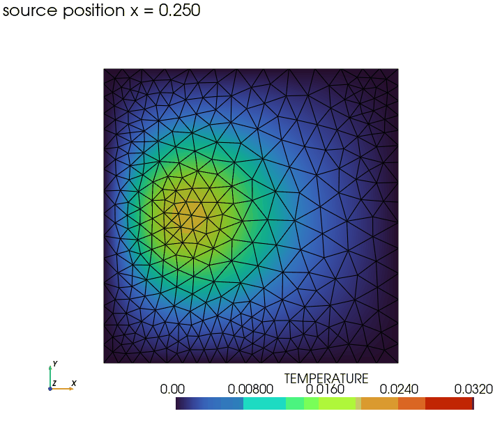
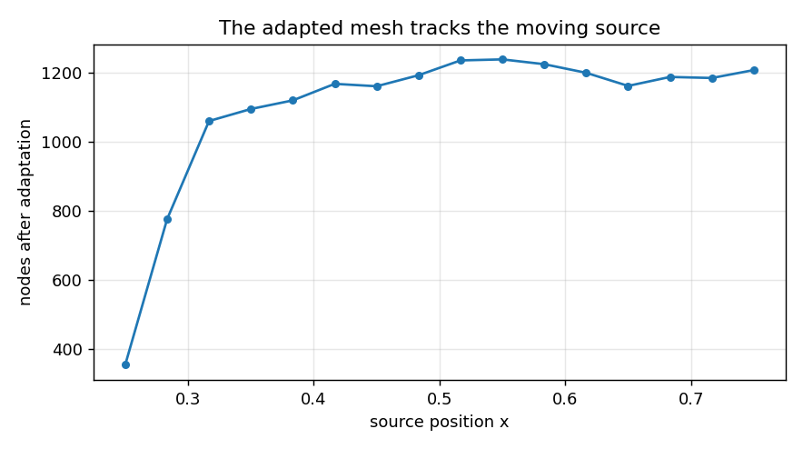

# Animated adaptive remeshing — the mesh chases the source

**Author:** [Vicente Mataix Ferrándiz](https://github.com/loumalouomega)

**Kratos version:** 10.4 (with `PhysicsNeMoApplication` and `MeshingApplication`/MMG)

**Source files:** [animated_adaptive_remeshing](https://github.com/KratosMultiphysics/Examples/tree/master/physics_nemo_application/use_cases/animated_adaptive_remeshing/source)

**Extra dependencies:** `nvidia-physicsnemo`, `torch`, `pyvista`, `imageio`, `matplotlib`

## Case Specification

Two recent capabilities in one loop. As a Gaussian heat source sweeps across the plate, each cycle runs: an imperfect MLP surrogate predicts the new temperature field; `AdaptiveRemeshProcess` assembles the **real PDE residual of that prediction** and remeshes with MMG — refining where the surrogate's physics error concentrates, near the hot spot; the solver then runs on the adapted mesh. The refined region **follows the source**, and previously refined regions coarsen back.

The whole run is recorded by core Kratos' new `pyvista_utilities.TransientPlotter`, which supports the mesh **topology changing between frames** by design — every frame here has a different node count.

A design detail learned by probing, kept in the script: the residual of a *converged* solve is machine-zero, so remeshing after the solve only coarsens. The surrogate's imperfect state is what carries the refinement signal — the same reason the [surrogate-driven remeshing case](../surrogate_driven_remeshing/README.md) needs no reference solution.

## Results

  

  

## References

- [MMG platform](https://www.mmgtools.org/) and Kratos' [MeshingApplication](https://github.com/KratosMultiphysics/Kratos/tree/master/applications/MeshingApplication).
- [PhysicsNeMoApplication documentation](https://kratosmultiphysics.github.io/Kratos/pages/Applications/PhysicsNeMo_Application/General/Overview.html)
