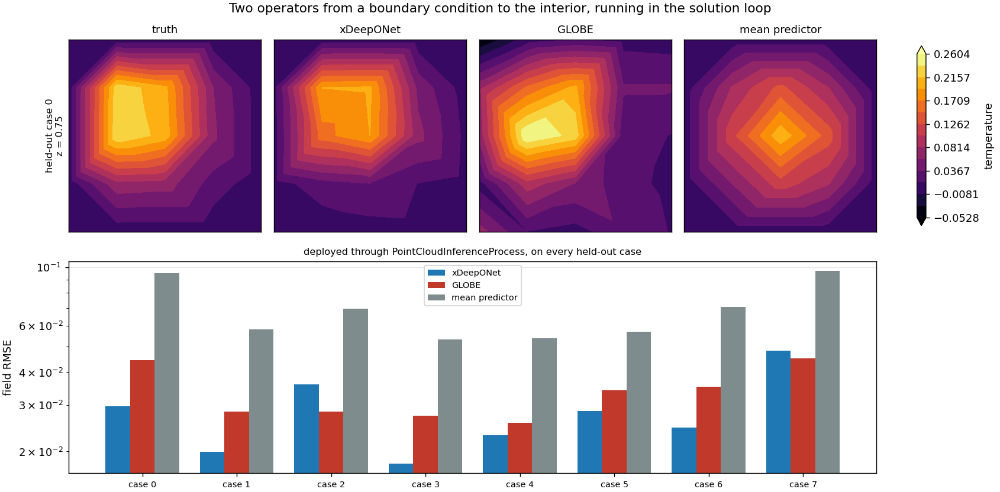
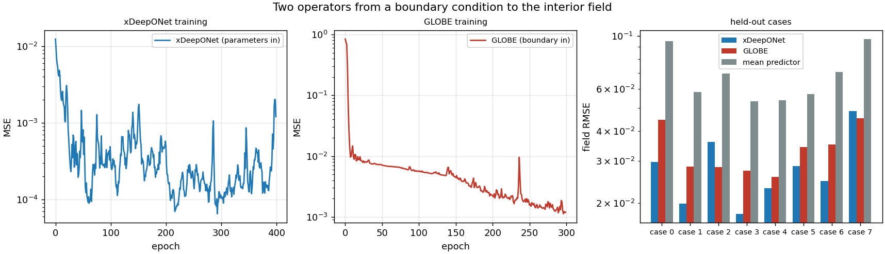

# Boundary-to-interior operators — GLOBE and xDeepONet deployed in the solution loop

**Author:** [Vicente Mataix Ferrándiz](https://github.com/loumalouomega)

**Kratos version:** 10.4 (with `PhysicsNeMoApplication` and `ConvectionDiffusionApplication`)

**Source files:** [boundary_to_interior_operators](https://github.com/KratosMultiphysics/Examples/tree/master/physics_nemo_application/use_cases/boundary_to_interior_operators/source)

**Extra dependencies:** `nvidia-physicsnemo`, `torch`, `matplotlib`

## Case Specification

An elliptic problem carries its boundary data into its interior. That is the structure two very different operator architectures both try to learn here, on the same physics, deployed through the same Kratos process — and it is worth seeing them side by side precisely because they are given different things to work with.

The physics is a unit cube solved by `ConvectionDiffusionApplication`. A Gaussian Dirichlet bump `A·exp(−((x−cx)² + (y−cy)²)/2w²)` sits on the top face, the rest of the skin is held at zero, and the interior temperature is what has to be predicted. Four divisions per side gives 125 nodes. Twenty-four cases are solved, sixteen for training and **eight held out**.

Neither operator uses a POD basis, which is the point. They are not interpolating in a precomputed subspace, they are mapping functions to functions.

- **xDeepONet** is given the case **parameters**. Its branch network takes `(cx, cy, A)` through 3 → 32 → 64, its trunk takes query coordinates through 3 → 32 → 64, and their inner product over a width-64 latent gives the field at any point. Four hundred epochs of Adam at 2·10⁻³.
- **GLOBE** is given the **boundary itself** — the actual top-face mesh, its connectivity and the temperatures on it — and propagates that inward through two communication hyperlayers with 12 latent scalars, 6 latent vectors and `[32, 32]` hidden layers. Three hundred epochs.

`02_deploy_operators.py` then runs both where they would actually be used: attached to a model part by `PointCloudInferenceProcess`, writing into ordinary nodal variables that every existing exporter and validation process already understands. They reach the process by different routes. xDeepONet's parameters arrive in a `"branch_input"` block, here as `"constants"` because a worked example can do that; in production they would come from `"process_info_variables"` or `"properties_variables"` so the running solver supplies them. GLOBE's boundary arrives in a `"globe"` block naming the sub-model-parts, the fields on them and the reference lengths.

**`"normalize_coordinates"` is false for both, and that is not incidental.** The process normalizes coordinates per axis against the cloud's own bounding box when asked to, and both operators were trained on raw coordinates. Turning it on would feed them a unit cube and quietly produce nonsense — the same normalization that makes the [geometry guardrail](../geometry_guardrail/README.md) case necessary.

## Results

Both operators beat the node-wise mean of the training fields — the predictor that ignores its input entirely — on **every one of the eight held-out cases**, which is what the script asserts rather than the easier claim about averages.

| held-out case | xDeepONet | GLOBE | mean predictor |
|---|---|---|---|
| 0 | 2.9744·10⁻² | 4.4565·10⁻² | 9.5272·10⁻² |
| 1 | 1.9904·10⁻² | 2.8352·10⁻² | 5.8236·10⁻² |
| 2 | 3.6003·10⁻² | **2.8288·10⁻²** | 6.9674·10⁻² |
| 3 | 1.8018·10⁻² | 2.7311·10⁻² | 5.3326·10⁻² |
| 4 | 2.3071·10⁻² | 2.5654·10⁻² | 5.3834·10⁻² |
| 5 | 2.8472·10⁻² | 3.4231·10⁻² | 5.6983·10⁻² |
| 6 | 2.4674·10⁻² | 3.5157·10⁻² | 7.0715·10⁻² |
| 7 | 4.8376·10⁻² | **4.5161·10⁻²** | 9.6913·10⁻² |
| **mean** | **2.8533·10⁻² (2.43x)** | **3.3590·10⁻² (2.07x)** | 6.9369·10⁻² |

The ranking between the two is reported and not asserted, because it is genuinely mixed: GLOBE wins cases 2 and 7, xDeepONet the other six. Two cases out of eight is not a result, and the case does not dress it up as one.

<p align="center">
  
</p>

The slice panel is what makes the baseline legible. The truth has an off-centre hot spot that both operators track; the mean predictor is a symmetric blob that ignores the input, which is exactly what a predictor that has never read its input looks like.

**The process is a faithful wrapper, not an approximation.** Script 01 evaluates both operators by calling them directly and script 02 re-evaluates them through `PointCloudInferenceProcess`. The two agree to about seven significant figures — 0.029743907483692815 against 0.0297439074986918 on case 0 — so the gathering, the ordering and the write-back cost nothing in accuracy.

Training is **not fast**: 430 seconds for both on CPU. GLOBE runs on CPU only through the bridge.

| | start | end | shape of the curve |
|---|---|---|---|
| xDeepONet | 1.236·10⁻² | 1.205·10⁻³ | noisy throughout, and **ends on an upswing** |
| GLOBE | ≈8.5·10⁻¹ | 1.190·10⁻³ | clean decay, one spike near epoch 235 |

<p align="center">
  
</p>

xDeepONet's curve deserves the honesty. Trained full-batch at 2·10⁻³ it oscillates over more than a decade and passes through 1.094·10⁻⁴ at epoch 300 before finishing at 1.205·10⁻³. The held-out numbers above are what that final checkpoint achieves, so they are real — but this is not a converged fit, and a smaller learning rate or a held-out-selected checkpoint would likely do better.

**Three sharp edges found while building this.** The first is a settings-shape trap: GLOBE's five keys must nest under a `"globe"` block. Written at the top level of the process parameters they produce

```
RuntimeError: Error: The item with name "boundary_fields" is present in this Parameters but NOT in the default values
```

which names the key but not the reason, and the key is spelled correctly — it is simply at the wrong depth.

The second was a real defect in the application, not in this case, and it is now fixed upstream with a regression test. Boundary meshes built from a Kratos model part carry **float64 point coordinates alongside float32 cell data**, and a float32 GLOBE then fails inside the matrix multiply with `mat1 and mat2 must have the same dtype`. `RunGlobeForward` now normalizes the meshes to the model's dtype.

The third is about borrowing a unit test's hyperparameters. The configuration in the application's own test is deliberately tiny, and at that size GLOBE here **collapses to predicting the field mean exactly** — a model that has learned the dataset's average and nothing about the boundary in front of it. Sixty epochs likewise leaves it far short. A test that checks the plumbing runs is not a starting point for a model that has to generalize.

## References

- Lu et al., *Learning nonlinear operators via DeepONet*, Nature Machine Intelligence, 2021. [arXiv:1910.03193](https://arxiv.org/abs/1910.03193)
- [PhysicsNeMoApplication documentation — Operators](https://kratosmultiphysics.github.io/Kratos/pages/Applications/PhysicsNeMo_Application/Operators/Operators.html)
- [PhysicsNeMoApplication documentation — Inference processes](https://kratosmultiphysics.github.io/Kratos/pages/Applications/PhysicsNeMo_Application/Inference/Inference.html)
