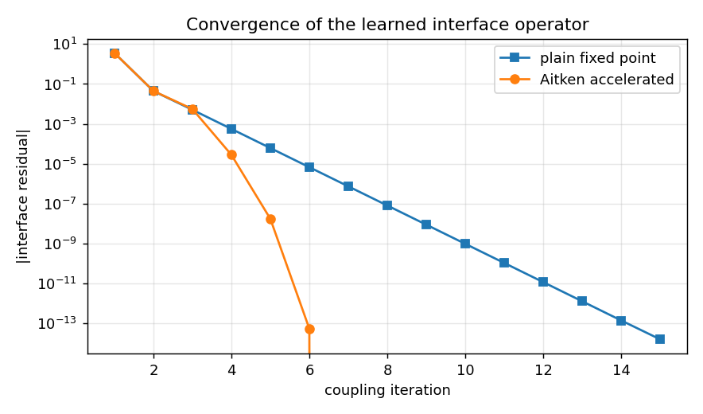

# A trained surrogate inside the CoSimulation loop

**Author:** [Vicente Mataix Ferrándiz](https://github.com/loumalouomega)

**Kratos version:** 10.4 (with `PhysicsNeMoApplication`, `CoSimulationApplication`, `MappingApplication`)

**Source files:** [cosim_surrogate](https://github.com/KratosMultiphysics/Examples/tree/master/physics_nemo_application/use_cases/cosim_surrogate/source)

**Extra dependencies:** `nvidia-physicsnemo`, `torch`, `scipy`, `matplotlib`

## Case Specification

The application's most distinctive integration: `cosim_surrogate_solver_wrapper` makes a trained checkpoint a **first-class CoSimulation citizen** — addressed by dotted path in the `"solvers"` block, exposing interface data like any solver wrapper, driven here by `gauss_seidel_strong` with an **Aitken** accelerator and a `kratos_mapping` data transfer over a meshed interface.

The coupled problem is a nonlinear interface fixed point *d* = *S*(*f*) with identity feedback *f* = *d*, where *S*(*f*) = 0.5 tanh(*f*) + 1 is played by a **trained MLP** (fit to samples of the operator, standing in for an expensive solver's interface response; max fit error 3.7·10⁻³). The correctness bar is strict: the coupled run must land on the mathematical fixed point *of the learned operator* — computed independently by root-finding — and it does, to **1.8·10⁻¹⁴**.

Two details learned from the application's own tests and kept in the script: an all-zero initial state trivially satisfies the *relative* convergence criterion (the loop stops after one iteration — seed a nonzero start), and a near-uniform contraction is exactly Aitken's regime.

## Results

Plain fixed-point iteration vs the Aitken-accelerated loop on the learned operator (replayed exactly, not parsed from logs) — Aitken reaches machine precision in a handful of iterations where the plain contraction grinds linearly:

  

## References

- Küttler & Wall, *Fixed-point fluid–structure interaction solvers with dynamic relaxation*, CM 2008 (Aitken in partitioned coupling).
- [Kratos CoSimulationApplication](https://github.com/KratosMultiphysics/Kratos/tree/master/applications/CoSimulationApplication)
- [PhysicsNeMoApplication documentation — CoSimulation](https://kratosmultiphysics.github.io/Kratos/pages/Applications/PhysicsNeMo_Application/CoSimulation/CoSimulation.html)
