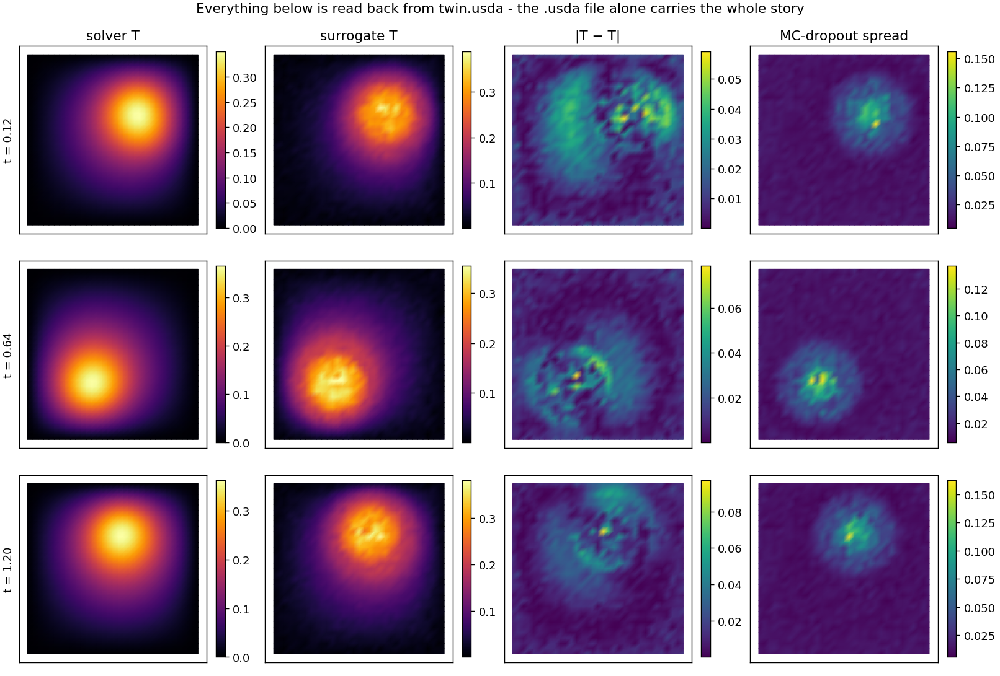

# Digital twin in OpenUSD — the solve, its surrogate and its uncertainty in one scrubbable file

**Author:** [Vicente Mataix Ferrándiz](https://github.com/loumalouomega)

**Kratos version:** 10.4 (with `PhysicsNeMoApplication` and `ConvectionDiffusionApplication`)

**Source files:** [digital_twin_usd](https://github.com/KratosMultiphysics/Examples/tree/master/physics_nemo_application/use_cases/digital_twin_usd/source)

**Extra dependencies:** `nvidia-physicsnemo`, `torch`, `usd-core`, `matplotlib`

## Case Specification

A transient heat-conduction plate with a moving Gaussian source, exported as a **digital twin**: `UsdExportProcess` (new in the application, needing only `pip install usd-core` — no Omniverse install exists or is required on the writing side) appends one time sample per step to a single OpenUSD stage that usdview, Omniverse or Blender scrub directly.

The twin carries more than the solve. A small one-step surrogate `f(T_prev, q) → T` (MLP with dropout) is trained on one recorded trajectory, then deployed the ordinary `ProjectParameters` way — `InferenceProcess` at `initialize_solution_step` predicts each step *before* the solver runs, MC dropout writes per-node error bars — so every USD time sample holds four vertex primvars: solver truth, surrogate prediction, and the spread. Points and primvars are time-sampled per step; topology only on steps where it changes (an adaptive-remeshing series stays valid; this fixed mesh carries a single topology sample).

The figure below is deliberately rendered **from the reopened `.usda` alone** — points, triangles and primvars all read back with `pxr` — proving the one file carries the whole story.

## Results

30 time samples over 1.2 s of simulated time. The seeded, asserted claim: the surrogate the twin carries genuinely tracks the solver — solver/prediction correlation **0.979–0.984** at the plotted times — and the MC-dropout spread concentrates exactly where the actual error `|T − T̂|` lives: at the moving hot spot, where the pointwise surrogate misses the diffusion coupling.

  

Open `data/twin.usda` in any USD viewer and scrub: the hot spot orbits, the prediction follows, the spread rides on top of it.

## References

- [OpenUSD](https://openusd.org/) and the [`usd-core` PyPI build](https://pypi.org/project/usd-core/).
- [PhysicsNeMoApplication documentation](https://kratosmultiphysics.github.io/Kratos/pages/Applications/PhysicsNeMo_Application/General/Overview.html) — the USD export is documented on the Mesh Bridge page.
