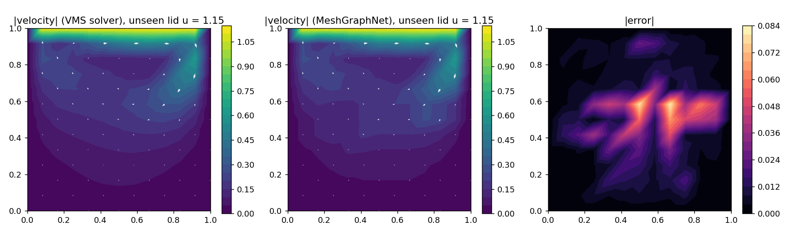
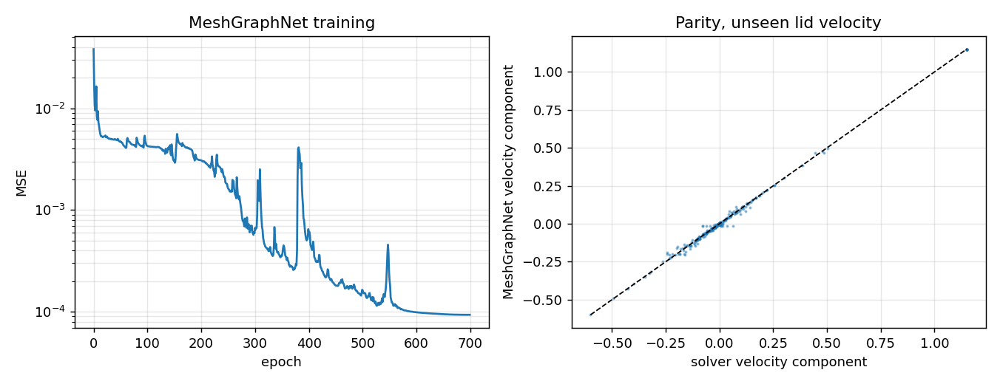
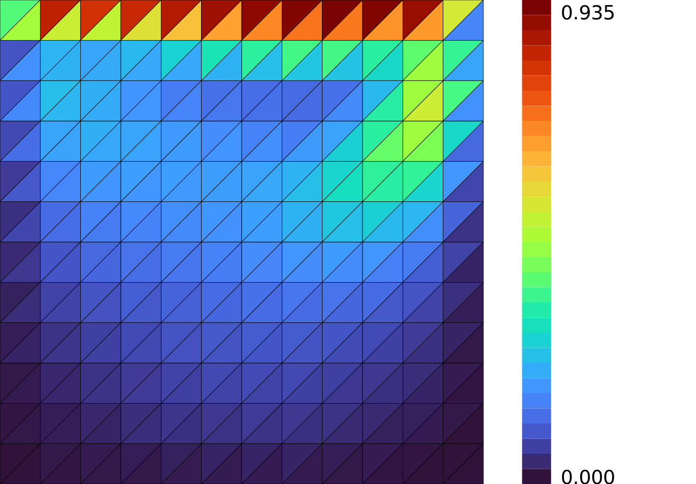

# Lid-driven cavity MeshGraphNet — the first fluid case

**Author:** [Vicente Mataix Ferrándiz](https://github.com/loumalouomega)

**Kratos version:** 10.4 (with `PhysicsNeMoApplication`)

**Source files:** [fluid_cavity_gnn](https://github.com/KratosMultiphysics/Examples/tree/master/physics_nemo_application/use_cases/fluid_cavity_gnn/source)

**Extra dependencies:** `nvidia-physicsnemo`, `torch`, `torch_geometric`, `torch_scatter`, `matplotlib`, `cairosvg`

## Case Specification

Incompressible **Navier–Stokes**: the classic lid-driven cavity, solved in memory by `FluidDynamicsApplication`'s monolithic VMS solver (no-slip walls, prescribed tangential lid velocity, a short transient to a quasi-steady state). The lid velocity is swept over ten solves; a MeshGraphNet learns the *(boundary condition) → (velocity field)* map on the solver's own triangle mesh — the graph bridge extracts the element-edge graph, and the per-node input is only the prescribed boundary velocity, so the recirculation vortex the network must reproduce is nowhere in its input.

The decision that makes it work, documented in the script: the problem is **nondimensionalized**. Inputs and targets are divided by the lid velocity, with the lid velocity riding along as a third input channel so the Reynolds-number dependence (viscosity fixed) stays learnable. Without that scaling the interior recirculation — an order of magnitude weaker than the lid boundary layer — washes out of the MSE, and the first version of this example produced exactly that: a correct boundary layer over a flat interior.

Deployment runs through `GraphInferenceProcess` on a lid velocity the model never saw, the boundary-condition features staged in a nodal variable and the prediction scattered back to the nodes.

## Results

On the unseen lid velocity (1.15): RMSE **1.1·10⁻²** against a velocity scale of 1.15 (~1 %), the residual error concentrated at the vortex core. Both the lid boundary layer and the interior recirculation are reproduced:

  

  

## Mesh (via meshio++)

The real VMS mesh, colored by velocity magnitude at the unseen lid velocity — [meshio++](https://github.com/KratosMultiphysics/meshioplusplus)'s SVG writer, run directly on the solved model part and rasterized to PNG for the embed (`source/02_mesh_svg.py`):

  

## References

- Ghia, Ghia & Shin, *High-Re solutions for incompressible flow using the Navier-Stokes equations and a multigrid method*, JCP 1982 (the cavity benchmark).
- Pfaff et al., *Learning Mesh-Based Simulation with Graph Networks*, ICLR 2021. [arXiv:2010.03409](https://arxiv.org/abs/2010.03409)
- [PhysicsNeMoApplication documentation](https://kratosmultiphysics.github.io/Kratos/pages/Applications/PhysicsNeMo_Application/General/Overview.html)
