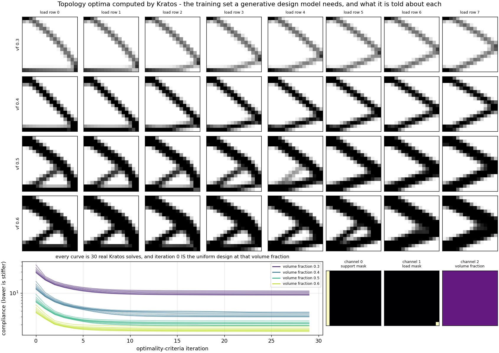
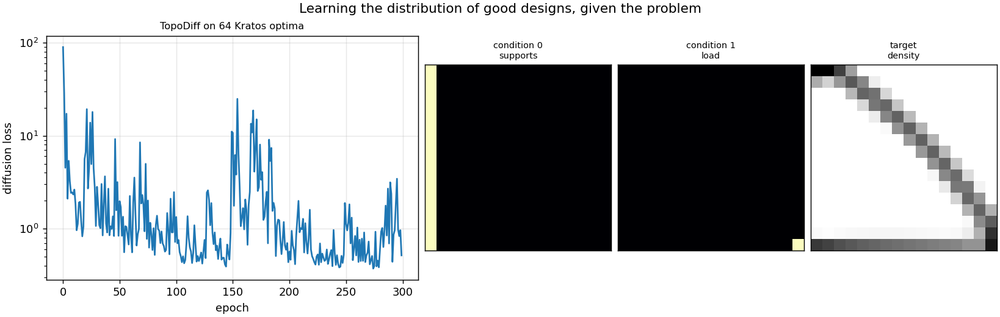
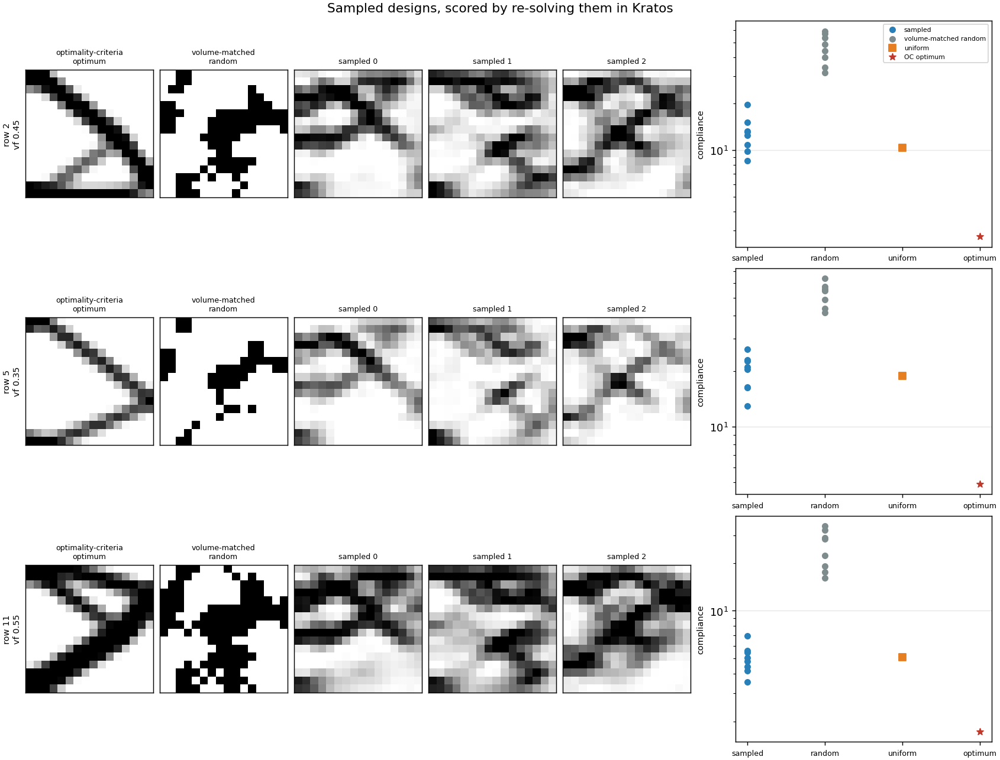

# Generative topology design — TopoDiff on SIMP optima, scored by re-solving

**Author:** [Vicente Mataix Ferrándiz](https://github.com/loumalouomega)

**Kratos version:** 10.4 (with `PhysicsNeMoApplication`, `StructuralMechanicsApplication` and `LinearSolversApplication`)

**Source files:** [generative_topology_design](https://github.com/KratosMultiphysics/Examples/tree/master/physics_nemo_application/use_cases/generative_topology_design/source)

**Extra dependencies:** `nvidia-physicsnemo`, `torch`, `matplotlib`

## Case Specification

Kratos is in this loop twice, and that is the whole point. It **computes the training set**, by running real topology optimization; and it **scores the output**, by re-solving every design the generative model proposes. Nothing here is judged by resembling the training data.

`01_optimize_training_designs.py` runs an optimality-criteria loop on a cantilever plate: elements take `E = E_min + ρ³·(E₀ − E_min)`, each iteration assembles and solves the finite-element problem, reads every element's strain energy back out of its own local system, filters the sensitivities and bisects on the volume multiplier. Thirty iterations per design, thirty real solves, about a second each.

The family varies **two** things, and that is deliberate. The conditioning a design model receives has three channels — where the structure is held, where it is loaded, and how much material it may use — and if every training design shared one volume fraction, that third channel would be a constant carrying no information while looking as though it carried some. So eight load rows are crossed with four volume fractions, giving 32 optima, mirrored top-to-bottom into 64 designs.

**The mirror is checked, not assumed, and the check is the interesting part.** Flipping a design in y and moving its load row to match is exact for the *continuum* problem, because the clamp runs the whole `x = 0` edge and is symmetric in y. It is **not** exact for this mesh: `StructuredMeshGeneratorProcess` splits every cell with a diagonal that always runs the same way, so the triangulation has no mirror symmetry at all. The script measures the gap at **1.72 %** — and then attributes it, by re-solving a *uniform* density field, which is trivially symmetric, at both load rows. That moves by **2.98 %**. The mesh alone accounts for more than the whole discrepancy, so the augmentation is sound and the assertion is set a few percent out rather than at machine precision.

`02_train_topodiff.py` trains a 1.35 M-parameter conditional `TopoDiff` on those 64 designs. `in_channels` is 4 because three conditioning channels are concatenated with the one density channel being denoised.

`03_sample_and_score.py` asks for **volume fractions the model was never trained on** — 0.45, 0.35 and 0.55, against a training set of 0.3, 0.4, 0.5 and 0.6 — then writes every sampled density field onto the elements and hands it back to the solver.

**Choosing the baseline is the hard part, and the obvious baseline is wrong.** Under SIMP with p = 3 the modulus goes as ρ³, so a uniform field is far stiffer than its volume fraction suggests, and "the generated design beats uniform" is a bar almost anything clears. The bar that means something is a **volume-fraction-matched random control**: a smooth random structure using the same amount of material, with its threshold bisected until the realized volume fraction meets the request, so it loses on where the material went rather than on how much of it there was.

## Results

The optimality-criteria loop does what it should. Every optimum is stiffer than the uniform field it started from, by **2.60x to 4.81x**, mean **3.42x**. That is one claim and not two: the loop begins from a uniform field at the requested volume fraction, so iteration 0's compliance *is* the uniform design's compliance.

  

The designs vary smoothly along both conditioning axes — thin single diagonals at volume fraction 0.3 thickening into two-bar trusses at 0.6, with the apex tracking the load row — which is what makes them a conditional dataset rather than a pile of structures.

TopoDiff's loss falls from **90.07** to **0.5154**, with a best epoch of 0.3716, in 53 seconds. The curve is visibly noisy and spikes back above 20 around epoch 160, which is what diffusion training looks like when the loss depends on which noise level each batch happens to draw. That is also why the script asserts only that the loss came down at all, rather than that the final epoch is the best one.

  

Then the part that has to be reported honestly.

| held-out condition | sampled mean | best sampled | volume-matched random | uniform | OC optimum |
|---|---|---|---|---|---|
| row 2, vf 0.45 | 12.8619 | 8.5523 | 45.9918 | 10.3168 | **2.7529** |
| row 5, vf 0.35 | 19.9165 | 12.9865 | 52.7400 | 18.8341 | **4.8911** |
| row 11, vf 0.55 | 5.0031 | 3.5614 | 24.9051 | 5.1030 | **1.7288** |

**What the model achieved:** sampled designs beat the volume-matched random control on every condition, by **3.6x, 2.6x and 5.0x**. That is the script's assertion, and it says the model learned something real about where material belongs.

**What it did not:** the sampled designs **lose to a plain uniform field on two of the three conditions**, and they sit **2.9x to 4.7x away from the optimizer** that produced their training data. A generative model trained on 64 designs for 300 epochs proposes structures that are much better than random and clearly worse than optimization. Reporting only the random comparison would have been true and misleading, so the uniform and optimum columns are in the table and none of them is asserted.

**What did generalize is the conditioning.** Asked for volume fractions it never saw, the model realized **0.477, 0.363 and 0.563** against requests of 0.45, 0.35 and 0.55 — slightly over each time, but interpolating the third channel rather than falling back on a training value.

  

Everything above is seeded. The script asserts that every sampled design is a real structure the solver can score, and that the sampled mean beats the volume-matched random mean, on every held-out condition.

**Three sharp edges found while building this.** The first was a real bug in the Kratos helper this case copies, and it is now fixed upstream. `ConstraintChannels` wrote the support mask along the **bottom** edge and the load at x-midpoint on the **top** edge, while the solve clamps `x = 0` and loads the far-x edge at the requested height — the channels were transposed against the problem they claimed to describe. The test did not catch it because it only checked each channel's **sum**, and a sum is invariant under exactly that transpose. A conditional model trained on those channels would have learned a confident mapping from the wrong description.

The second is a floor, not a preference: `model_channels` cannot be dropped to 32 to save time. TopoDiff derives its attention head count from the channel width, and 32 yields `num_heads = 0` and a division error rather than a smaller model. Sixty-four is the smallest that works.

The third is the checkpoint. `LoadModel` returns the bare `TopoDiff`, so `WrapDiffusionModel` has to be reapplied before sampling — the wrapper does not survive the round trip, and nothing says so. What does survive is the model: a seeded ensemble drawn before saving and after reloading agrees to 9.3·10⁻¹⁰.

## References

- Mazé and Ahmed, *Diffusion Models Beat GANs on Topology Optimization*, AAAI 2023. [arXiv:2208.09591](https://arxiv.org/abs/2208.09591)
- Bendsøe and Sigmund, *Topology Optimization — Theory, Methods and Applications*, Springer, 2003.
- [PhysicsNeMoApplication documentation — Diffusion](https://kratosmultiphysics.github.io/Kratos/pages/Applications/PhysicsNeMo_Application/Diffusion/Diffusion.html)
