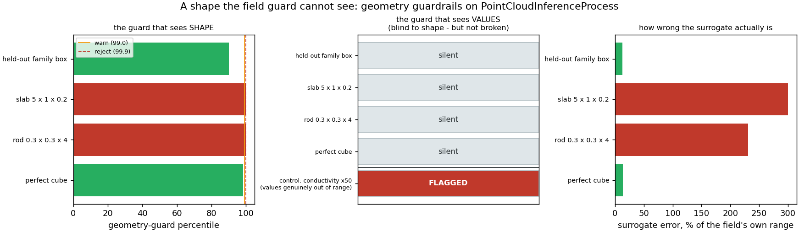

# Geometry guardrail — the out-of-distribution question a field guard cannot answer

**Author:** [Vicente Mataix Ferrándiz](https://github.com/loumalouomega)

**Kratos version:** 10.4 (with `PhysicsNeMoApplication` and `ConvectionDiffusionApplication`)

**Source files:** [geometry_guardrail](https://github.com/KratosMultiphysics/Examples/tree/master/physics_nemo_application/use_cases/geometry_guardrail/source)

**Extra dependencies:** `nvidia-physicsnemo`, `torch`, `matplotlib`

## Case Specification

A surrogate trained on one family of geometries has two quite different ways of being handed something it should refuse, and the shipped guards answer only one of them. `ood_guard_utils` watches the model's **input values** — here conductivity and heat flux, gathered per node — which catches a case driven outside the range it was trained on. It cannot catch a change of **shape**, and the reason is concrete: `PointCloudInferenceProcess` normalizes coordinates per axis against the cloud's own bounding box, so a 5 × 1 × 0.2 slab arrives at the model looking exactly like a unit cube. Every value the field guard inspects is perfectly in range. The geometry is nonsense.

`geometry_guard_utils` asks the other question. It fits a density model to descriptors of the outward-oriented boundary surface the mesh bridge already builds (`SurfaceOfModelPart`), and scores a new geometry against the training family. Both guards attach to the same process through their own settings blocks — `"ood_guard"` and `"geometry_guard"` — so having both costs one block, not a rewrite, and both honour the same `advisory` / `strict` / `ignore` policy.

**For the comparison to mean anything, only the shape may vary.** The volumetric source here is uniform, so the two nodal inputs are constants drawn from the same ranges whatever the box's proportions: the values carry no information about the geometry, and any flag is attributable to shape alone. That is deliberate, and the first version of this case got it wrong. With a Gaussian source of width `0.15 · min(side)`, the slab's source is four times sharper than the family's, the flux *distribution* changes with the geometry, and the field guard flags the slab — correctly, and for the wrong reason. Measured that way it fired on both the slab and the rod. **If your case data ties the inputs to the geometry, the field guard is not blind at all**; it is blind to shape only when the inputs genuinely do not encode it.

**Two sizing traps, both measured here.** The descriptor is 22 numbers wide (`FeatureWidth`), and 22 is necessary but *not sufficient*: fitted on 24 geometries the guard rejects its own **held-out** family members at percentile 100, while `CheckFamilySize` reports no problem at that size. Held-out members are accepted from about 40 upward, so this case fits on 60. Fit on too few and the guard rejects everything, which is indistinguishable from a guard that is working until you test it on data it should accept.

## Results

The four probe geometries go through the same process, with both guards `advisory`, and the guards disagree exactly where they should:

| probe | geometry guard | field guard | surrogate error |
|---|---|---|---|
| held-out family box | **OK** @ 90.0 | silent | 13.1% |
| slab 5 × 1 × 0.2 | **REJECT** @ 100.0 | silent | **300.0%** |
| rod 0.3 × 0.3 × 4 | **REJECT** @ 100.0 | silent | **231.1%** |
| perfect cube | **OK** @ 98.3 | silent | 13.3% |

The surrogate error is quoted against each field's *own* range, and that range collapses on the thin domains — 0.0049 for the slab and 0.0063 for the rod against about 0.05 for the cubic boxes, because uniformly heating a thin box produces a much smaller temperature field. That is why the relative errors exceed 100%: the prediction is not merely imprecise, it is the wrong scale entirely. With `"policy": "strict"` the slab is refused outright, and the refusal comes from the **geometry** guard.

**The control is what makes the middle column a result rather than an absence.** A guard that can never fire would also look "blind to shape", so the case hands the same field guard values that genuinely are out of range — conductivity 50× the family's span of about [0.81, 1.19] — and it flags them. Its silence on the slab therefore means the slab's *values* really are in-distribution, which is the whole point.

  

The perfect cube is worth a note, because the shipped test pins the opposite behaviour. Fitted on 24 Gaussian-perturbed boxes, a perfect cube is rejected; fitted on this 60-member uniform family it is **accepted at the 98.3rd percentile** — atypical enough to sit just under the 99.0 warn line, since no family member has all three sides equal, but not rejected. Whether the exact centre of a family looks like an outlier depends on the family, so treat it as a percentile to read rather than a rule.

All of the above is seeded and asserted: the slab is REJECTed, the field guard does not flag it, a held-out family member is accepted, and the control fires.

## References

- Model-agnostic OOD detection for surrogates: `physicsnemo.experimental.guardrails` — `embedded.OODGuard` on model inputs and `geometry.GeometryGuardrail` on triangulated surfaces.
- [PhysicsNeMoApplication documentation — Uncertainty and guardrails](https://kratosmultiphysics.github.io/Kratos/pages/Applications/PhysicsNeMo_Application/Uncertainty/Uncertainty.html)
- [PhysicsNeMoApplication documentation — Point clouds](https://kratosmultiphysics.github.io/Kratos/pages/Applications/PhysicsNeMo_Application/Point_Clouds/Point_Clouds.html)
