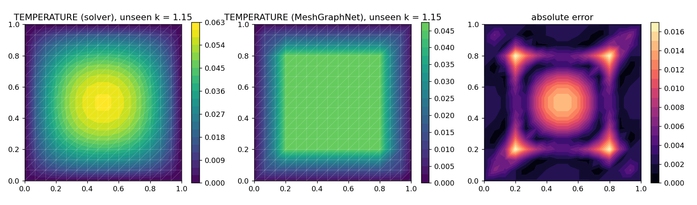
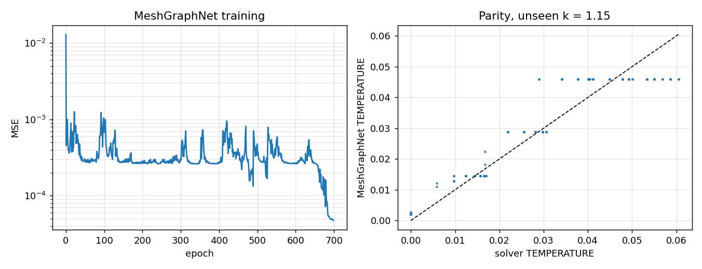
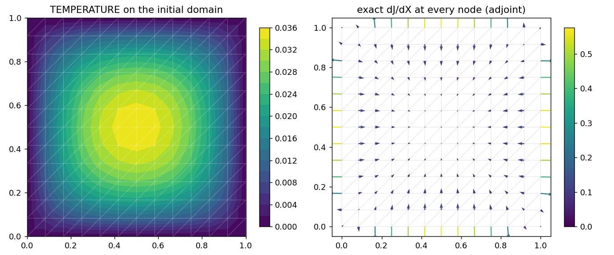
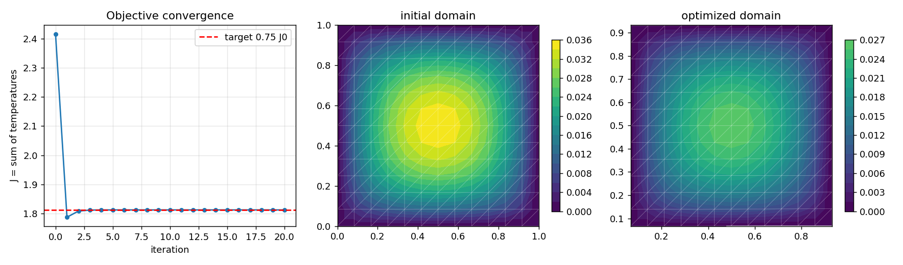
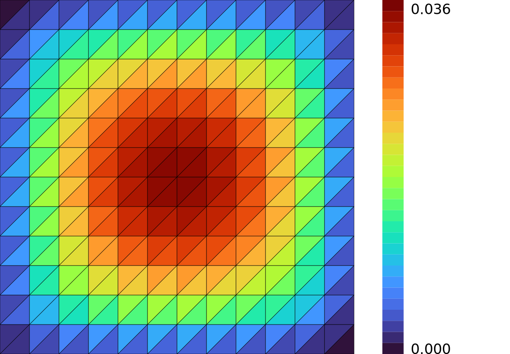
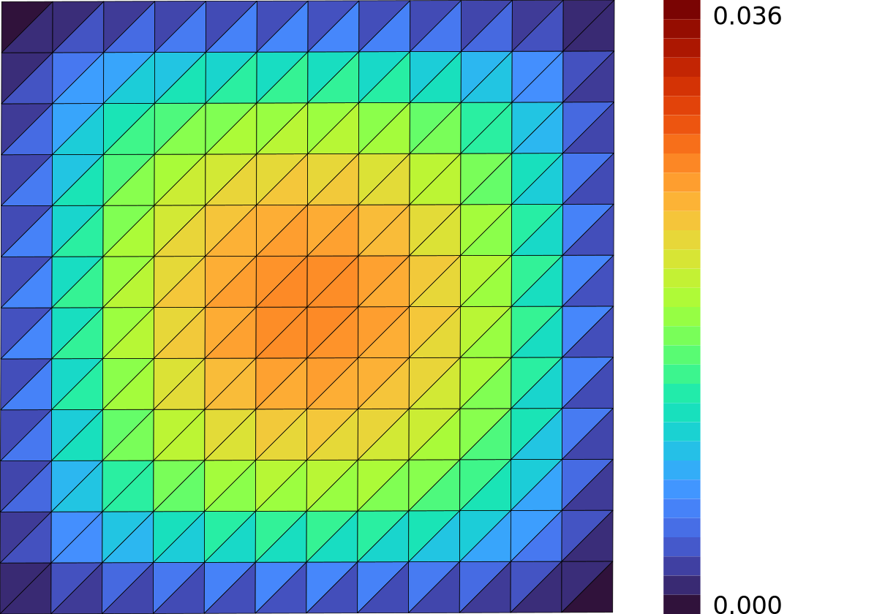

# GNN surrogates and exact shape optimization

**Author:** [Vicente Mataix Ferrándiz](https://github.com/loumalouomega)

**Kratos version:** 10.4 (with `PhysicsNeMoApplication`)

**Source files:** [gnn_and_exact_shape_optimization](https://github.com/KratosMultiphysics/Examples/tree/master/physics_nemo_application/use_cases/gnn_and_exact_shape_optimization/source)

**Extra dependencies:** `nvidia-physicsnemo`, `torch`, `torch_geometric`, `torch_scatter`, `matplotlib`, `cairosvg`

## Case Specification

Two complementary halves of ML-augmented simulation, on the same stationary heat-conduction case (−*k*∆*u* = *f* on the unit square, walls clamped):

* **Cheap predictions** (`01_gnn_surrogate.py`): a MeshGraphNet operating directly on the solver's mesh. The graph bridge extracts the mesh's true element-edge graph (bidirectional, relative-position edge features — MeshGraphNet's convention), so nothing is resampled onto a grid and the identical machinery applies to unstructured meshes. Trained on a 12-point conductivity sweep, deployed on an unseen conductivity through `GraphInferenceProcess` — the gather/predict/scatter loop of a solver-coupled deployment.

* **Exact derivatives** (`02_exact_shape_gradients.py` and the narrative notebook [`shape_optimization.ipynb`](source/shape_optimization.ipynb)): no surrogate anywhere. For *J* = Σ*T*, the adjoint method through the solver's **own assembled tangent** (`differentiable_residual.TangentAssembler` + `sensitivity_utils.ComputeShapeSensitivityField`) yields d*J*/d*X* at every node for one linear solve; `ComputeControlSensitivities` back-propagates that field through a differentiable free-form-deformation lattice to 8 design variables; 20 gradient-descent iterations drive *J* to 75 % of its initial value.

## Results

### The MeshGraphNet on an unseen conductivity

RMSE 5.8·10⁻³ against a field peaking at 6.1·10⁻² (~10 % relative — a small demonstration network; capacity and sweep density are the levers):

  

  

### The exact sensitivity field

d*J*/d*X* at every node, from the adjoint — the arrows point where moving material raises the integrated temperature, and their pattern (inward from the cold walls) is what the optimizer will exploit:

  

### Verification, then optimization

The FFD chain rule is checked against **re-solved central finite differences** — a fresh PDE solve at each perturbed lattice control, the most expensive and most convincing comparison available:

| lattice entry | chain rule | re-solve FD | relative difference |
|---|---|---|---|
| (1, 0, 0, 0) | +6.00630469·10⁻¹ | +6.00630468·10⁻¹ | 7.0·10⁻¹⁰ |
| (0, 1, 0, 1) | +6.00630469·10⁻¹ | +6.00630468·10⁻¹ | 5.7·10⁻¹⁰ |
| (1, 1, 0, 0) | +5.79473079·10⁻¹ | +5.79473079·10⁻¹ | 4.0·10⁻¹⁰ |

Gradient descent on the lattice then reaches the target **exactly** (*J*: 2.416546 → 1.812410, target 1.812410) in about two iterations, the rest polishing; the domain contracts around the heat source:

  

The notebook ends with the practical caveat: for larger deformations, `mesh_bridge.deformation` provides mesh-quality energies (including an inversion barrier) to keep an optimizer from tearing the mesh.

## Mesh (via meshio++)

The initial and shape-optimized domains, colored by TEMPERATURE, rendered by [meshio++](https://github.com/KratosMultiphysics/meshioplusplus)'s SVG writer directly on the FFD-deformed mesh and rasterized to PNG for the embed (`source/03_mesh_svg.py`):

  
  

## References

- Pfaff et al., *Learning Mesh-Based Simulation with Graph Networks*, ICLR 2021. [arXiv:2010.03409](https://arxiv.org/abs/2010.03409)
- [PhysicsNeMoApplication documentation](https://kratosmultiphysics.github.io/Kratos/pages/Applications/PhysicsNeMo_Application/General/Overview.html)
