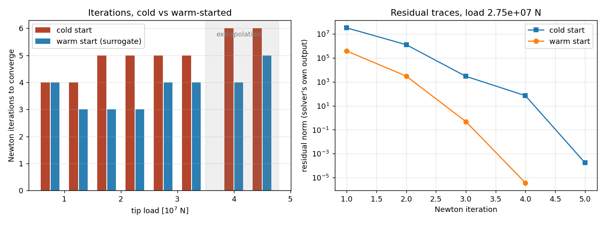
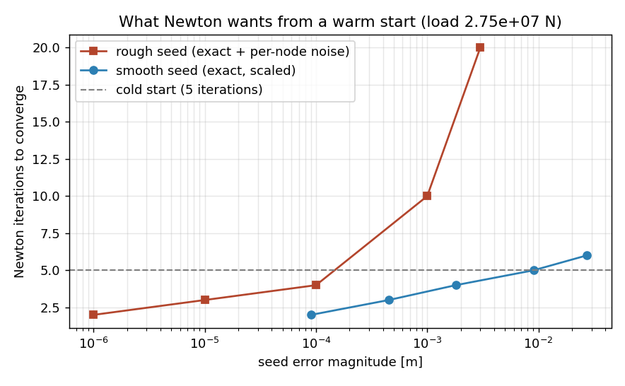
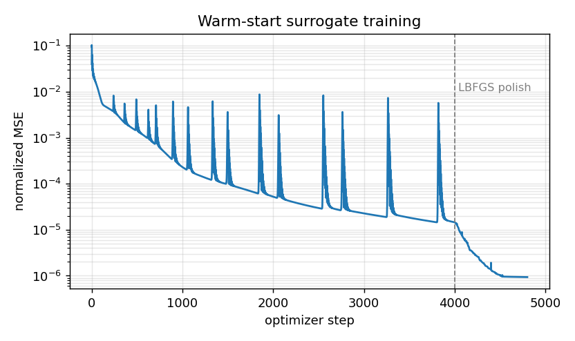
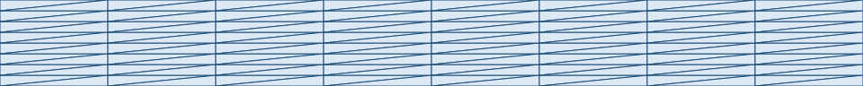
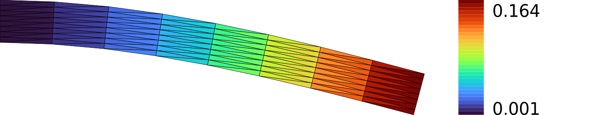

# Hybrid initialization — a surrogate accelerating Newton

**Author:** [Vicente Mataix Ferrándiz](https://github.com/loumalouomega)

**Kratos version:** 10.4 (with `PhysicsNeMoApplication`)

**Source files:** [hybrid_initialization](https://github.com/KratosMultiphysics/Examples/tree/master/physics_nemo_application/use_cases/hybrid_initialization/source)

**Extra dependencies:** `torch`, `matplotlib`, `cairosvg`

## Case Specification

Every other case in this collection uses the surrogate *instead of* the solver or *after* it. This one uses it to make the **solver itself cheaper**: `HybridInitializationProcess` runs one forward pass in `ExecuteBeforeSolutionLoop` and writes the predicted displacement field into the solution-step variables, so Newton–Raphson starts from the prediction instead of zero — the hybrid-initialization idea popularized by NVIDIA's `physicsnemo-cfd`, applied to solid mechanics.

The problem is a geometrically nonlinear cantilever (`TotalLagrangianElement2D3N`, plane strain, tip loads up to 4.5·10⁷ N — tip deflections up to 0.27 m on a 1 m strip). Four solves at training loads teach an MLP (x, y, load) → (uₓ, u_y); eight *unseen* loads are then solved twice each — cold and warm-started — and the solver's own `NL_ITERATION_NUMBER` is compared. The warm start is attached the way any Kratos process is attached, through the `processes` list of the `ProjectParameters`.

Three findings shaped the example and are pinned in the scripts:

* **Newton rewards smooth accuracy, not closeness.** The seed-quality experiment (exact solution + controlled perturbations) shows a *rough* seed 100× closer to the solution than zero takes **more** iterations than a cold start — per-node noise carries huge high-frequency strain residual. An Adam-only fit (RMSE ≈ 9·10⁻⁴ m) lost iterations; the LBFGS-polished fit (1.3·10⁻⁴ m) wins everywhere.
* **The convergence target must be absolute.** A relative residual criterion normalizes by the initial residual — exactly the thing the warm start shrinks — so the better the warm start, the harsher its target. With the stock relative criterion the warm runs saved nothing.
* **A value written to a fixed DOF becomes its Dirichlet value.** The process writes all nodes, clamp included; the clamp is re-imposed after the warm start.

`01_train_surrogate.py` (4 solves + Adam then LBFGS, ~1 min); `02_accelerate_newton.py` (8×2 solves, residual traces, seed-quality experiment, ~1 min).

## Results

Across the six interpolation loads the warm start saves **7 of 28 Newton iterations (25 %)**, and keeps saving under extrapolation beyond the training range (6 → 4 at 4.0·10⁷ N, 6 → 5 at 4.5·10⁷ N). The two runs agree to a tip-deflection gap below **5·10⁻¹⁰ m** — the warm start changes the path to the solution, never the solution. The residual traces (the solver's own `RESIDUAL CRITERION` output, captured verbatim) show the warm run starting two orders of magnitude lower and staying ahead:

  

What Newton wants from a warm start — rough seeds (exact + per-node noise) blow past the cold baseline while smooth seeds stay cheap at 60× the error. This is why the surrogate is polished with LBFGS instead of stopping where Adam stalls:

  

  

An honest accounting note: at this problem size (81 nodes) the checkpoint load and forward pass cost more wall-clock than the saved iterations return — the measured quantity here is iterations, which is what transfers to problem sizes where a Newton iteration costs minutes and a forward pass stays at milliseconds.

## Mesh (via meshio++)

The real `TotalLagrangianElement2D3N` mesh, undeformed and at the converged deformed configuration (colored by displacement magnitude), rendered by [meshio++](https://github.com/KratosMultiphysics/meshioplusplus)'s SVG writer directly from the solved model part and rasterized to PNG for the embed — `source/03_mesh_svg.py`:

  
  

## References

- NVIDIA `physicsnemo-cfd` — hybrid initialization tools (the recipe this process implements for Kratos solves). [github.com/NVIDIA/physicsnemo-cfd](https://github.com/NVIDIA/physicsnemo-cfd)
- [PhysicsNeMoApplication documentation](https://kratosmultiphysics.github.io/Kratos/pages/Applications/PhysicsNeMo_Application/General/Overview.html)
