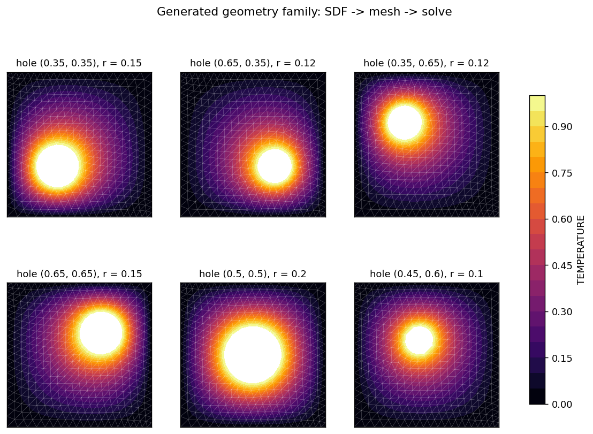
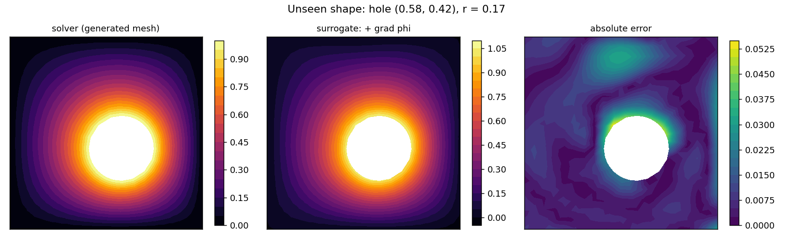
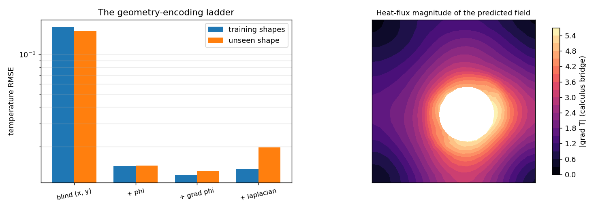
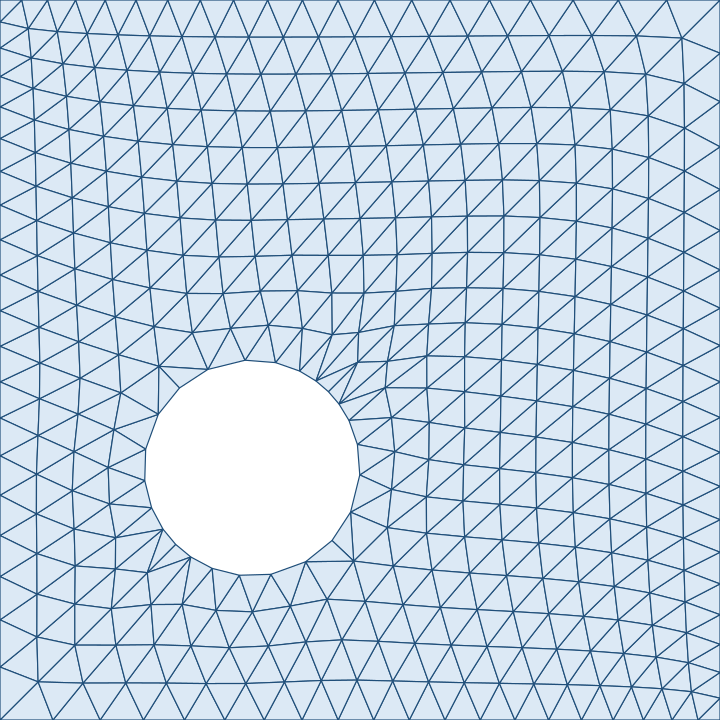
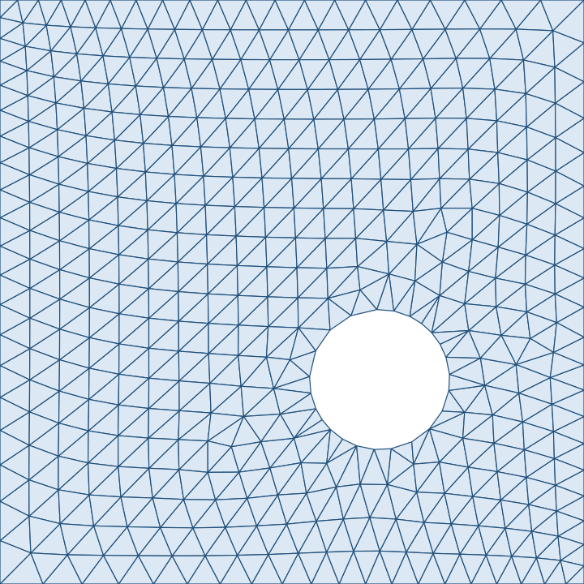
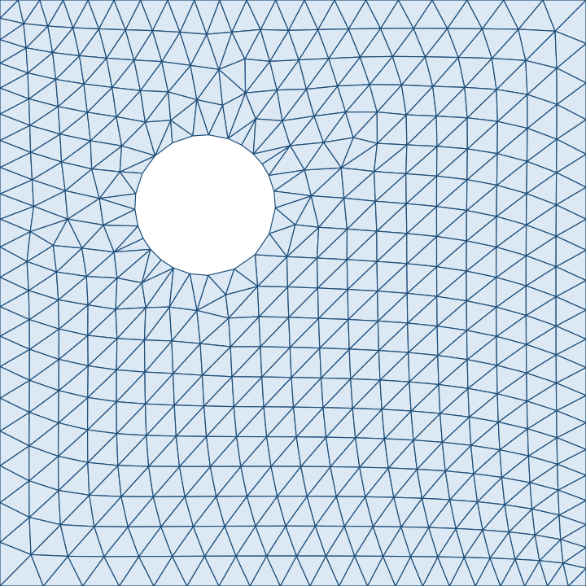
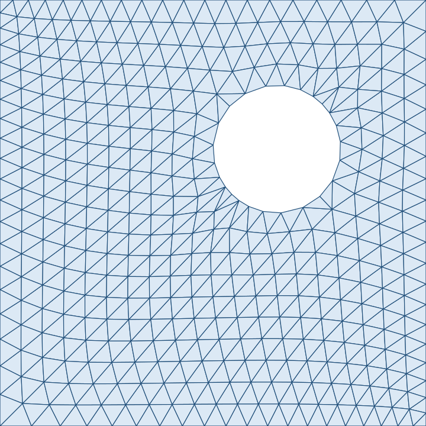
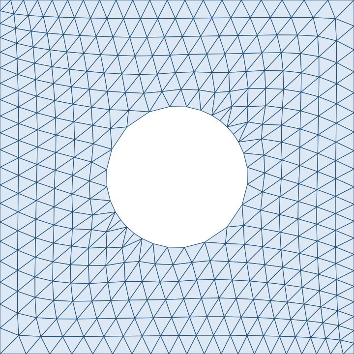
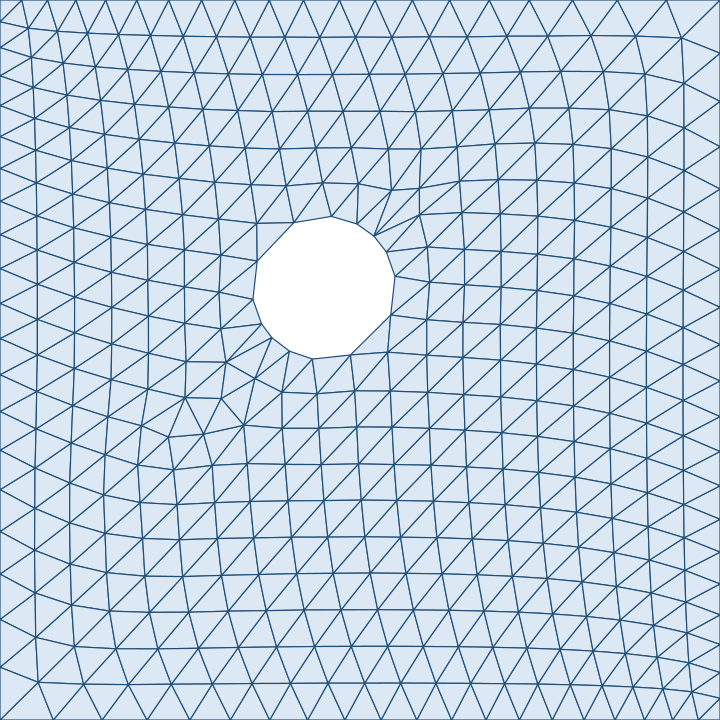
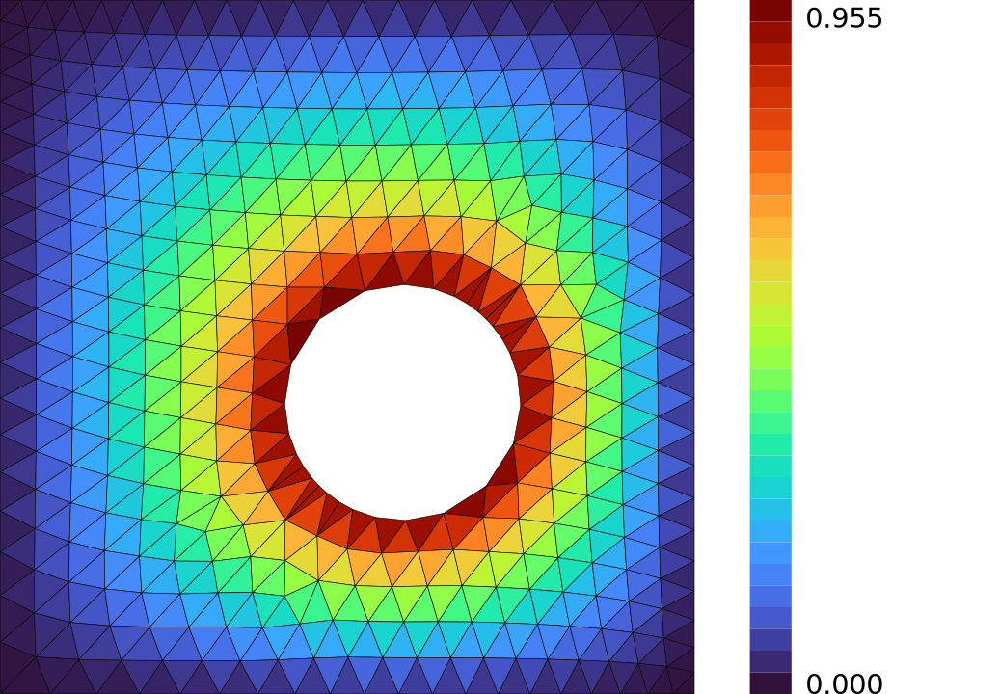

# Implicit geometry — meshes from math, surrogates from distance

**Author:** [Vicente Mataix Ferrándiz](https://github.com/loumalouomega)

**Kratos version:** 10.4 (with `PhysicsNeMoApplication`)

**Source files:** [implicit_geometry_sdf_surrogate](https://github.com/KratosMultiphysics/Examples/tree/master/physics_nemo_application/use_cases/implicit_geometry_sdf_surrogate/source)

**Extra dependencies:** `nvidia-physicsnemo` (>= 2.2), `torch`, `matplotlib`, `cairosvg`

## Case Specification

No mesher input file exists in this example. The geometry is a **signed distance function** — a unit box minus a disc, composed from physicsnemo's differentiable SDF primitives (`mesh_bridge.generate.SdfPrimitives`) — and `GenerateImplicitDomain` + `PopulateModelPartFromMesh` turn it into a solvable Kratos model part (~400 nodes, 0.2 s per shape). The hole boundary is held at T = 1, the outer square at T = 0, and `ConvectionDiffusionApplication`'s stationary solver produces the reference fields. Boundary selection exploits the generator's guarantee that boundary nodes land *exactly* on the zero level set.

Six hole positions/radii form the training family; the surrogate question is **how to show a network the geometry**. Four identical MLPs are trained on the pooled nodal data, differing only in their inputs — a ladder of encodings computed entirely by autograd on the SDF (the primitives are differentiable closures):

| encoding | training RMSE | unseen-shape RMSE |
|---|---|---|
| blind (x, y) | 1.6·10⁻¹ | 1.5·10⁻¹ |
| + φ (distance value) | 1.4·10⁻² | 1.4·10⁻² |
| + ∇φ (direction to the hole) | **1.2·10⁻²** | **1.3·10⁻²** |
| + Δφ (curvature, the full 2-jet) | 1.3·10⁻² | 2.0·10⁻² |

Two details the scripts pin: the jet is taken on the *hole's* SDF, not the composed shape — min/max combinators have kinks whose second derivatives autograd NaNs on (measured, and the box is common to the family anyway); and the deployment closes with `calculus_bridge.ComputeNodalDerivatives` turning the *predicted* field into a heat-flux magnitude on the generated triangles — the same physics diagnostic, no solver assembly.

`01_generate_and_train.py` (6 generate+solve + 4 trainings, ~2 min); `02_predict_unseen_shape.py` (unseen generate+solve, ladder comparison, flux, under a minute).

## Results

The training family, exactly as generated — every panel a different mesh topology from the same five lines of SDF math:

  

On a shape none of the models saw (hole at (0.58, 0.42), r = 0.17), the geometry-blind net is 10× worse than every SDF encoding — its hole never moved. The distance *value* does most of the work (12× drop), the *gradient* adds a little, and the full 2-jet **overfits** at this data size — the honest shape of the ladder, kept as measured:

  

  

## Mesh gallery (via meshio++)

The six generated meshes, rendered by [meshio++](https://github.com/KratosMultiphysics/meshioplusplus)'s SVG writer and rasterized to PNG for the embed — every triangle in these panels is exactly the one the solver assembled:

  
  
  
   
  
  
  

And the unseen deployment shape, field-colored directly on the generated triangulation:

  

`source/03_mesh_gallery_svg.py` regenerates these from the stage 1/2 artifacts.

## References

- physicsnemo mesh generation (implicit domains, SDF primitives). [github.com/NVIDIA/physicsnemo](https://github.com/NVIDIA/physicsnemo)
- [PhysicsNeMoApplication documentation — Mesh Bridge](https://kratosmultiphysics.github.io/Kratos/pages/Applications/PhysicsNeMo_Application/General/Overview.html)
