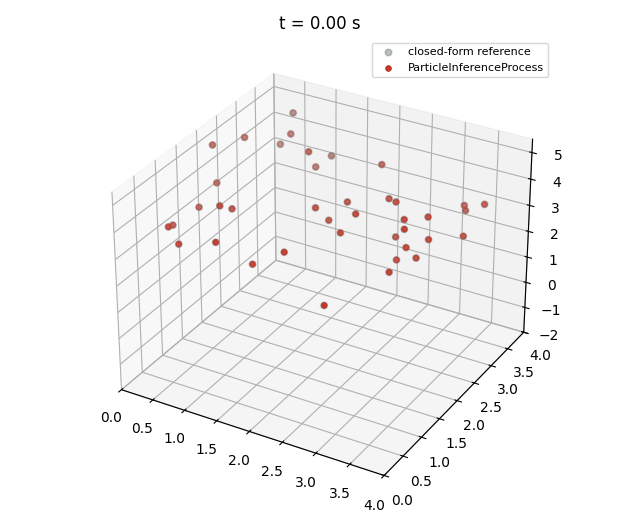
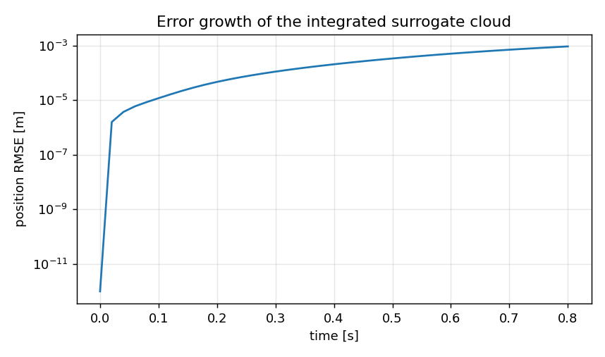

# Lagrangian particle surrogate

**Author:** [Vicente Mataix Ferrándiz](https://github.com/loumalouomega)

**Kratos version:** 10.4 (with `PhysicsNeMoApplication`)

**Source files:** [lagrangian_particle_surrogate](https://github.com/KratosMultiphysics/Examples/tree/master/physics_nemo_application/use_cases/lagrangian_particle_surrogate/source)

**Extra dependencies:** `nvidia-physicsnemo`, `torch`, `matplotlib`

## Case Specification

New physics for these examples: **no mesh at all**. A cloud of particles falls under gravity with linear drag (*a* = *g* − *c v*, closed-form comparable); a model learns the per-particle acceleration from a velocity window (`CreateParticleTrajectoryDataset`, the Learning-to-Simulate layout), and `ParticleInferenceProcess` deploys it — building the radius-proximity graph each step through `particle_bridge`, running the model, and integrating the predicted acceleration into velocities and **node positions** (semi-implicit Euler; the model part genuinely moves).

The governance detail demonstrated is the **normalization card**: the model is trained to predict *standardized* accelerations, and the checkpoint's card (`"output_normalization"`) is what de-normalizes at deployment. The process integrates its output *twice* — `v += dt·a`, then `x += dt·v` — so a missing de-normalization compounds straight into positions.

**A sharp edge found while building this** (kept in the script's comments): `CreateParticleTrajectoryDataset(normalize=True)` standardizes the *features* as well as the targets, but the process feeds the model **raw velocities** at deployment — a model trained that way receives out-of-distribution inputs and drifted to 18 % position error here. The working flow is raw features + hand-standardized targets + the card, which the script implements.

## Results

Deployed on an unseen cloud for 40 steps, the process-integrated positions track the closed form to a final RMSE of **9.2·10⁻⁴ m over a 2.84 m mean drop** (~0.03 %) — in the animation the surrogate points sit exactly on the reference:

  

  

## References

- Sanchez-Gonzalez et al., *Learning to Simulate Complex Physics with Graph Networks*, ICML 2020. [arXiv:2002.09405](https://arxiv.org/abs/2002.09405)
- [PhysicsNeMoApplication documentation — Particle Methods](https://kratosmultiphysics.github.io/Kratos/pages/Applications/PhysicsNeMo_Application/Particle_Methods/Particle_Methods.html)
