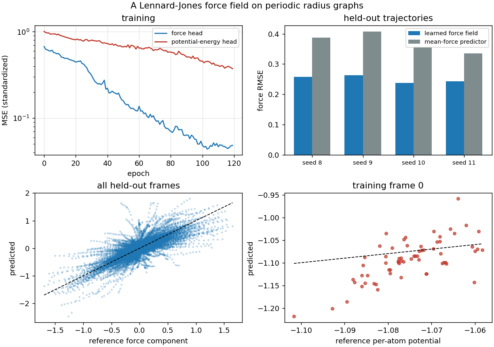
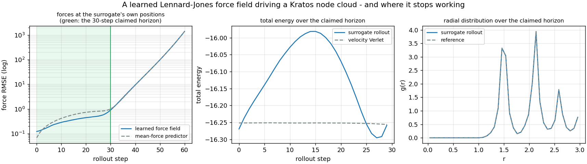
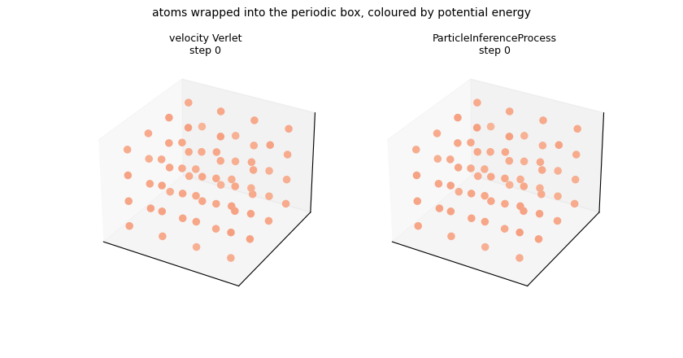

# Lennard-Jones molecular dynamics — a learned force field in a periodic box

**Author:** [Vicente Mataix Ferrándiz](https://github.com/loumalouomega)

**Kratos version:** 10.4 (with `PhysicsNeMoApplication`)

**Source files:** [lennard_jones_md](https://github.com/KratosMultiphysics/Examples/tree/master/physics_nemo_application/use_cases/lennard_jones_md/source)

**Extra dependencies:** `nvidia-physicsnemo`, `torch`, `torch_geometric`, `torch_scatter`, `scipy`, `matplotlib`, `pillow`

## Case Specification

Molecular dynamics is the Lagrangian particle problem at its purest: **no mesh, no persistent connectivity**, interactions that exist only inside a cutoff radius, and a **periodic box** in which the two nearest atoms may sit on opposite sides of the domain. NVIDIA's own molecular-dynamics example trains the generic `MeshGraphNet` on (positions → forces) frames — no molecular architecture exists upstream and none is needed. What this bridge had to grow was the **minimum-image neighbour search**, which is `particle_bridge`'s `"box_size"`: with it, a pair 0.1 apart *through* the boundary of a box of 1.0 is a neighbour at distance 0.1, and the edge vector is the short one; without it they are 0.9 apart and not neighbours at all.

The data comes from `utilities.lennard_jones_reference`, a numpy-only velocity-Verlet integrator in reduced units (no torch, no physicsnemo — it is a reference, not a model). It carries the fact the whole recipe rests on: **velocity Verlet *is* the Störmer-Verlet recurrence**, so the central-difference acceleration targets `CreateParticleTrajectoryDataset` builds are the integrator's own forces to round-off — measured here at **3.0·10⁻¹¹**. These are labels with no discretization error in them.

Two `MeshGraphNet` heads are trained on the periodic radius graph of each frame (64 atoms, ~1150 directed edges, **18 neighbours per atom** at the usual 2.5σ cutoff): per-atom **force** and per-atom **potential energy**, the two halves of a learned force field. The force model is then saved with **both** normalization halves in its model card, which is what lets `ParticleInferenceProcess` standardize the raw velocity history it gathers *and* de-normalize the acceleration it integrates. That matters more here than anywhere else in these examples, because the process integrates its output **twice** — `v += dt·a`, then `x += dt·v` — so a left-normalized prediction compounds straight into node positions.

**The modelling lesson, which cost this case a rewrite.** The atoms start on a lattice and melt into a liquid. Once they do, pairs come close and the r⁻¹³ repulsive core produces forces one to two orders of magnitude larger than the typical ones. Measured over ten seeds, the largest force anywhere in the trajectory is **2.0 at 20 steps, 32.3 at 26, and 81.3 at 32**. Those spikes dominate a mean-squared loss and a small network fits none of them: trained across the melting onset, the loss sits at its predict-zero value and the model **loses to its own baseline** (measured: RMSE 4.84 against a baseline of 4.39). So the recipe is pinned to the near-equilibrium window and the width of that window is stated rather than hidden. A force field for the repulsive core is a different, and much larger, model.

**How a rollout is graded honestly.** Molecular dynamics is chaotic: two trajectories differing by 10⁻⁸ separate exponentially, so position error against the reference measures Lyapunov time, not the quality of a force field. `02_rollout_in_the_box.py` therefore recomputes the reference forces **at the surrogate's own positions** every step and compares them against the mean-force predictor at those same configurations, with total energy and the radial distribution function reported alongside as structural checks. The asserted claim is made over the window the model was actually trained in — a boundary fixed by the training trajectory length, not by where the curves happen to cross — and the degradation beyond it is plotted rather than cropped out.

* `01_train_force_field.py` — trajectories, dataset, both heads, the card, held-out evaluation (about a minute on CPU);
* `02_rollout_in_the_box.py` — 30 self-driven steps through `ParticleInferenceProcess`, which rebuilds the periodic graph from the current node positions every step (seconds).

## Results

**The force field generalizes to trajectories it never saw.** Trained on eight 20-step trajectories (136 samples, 1152 directed edges per frame), the force head's standardized loss falls **0.674 → 0.048**, and on four held-out trajectories the force RMSE beats the mean-force predictor on every one — **0.2580/0.3878 (1.50x)**, **0.2631/0.4070 (1.55x)**, **0.2374/0.3566 (1.50x)**, **0.2426/0.3351 (1.38x)**, aggregate **0.2503 against 0.3716 (1.48x)**. That is the seeded, asserted claim, and it is made over four trajectories rather than one precisely so a good average cannot hide a bad case. About a minute of CPU for the whole script (2m54s including the second head).

The **potential-energy head is the weaker half and the figure shows it**: its loss falls 1.009 → 0.374, but the parity plot is visibly loose — the predictions spread wider than the reference range. It is included because force *and* energy are the two halves of a force field, not because this one is accurate.

  

**Deployed, it drives the cloud for about thirty steps and then it doesn't.** Over the claimed 30-step horizon the process-driven rollout keeps a force RMSE of **0.3634 against the mean-force predictor's 0.5365 (1.48x)**, graded at the surrogate's own positions; total energy drifts **6.79·10⁻⁴** against the symplectic reference's **2.73·10⁻⁴** (about **2x**, which is what an explicit semi-implicit integrator with a learned force costs), and the radial distribution function is essentially indistinguishable from the reference's — the liquid structure survives.

Beyond that horizon it diverges, and the left panel is plotted on a log axis to show it. The mean force error per 10-step block runs **0.19, 0.36, 0.54, then 3.2, 33, 409, 1.4·10³**: the self-driven trajectory goes numerically unstable, atoms are driven together and the r⁻¹³ core does the rest. Watch what that does to the metric — past step 30 the ratio to the baseline returns to almost exactly **1.00**, not because the model has become as good as predicting the mean force, but because both numbers are saturated by the same enormous reference forces. A ratio can keep reporting a healthy value long after the thing it measures has stopped meaning anything.

  

  

This is the ordinary failure mode of an autoregressive learned force field with no thermostat or stability mechanism, and it is why the claim is stated with a horizon attached rather than as "it works".

## References

- Sanchez-Gonzalez et al., *Learning to Simulate Complex Physics with Graph Networks*, ICML 2020. [arXiv:2002.09405](https://arxiv.org/abs/2002.09405) — the graph-network simulator this deployment path implements.
- Frenkel and Smit, *Understanding Molecular Simulation*, 2nd ed. — velocity Verlet, the minimum-image convention and the shifted Lennard-Jones potential in reduced units.
- NVIDIA PhysicsNeMo, `examples/molecular_dynamics/lennard_jones` — the upstream recipe, which likewise uses the generic `MeshGraphNet`.
- [PhysicsNeMoApplication documentation — Particle Methods](https://kratosmultiphysics.github.io/Kratos/pages/Applications/PhysicsNeMo_Application/Particle_Methods/Particle_Methods.html)
