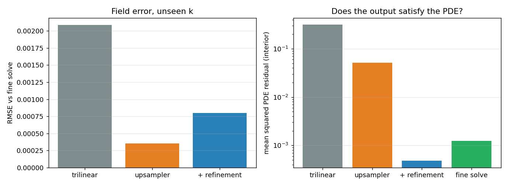
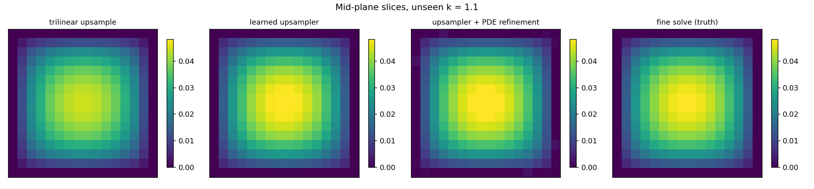

# Physics-refined superresolution

**Author:** [Vicente Mataix Ferrándiz](https://github.com/loumalouomega)

**Kratos version:** 10.4 (with `PhysicsNeMoApplication`)

**Source files:** [physics_informed_superresolution](https://github.com/KratosMultiphysics/Examples/tree/master/physics_nemo_application/use_cases/physics_informed_superresolution/source)

**Extra dependencies:** `nvidia-physicsnemo`, `torch`, `matplotlib`

## Case Specification

Superresolution graded by the **PDE itself**. The physics is a genuinely 3D case — stationary heat conduction −*k*∆*u* = *f* on a tet-filled unit cube (`ConvectionDiffusionApplication` at `domain_size: 3`), solved on an 8³-node coarse mesh and a 16³-node fine mesh over a conductivity sweep.

A learned upsampler (trilinear + zero-initialized convolutional correction, the residual-over-baseline design of the [transient superresolution example](../transient_superresolution/README.md), here in 3D) maps coarse-solve grids to fine-solve grids. Trained on pixels it beats trilinear 6× in RMSE — and its output is still mediocre *physics*: finite-difference second derivatives amplify exactly the high-frequency error a pixel metric cannot see, so its PDE residual sits 40× above the fine solve's own.

The demonstrated remedy is **refinement, not retraining**: `physics_informed.MakePhysicsLossTerm` (`builtin:diffusion`, `grad_method: "finite_difference"`, `boundary_trim: 1`) is a differentiable residual, and minimizing

```
residual²(v) + λ ‖v − v_SR‖²
```

over the output field *v* is a nearly quadratic problem that 300 Adam steps solve.

Two findings from building this example are part of its documentation:

* **The residual metric needs `boundary_trim`.** The upstream finite-difference stencils are wrong on the outermost shell of a non-periodic field — a field whose interior residual is FD-exactly zero still averaged O(1) over the full grid. The `boundary_trim` setting (added to the application when this example exposed the problem) drops that shell; with it, a manufactured quadratic scores 10⁻¹² and a doubled field scores exactly *f*².
* **The same term as a *training* loss is a negative result.** Weighting the residual into the upsampler's training objective degraded both metrics at every weight tried (10⁻⁵–10⁻³): the stiff second-derivative objective demands more smoothness than the small network can represent and conflicts with the data fit. Refinement side-steps this by optimizing the field, not the weights.

## Results

On an unseen conductivity (*k* = 1.1):

| field | RMSE vs fine solve | PDE residual (interior) |
|---|---|---|
| trilinear upsample | 2.09·10⁻³ | 3.16·10⁻¹ |
| learned upsampler | **3.51·10⁻⁴** | 5.10·10⁻² |
| upsampler + PDE refinement | 7.97·10⁻⁴ | **4.82·10⁻⁴** |
| fine solve (truth) | — | 1.24·10⁻³ |

The refined field satisfies the PDE **better than the fine solve itself** (the FEM solution carries its own discretization error against the FD operator), at a small pixel cost against the already-excellent upsampler — the anchor weight λ sets that trade.

<p align="center">
  
</p>

<p align="center">
  
</p>

## References

- Raissi et al., *Physics-Informed Neural Networks*. [arXiv:1711.10561](https://arxiv.org/abs/1711.10561)
- [PhysicsNeMoApplication documentation — Physics-Informed](https://kratosmultiphysics.github.io/Kratos/pages/Applications/PhysicsNeMo_Application/Physics_Informed/Physics_Informed.html)
