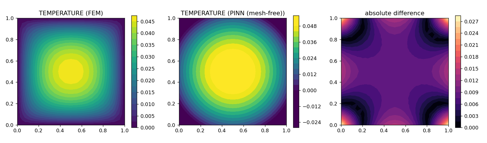
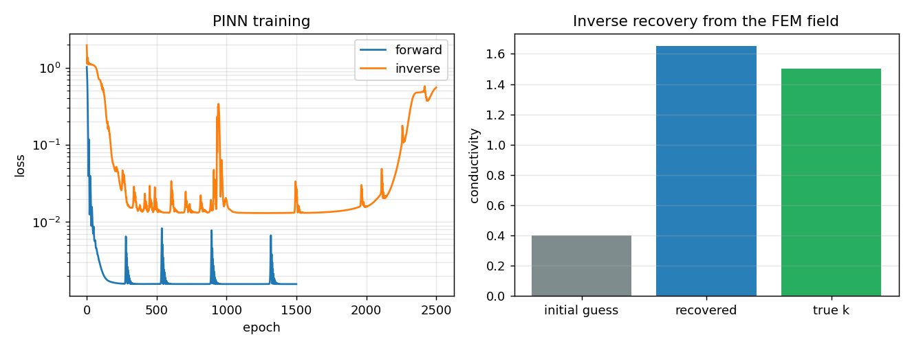

# PINN forward solve and inverse coefficient recovery

**Author:** [Vicente Mataix Ferrándiz](https://github.com/loumalouomega)

**Kratos version:** 10.4 (with `PhysicsNeMoApplication`)

**Source files:** [pinn_forward_and_inverse](https://github.com/KratosMultiphysics/Examples/tree/master/physics_nemo_application/use_cases/pinn_forward_and_inverse/source)

**Extra dependencies:** `nvidia-physicsnemo` (with its bundled `physicsnemo.sym`), `torch`, `matplotlib`

## Case Specification

`PinnSolveProcess` solves the PDE with a neural network and **no mesh assembly**: the collocation points are the model part's nodes, the boundary data its fixed DOFs. Both modes are demonstrated against `ConvectionDiffusionApplication` ground truth on the thermal plate (−*k*∆*u* = *f*, walls clamped, *k* = 1.5):

1. **Forward**: from the Dirichlet data alone, the PINN fills in the interior by minimizing the PDE residual at the nodes — compared against the FEM solution of the same BVP.
2. **Inverse**: the conductivity becomes a *trainable scalar* (`"mode": "inverse"`, `inverse_parameters`), recovered from the FEM temperature field as observations, starting from a 4×-wrong initial guess and read back from `process.inverse_values`.

**The finding this example produced** (fixed in the application while building it): the built-in diffusion PDE was hard-coded 3D. On a planar collocation cloud — which is what any 2D Kratos model part gives a PINN — *u₂₂* in the unconstrained *z* direction is a free knob, and the network used it to cancel the source: **the loss converged to 10⁻⁶ while the in-plane amplitude came out at half its true value**. The new `"dim": 2` argument in `pde_arguments` drops the *z*-Laplacian; the scripts use it, and the failure is documented here so nobody re-diagnoses it.

## Results

**Forward** — the PINN reproduces the FEM field with RMSE 8.6·10⁻³ against a field maximum of 4.7·10⁻² (~15–18 %, with a small systematic amplitude overshoot). That accuracy gap *is* the honest story: the PINN trades the mesh and the assembly for an optimization problem, and at this budget the FEM solution remains the reference — which is exactly why the application treats PINNs as one tool among the solver-coupled ones, not a replacement.

  

**Inverse** — from observations of the FEM field and an initial guess of 0.4, the recovered conductivity lands at **1.65 against a true 1.5** (~10 %). Joint optimization of the network and the coefficient is genuinely sensitive to the data/physics weighting (`data_weight`); the scripts document the setting that works and the ones that do not.

  

A related guard worth knowing about: `normalize_coordinates` conditions the network's inputs on non-unit domains, and the application's own regression tests pin that it does **not** change which equation is solved — the PDE is differentiated in physical coordinates either way.

## References

- Raissi, Perdikaris & Karniadakis, *Physics-Informed Neural Networks*, JCP 2019. [arXiv:1711.10561](https://arxiv.org/abs/1711.10561)
- [PhysicsNeMoApplication documentation — Physics-Informed](https://kratosmultiphysics.github.io/Kratos/pages/Applications/PhysicsNeMo_Application/Physics_Informed/Physics_Informed.html)
