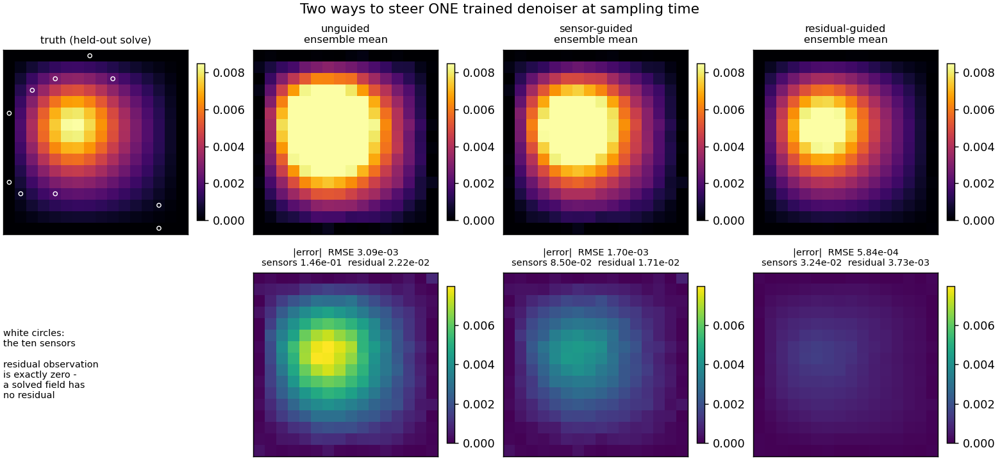
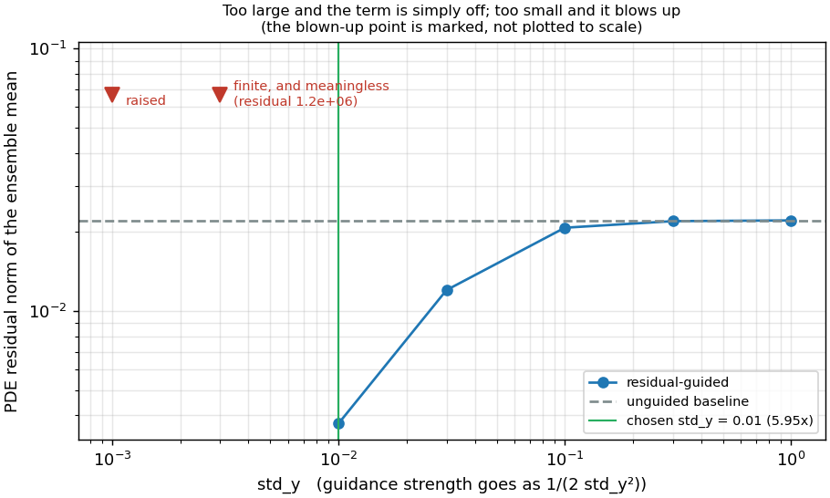
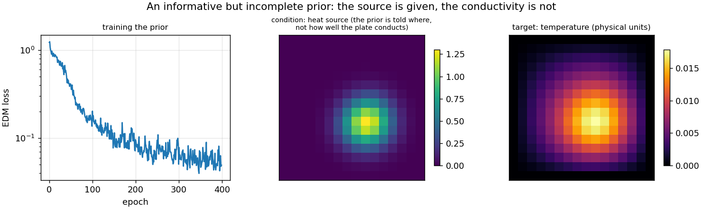

# Residual-guided diffusion — steering a trained denoiser with the solver's own physics

**Author:** [Vicente Mataix Ferrándiz](https://github.com/loumalouomega)

**Kratos version:** 10.4 (with `PhysicsNeMoApplication` and `ConvectionDiffusionApplication`)

**Source files:** [residual_guided_diffusion](https://github.com/KratosMultiphysics/Examples/tree/master/physics_nemo_application/use_cases/residual_guided_diffusion/source)

**Extra dependencies:** `nvidia-physicsnemo`, `torch`, `matplotlib`

## Case Specification

Diffusion posterior sampling steers an **already-trained** generator at sampling time. The guidance term enters the sampler's score rather than the training loss, so one checkpoint can be pointed at different constraints afterwards — the cost is a gradient through the model at every sampling step, and nothing else.

`01_train_prior.py` trains the prior: a conditional diffusion model over solved temperature fields of a unit-square plate, conditioned on the **heat-source field**. It is told where the heat enters and not how well the plate conducts it, so the shape of the answer is determined and its magnitude is not — a real, stateable gap for guidance to fill. (The conductivity plane would have been the obvious condition and is the wrong one: `thermal_plate` gives each case one scalar conductivity, so that plane is flat to **4.4·10⁻¹⁶** and carries a single number. Conditioning on it would have made the comparison below look good for the wrong reason.)

`02_guide_at_sampling_time.py` then samples that same checkpoint three ways:

- **unguided**, as a baseline;
- **`"data_consistency"`**, pulled toward ten sparse sensor readings — the classical inverse problem;
- **`"model_consistency"`**, pulled toward a differentiable forward operator, which here is the **exact discrete FEM residual** assembled by Kratos through `MakeKratosResidualObservationOperator`. The observation is exactly zero, because a field that solves the PDE has no residual. This is the solver's own physics grading the generator.

**`std_y` is the whole ballgame, and getting it wrong is silent in both directions.** It is nominally the observation noise level, but it also sets the guidance strength, which scales as 1/(2·std_y²). Two contracts the case also exercises: the residual operator **writes the trial field into the model part's DOFs** while assembling, so `operator.Restore()` must follow every use — and must run on the **failing** path too, in a `finally`, because the sweep's smallest `std_y` raises inside the sampler, and an exception that escapes before the restore leaves the model part silently modified with nothing to show for it (the script's check that the temperature field comes back bit-identical is exactly what caught that); and the residual is assembled in **physical units**, which is why the operator is handed the card's `"output_normalization"` — the prior trains on fields scaled by ~96 to meet EDM's `sigma_data`, and a residual computed on EDM-scaled values would mean nothing.

## Results

Three ensembles from one checkpoint, on a case the prior never saw, all seeded:

| ensemble | sensor mismatch | PDE residual | field RMSE |
|---|---|---|---|
| unguided | 1.465·10⁻¹ | 2.218·10⁻² | 3.092·10⁻³ |
| sensor-guided | 8.497·10⁻² (**1.72x**) | 1.714·10⁻² | 1.704·10⁻³ |
| residual-guided | **3.237·10⁻²** | **3.725·10⁻³ (5.95x)** | **5.839·10⁻⁴** |

Each guided ensemble beats the unguided one at the thing it is steered toward, and those two margins — 1.72x and 5.95x — are what the script asserts. The result worth pausing on is the third row: **the residual-guided ensemble is best on every column, including the sensors it was never shown.** Ten point measurements constrain the field at ten points; the discrete PDE residual constrains it everywhere, and on this problem that is the stronger information by a factor of five.

  

**The sweep is in the case because an effectively disabled guidance term looks exactly like a working one.** Measured against an unguided residual of 2.2·10⁻²:

| `std_y` | 1.0 | 0.3 | 0.1 | 0.03 | **0.01** | 0.003 | 0.001 |
|---|---|---|---|---|---|---|---|
| residual | 2.216·10⁻² | 2.201·10⁻² | 2.078·10⁻² | 1.202·10⁻² | **3.725·10⁻³** | 1.167·10⁺⁶ | — |
| vs unguided | 1.00x | 1.01x | 1.07x | 1.84x | **5.95x** | blown up | raises |

At `std_y = 1.0` the "guided" ensemble matches the unguided one to four significant figures — yet a naive `guided < unguided` check still passes, by 0.07 %. That is how this case was first written, and it is why the assertion now demands a margin. At the other end, note what sits between working and raising: at **0.003 the sampler returns finite values whose residual is 1.2·10⁺⁶**, and nothing complains. The bridge's guard catches non-finite output at 0.001 with an actionable message; there is a band just above it where the numbers are finite and meaningless. Match `std_y` to the scale of the thing being observed.

  

  

## References

- Chung et al., *Diffusion Posterior Sampling for General Noisy Inverse Problems*, ICLR 2023. [arXiv:2209.14687](https://arxiv.org/abs/2209.14687)
- Karras et al., *Elucidating the Design Space of Diffusion-Based Generative Models* (EDM), NeurIPS 2022. [arXiv:2206.00364](https://arxiv.org/abs/2206.00364) — the `sigma_data` contract the scaling above respects.
- [PhysicsNeMoApplication documentation — Diffusion](https://kratosmultiphysics.github.io/Kratos/pages/Applications/PhysicsNeMo_Application/Diffusion/Diffusion.html)
- [PhysicsNeMoApplication documentation — Physics-Informed](https://kratosmultiphysics.github.io/Kratos/pages/Applications/PhysicsNeMo_Application/Physics_Informed/Physics_Informed.html) — the differentiable residual the model-consistency operator is built on.
