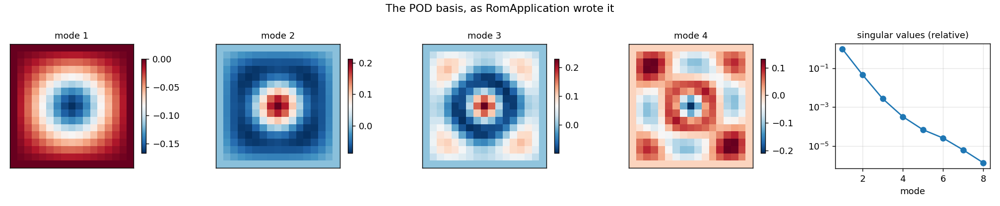
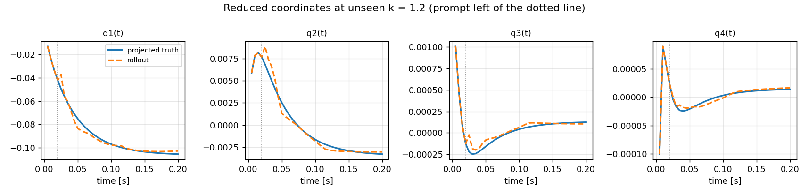
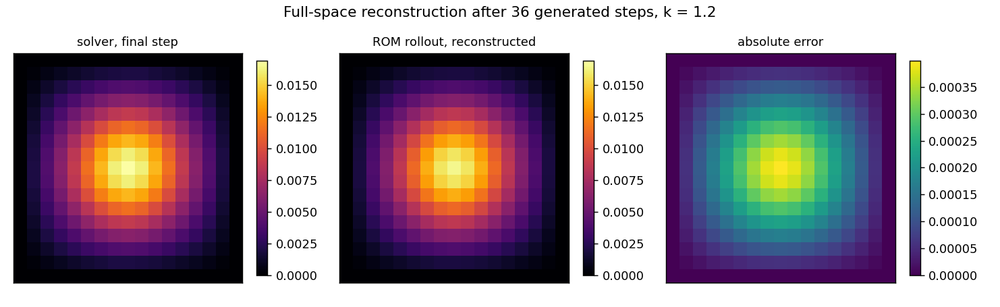
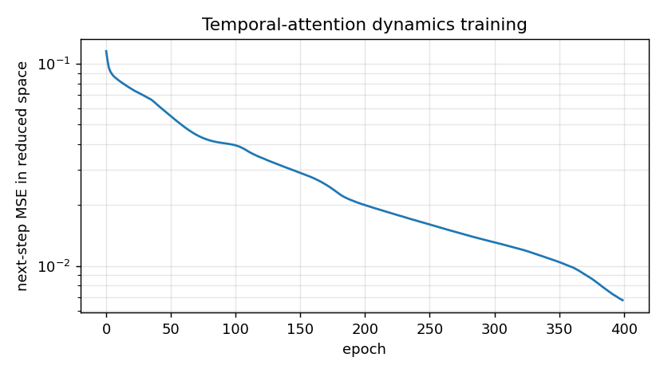
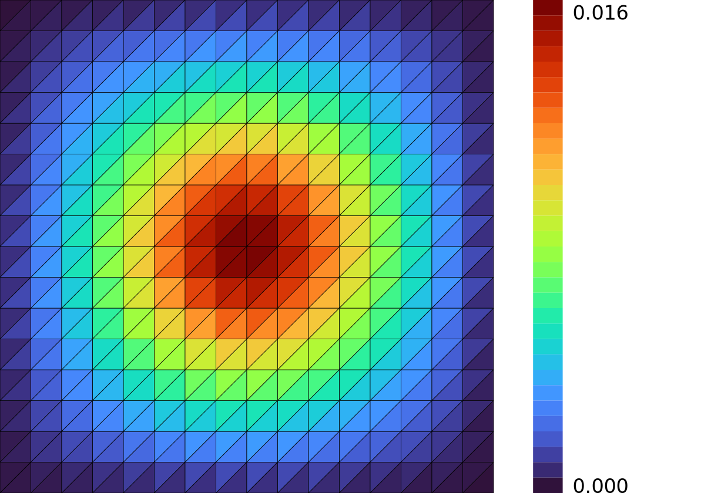

# ROM-space temporal surrogate — dynamics in eight numbers

**Author:** [Vicente Mataix Ferrándiz](https://github.com/loumalouomega)

**Kratos version:** 10.4 (with `PhysicsNeMoApplication` and `RomApplication`)

**Source files:** [rom_temporal_surrogate](https://github.com/KratosMultiphysics/Examples/tree/master/physics_nemo_application/use_cases/rom_temporal_surrogate/source)

**Extra dependencies:** `nvidia-physicsnemo`, `torch`, `matplotlib`, `cairosvg`

## Case Specification

The interoperability example: the POD basis is written by **RomApplication's own `CalculateRomBasisOutputProcess`** (numpy format — `RightBasisMatrix.npy`, `NodeIds.npy`, `RomParameters.json`), fed one snapshot per `PrintOutput()` from four transient thermal solves (k = 0.7, 1.0, 1.5, 2.0; 40 steps each, 289 nodes), exactly as a RomApplication workflow would produce it. `rom_bridge.LoadRomBasis` reads those files back, and from there the pipeline never touches full space again until reconstruction:

* `ProjectToReducedSpace` turns every 289-node state into **8 coefficients** (the SVD truncated at 10⁻⁶ relative singular value; 3 modes already carry 99.9999 % of the energy);
* `rom_temporal.CreateSequenceModel` builds physicsnemo's temporal-attention `Sequence_Model` over those coefficients, conditioned on the conductivity as context; `TrainRomTemporalModel` fits next-step prediction;
* at an **unseen k = 1.2**, `PredictRomTrajectory` is prompted with the first 4 projected states and generates the remaining 36 autoregressively; `ReconstructFromReducedSpace` lifts any step back to the full field.

One lesson recurs from the thermo-mechanical case, now in reduced space: mode 1 carries ~10× the amplitude of mode 2 and ~100× mode 4, and on raw coordinates the loss optimizes mode 1 only — the higher modes rolled out in visibly wrong directions (2.8× worse overall). The coefficients are **per-mode normalized** before training; the scales ship with the checkpoint.

`01_basis_and_dynamics.py` (4 transients + RomApplication SVD + training, ~3 min); `02_rollout_unseen.py` (one transient + rollout + reconstruction, under a minute).

## Results

The basis exactly as RomApplication wrote it — radial mode 1, its harmonics, and the spectrum falling six decades in eight modes:

  

All eight reduced coordinates tracked over the 36 generated steps at the unseen conductivity (four shown; the prompt ends at the dotted line). Rollout-vs-projected-truth RMSE **1.9·10⁻⁴** against a truncation floor of 1.4·10⁻⁹ — the error is all dynamics, none of it basis:

  

Reconstructed to full space after 36 generated steps, the field agrees with the solver to a max nodal error of 4.0·10⁻⁴ against a field max of 1.7·10⁻² (~2 %):

  

  

## Mesh (via meshio++)

The 16×16 structured triangle mesh the whole example is built on — 289 nodes projected to 8 numbers and back — colored by TEMPERATURE at the unseen conductivity's final step, rendered by [meshio++](https://github.com/KratosMultiphysics/meshioplusplus)'s SVG writer and rasterized to PNG for the embed (`source/03_mesh_svg.py`):

  

## References

- physicsnemo `Sequence_Model` (temporal attention over reduced coordinates, transolver/rom family). [github.com/NVIDIA/physicsnemo](https://github.com/NVIDIA/physicsnemo)
- [Kratos RomApplication](https://github.com/KratosMultiphysics/Kratos/tree/master/applications/RomApplication) — `CalculateRomBasisOutputProcess`, the basis producer.
- [PhysicsNeMoApplication documentation](https://kratosmultiphysics.github.io/Kratos/pages/Applications/PhysicsNeMo_Application/General/Overview.html)
