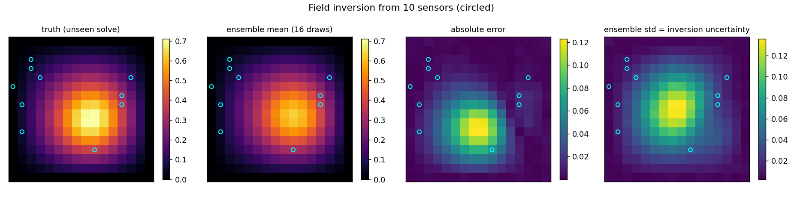
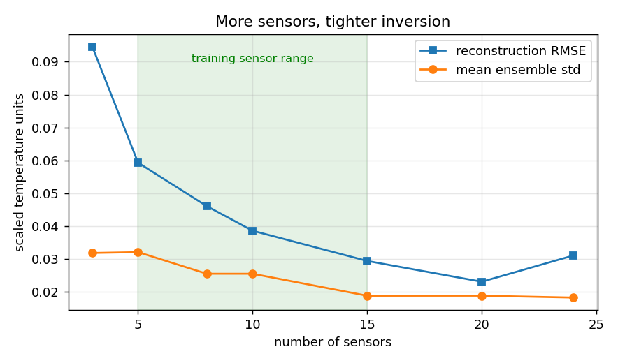
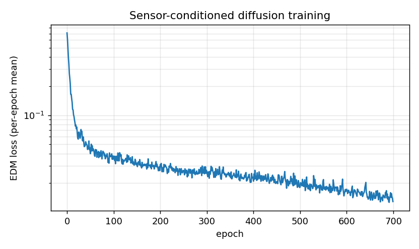

# Sparse-sensor field inversion — what ten sensors can tell you

**Author:** [Vicente Mataix Ferrándiz](https://github.com/loumalouomega)

**Kratos version:** 10.4 (with `PhysicsNeMoApplication`)

**Source files:** [sparse_sensor_inversion](https://github.com/KratosMultiphysics/Examples/tree/master/physics_nemo_application/use_cases/sparse_sensor_inversion/source)

**Extra dependencies:** `nvidia-physicsnemo`, `torch`, `matplotlib`

## Case Specification

The FWI-style recipe the application test-pins (borehole property inversion in `test_corrdiff_recipe.py`), applied to the thermal plate: a conditional diffusion model learns p(full field | sensor readings, mask). Every training sample is one stationary solve sampled on a 16×16 grid; its **condition is two channels** — the field values at a random set of sensor pixels, and the binary mask marking which pixels are sensors. Ninety-six solves, each masked **three independent ways** (mask augmentation — triples the dataset with zero extra solves, and teaches the model that the field is the invariant, the sensor layout is noise), train the same EDM-preconditioned SongUNet denoiser the CorrDiff case uses (`diffusion_utils.TrainDiffusionModel`).

At deployment, `diffusion_utils.GenerateEnsemble` draws 16 full-field samples from ten sensor readings on an unseen case; the **ensemble mean is the reconstruction, the per-pixel ensemble std is the inversion uncertainty**. A sensor-count sweep (3…24, three random layouts each — a single layout is too noisy to trend) re-inverts the same field to show what more sensors buy.

## Results

Ten sensors (circled) reconstruct the field to RMSE **0.035** against a field max of 0.71 — 5 % of the range. The uncertainty panel carries the signature the recipe is built to show: **std 0.019 at the sensors vs 0.033 away from them** — the model is confident where it was told the answer and honest where it had to infer:

  

The sensor-count sweep — both reconstruction error and mean uncertainty fall through the model's training range (5–15 sensors) and keep improving slightly beyond it:

  

  

A measured trap worth keeping: the first version of this example scored one random sensor layout per count, and the curve was not monotone — an unlucky 20-sensor layout scored worse than a lucky 3-sensor one. Averaging three layouts per count (still cheap — no new solves) turned noise into trend.

## References

- The application's `test_corrdiff_recipe.py::TestFwiInversionRecipe` — the layered-earth inversion this recipe is built from.
- [PhysicsNeMoApplication documentation — Diffusion Bridge](https://kratosmultiphysics.github.io/Kratos/pages/Applications/PhysicsNeMo_Application/General/Overview.html)
