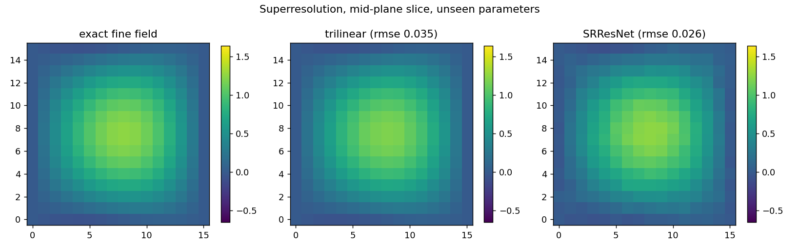
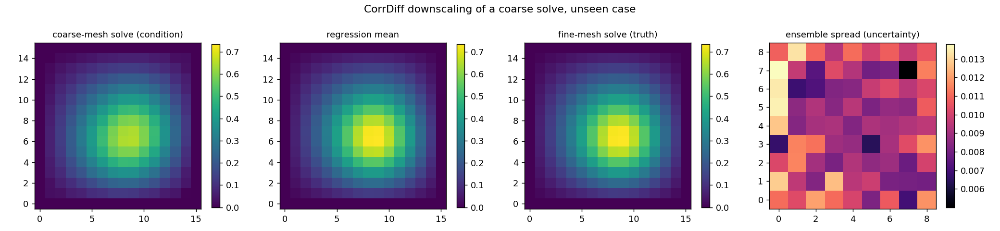

# Superresolution and CorrDiff diffusion downscaling

**Author:** [Vicente Mataix Ferrándiz](https://github.com/loumalouomega)

**Kratos version:** 10.4 (with `PhysicsNeMoApplication`)

**Source files:** [superresolution_and_diffusion](https://github.com/KratosMultiphysics/Examples/tree/master/physics_nemo_application/use_cases/superresolution_and_diffusion/source)

**Extra dependencies:** `nvidia-physicsnemo`, `torch`, `scipy`, `matplotlib`

## Case Specification

Two ways of recovering resolution that a coarse representation lost — one deterministic, one probabilistic with error bars.

**Deterministic superresolution** (`01_superresolution.py`): PhysicsNeMo's SRResNet upsamples 8³ voxel grids to 16³ between two *unrelated* model parts through `SuperResolutionProcess` — sample the coarse part, run the model, scatter onto the fine part's nodes. Trained on 24 realizations of a parametrized smooth 3D field and deployed on unseen parameters, against a trilinear-interpolation baseline.

**CorrDiff diffusion downscaling** (`02_corrdiff_downscaling.py`): here the coarse information is a genuinely **under-resolved solve** — the thermal plate of the other examples solved on an 8×8 mesh, which flattens and spreads the Gaussian hot spot, versus the same case solved on a 32×32 mesh. Both are sampled on a common 16×16 grid (`GridDatasetExportProcess`, 64 solve pairs), so the model corrects real discretization error, not a synthetic blur. CorrDiff's two stages (`TrainCorrDiffPair`): a regression UNet learns the deterministic mean correction; an EDM diffusion model learns the distribution of the **residual** around it. At deployment, `DiffusionInferenceProcess` draws a 16-member ensemble, writing the mean to the output field and the per-node spread to an uncertainty field.

## Results

### SRResNet vs trilinear

On unseen parameters the learned upsampler beats trilinear interpolation (RMSE **0.026 vs 0.035**), most visibly where the field curves fastest:

  

### CorrDiff on a coarse solve it never saw

The regression stage alone cuts the grid RMSE of the coarse condition from **0.022 to 0.003** — visually it restores the peak the 8×8 mesh could not represent. On the nodes, the full CorrDiff ensemble mean improves on the coarse solve (RMSE **0.0088 vs 0.0115**) and — the point of the diffusion stage — its ensemble spread (**0.0096**) prices its own actual error (**0.0088**): the error bar is honest.

  

A tuning note recorded from building this example: with the diffusion stage undertrained (150 epochs), the ensemble mean was *worse* than the coarse input — the residual sampler's noise drowned the tiny residual signal — while the spread still tracked the (larger) error. The residual stage needs to be trained until its loss is small against the residual's own scale before the ensemble mean is competitive; 500 epochs suffice here.

## References

- Mardani et al., *Residual Diffusion Modeling for Km-scale Atmospheric Downscaling* (CorrDiff). [arXiv:2309.15214](https://arxiv.org/abs/2309.15214)
- Ledig et al., *Photo-Realistic Single Image Super-Resolution Using a GAN* (SRResNet). [arXiv:1609.04802](https://arxiv.org/abs/1609.04802)
- [PhysicsNeMoApplication documentation](https://kratosmultiphysics.github.io/Kratos/pages/Applications/PhysicsNeMo_Application/General/Overview.html)
