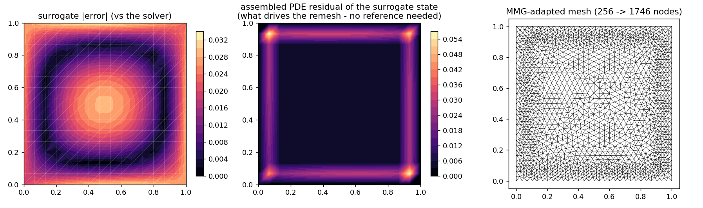
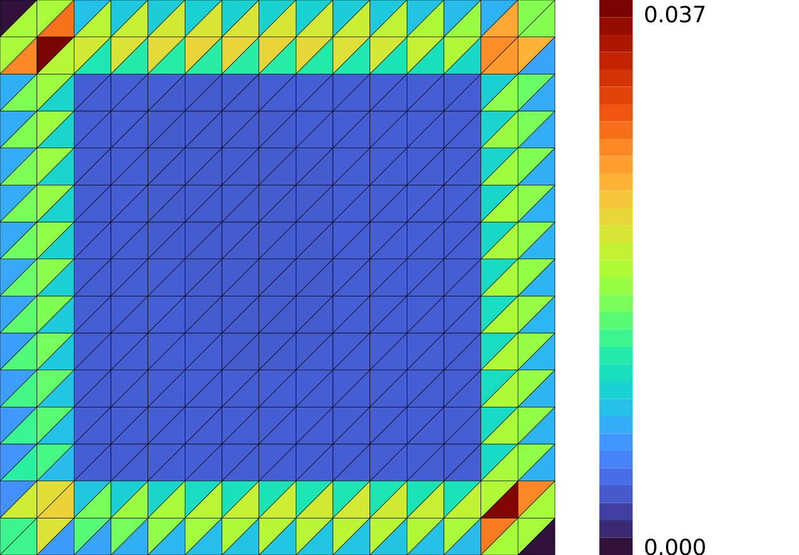
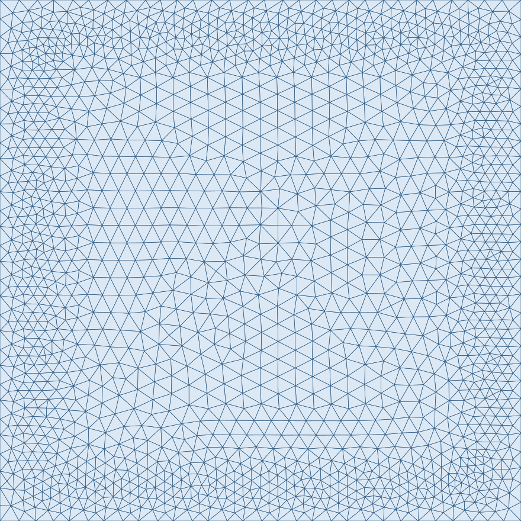

# Surrogate-error-driven adaptive remeshing (MMG)

**Author:** [Vicente Mataix Ferrándiz](https://github.com/loumalouomega)

**Kratos version:** 10.4 (with `PhysicsNeMoApplication` and `MeshingApplication`/MMG)

**Source files:** [surrogate_driven_remeshing](https://github.com/KratosMultiphysics/Examples/tree/master/physics_nemo_application/use_cases/surrogate_driven_remeshing/source)

**Extra dependencies:** `nvidia-physicsnemo`, `torch`, `matplotlib`, `cairosvg`

## Case Specification

The loop this example closes: a surrogate writes its prediction onto the model part, and `AdaptiveRemeshProcess` assembles the **real PDE residual of that state** through the solver's own elements (`solver_residuals.ResidualEvaluator`), turns the per-node residual into an equidistributed target size field, and remeshes with `MeshingApplication`'s MMG. Elements concentrate where the surrogate's physics error lives — and crucially, **no reference solution is needed**: the residual is computable from the surrogate state alone, which is what makes the loop deployable.

The surrogate is a deliberately modest MLP *(x, y, k) → T* trained on six thermal-plate solves and evaluated on an unseen conductivity. Its prediction is written into `TEMPERATURE`; one call to the process does the scoring, the size-field construction and the MMG adaptation.

## Results

Left: the surrogate's actual error against the solver (which the process never sees). Middle: the assembled PDE residual of the surrogate state — the quantity that drives the adaptation. Right: the MMG-adapted mesh, 256 → 1746 nodes, densest along the boundary ring and corners where the residual concentrates.

  

A distinction worth reading off the figure: the **residual is not the error map**. The residual measures where the surrogate state violates the PDE *locally* (here: the boundary ring, where the smooth MLP fights the clamped walls), while the global error also pollutes the smooth center through the PDE's Green's function. Residual-driven adaptation refines where extra resolution buys the most local physics consistency — the same logic as classical residual-based error estimators, with a surrogate in place of the coarse solution.

## Mesh (via meshio++)

The mesh before adaptation (colored by the assembled residual that drives the remesh) and after MMG has refined it, at full triangle resolution — [meshio++](https://github.com/KratosMultiphysics/meshioplusplus)'s SVG writer, run directly on the model part and rasterized to PNG for the embed (`source/02_mesh_svg.py`):

  
  

## References

- MMG remeshing in Kratos: [MeshingApplication](https://github.com/KratosMultiphysics/Kratos/tree/master/applications/MeshingApplication) and the [MMG platform](https://www.mmgtools.org/).
- [PhysicsNeMoApplication documentation](https://kratosmultiphysics.github.io/Kratos/pages/Applications/PhysicsNeMo_Application/General/Overview.html)
