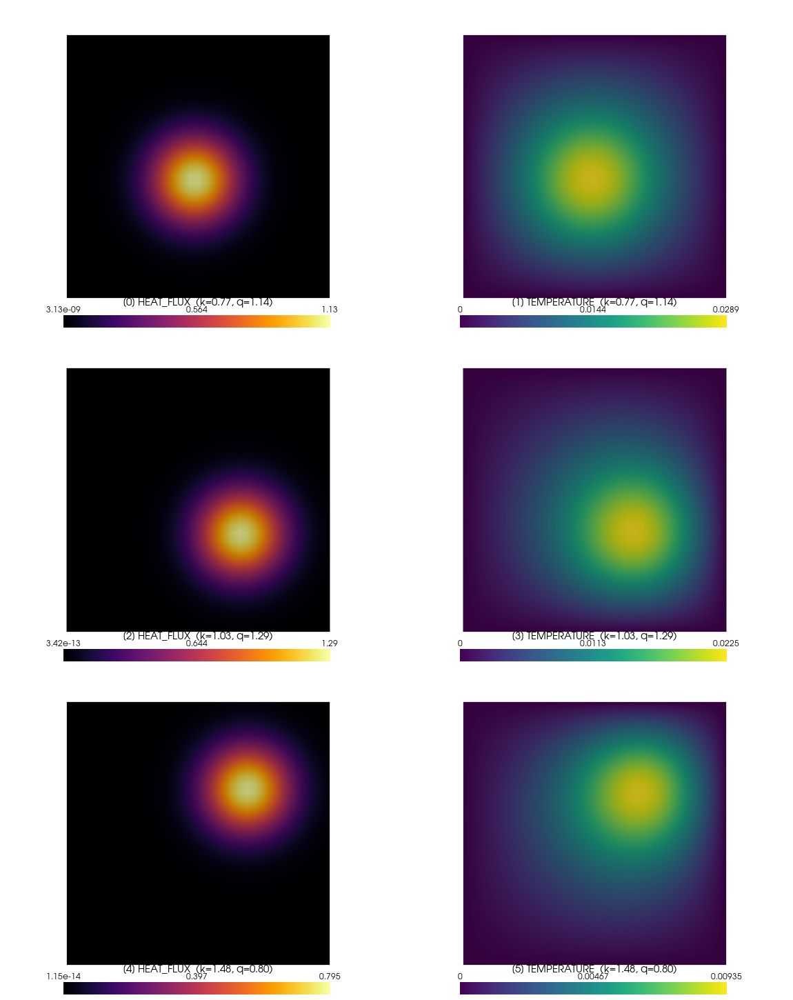
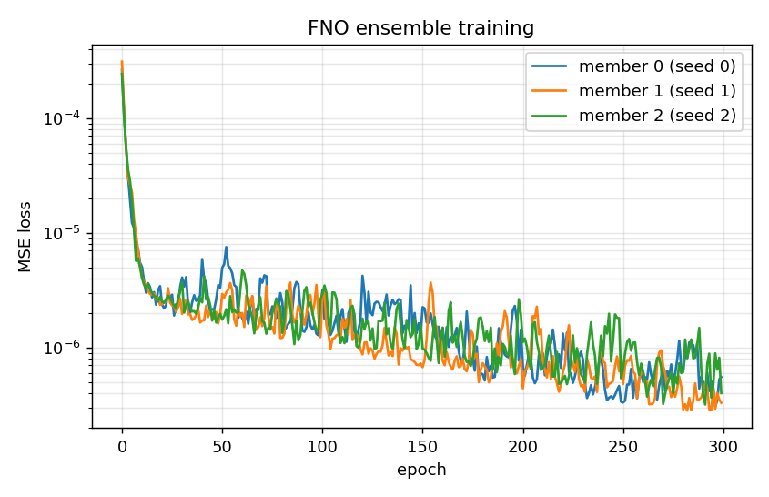
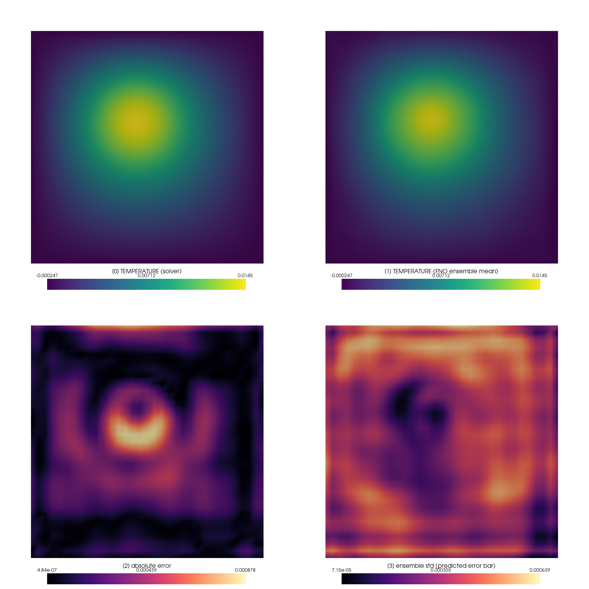
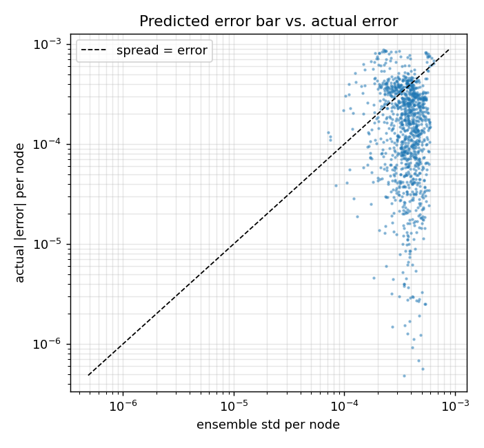
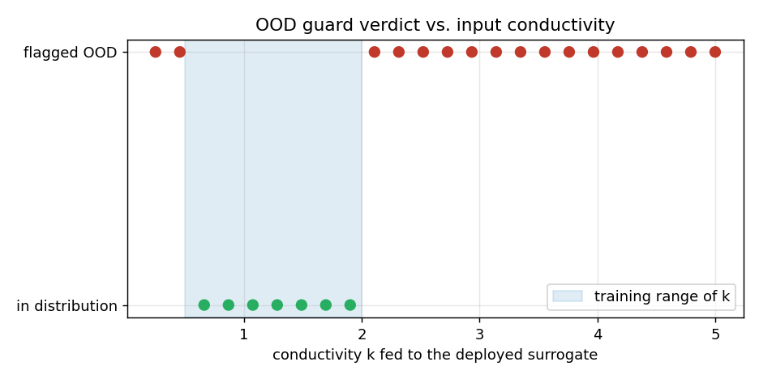
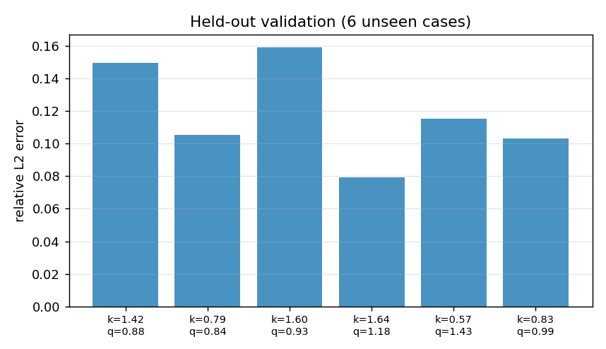
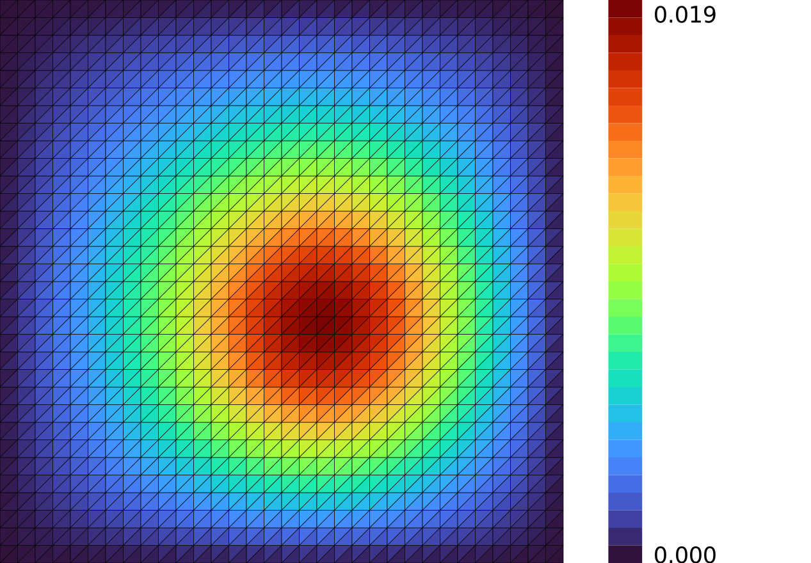

# Thermal surrogate lifecycle — train, govern, deploy, validate, serve

**Author:** [Vicente Mataix Ferrándiz](https://github.com/loumalouomega)

**Kratos version:** 10.4 (with `PhysicsNeMoApplication`)

**Source files:** [thermal_surrogate_lifecycle](https://github.com/KratosMultiphysics/Examples/tree/master/physics_nemo_application/use_cases/thermal_surrogate_lifecycle/source)

**Extra dependencies:** `nvidia-physicsnemo`, `torch`, `onnxruntime`, `pyvista`, `matplotlib`, `cairosvg` (all CPU-capable; a GPU accelerates training but is not required)

## Case Specification

This example walks the **complete lifecycle of an ML surrogate for a Kratos solver** — the workflow, not just the model. The physics is a stationary heat-conduction problem on a unit plate (`ConvectionDiffusionApplication`): conductivity *k* is uniform per case and the volumetric heat source is a Gaussian bump of amplitude *q* centered at a varying position, so each case is the Poisson problem −*k*∆*u* = *f* with homogeneous Dirichlet walls. The surrogate learns the *(k-field, f-field) → u-field* map — a genuine function-to-function operator, not a scalar-parameter fit.

The four stages, each a runnable script:

| Stage | Script | What it produces |
|---|---|---|
| 1. Data | `01_generate_dataset.py` | 40 real solves swept over *k* ∈ [0.5, 2], *q* ∈ [0.5, 1.5] and the source center; input/target grids in the `(C, D, H, W)` layout PhysicsNeMo's grid models consume, sampled by the mesh bridge |
| 2. Training | `02_train.py` | a 3-member FNO ensemble; per-member **model cards**; an **OOD guard** calibrated on the training inputs during training |
| 3. Deployment | `03_deploy_in_loop.py` | in-loop inference through `GridInferenceProcess` on an unseen case, ensemble uncertainty, and the OOD guard exercised on a conductivity ramp |
| 4. Validation & serving | `04_validate_and_export.py` | `ValidationMetricsProcess` numbers on a held-out sweep; distillation to an ONNX student; ONNX Runtime parity; a Triton model repository |

Run the stages in order from the `source` directory (`PYTHONPATH`/`LD_LIBRARY_PATH` pointing at your Kratos build). Every figure below is regenerated by the scripts — nothing is hand-drawn.

### The training data

Three of the forty training cases: the Gaussian source (left) next to the solved temperature (right). The solution moves and rescales with the source and the conductivity, which is what the operator has to learn.

<p align="center">
  
</p>

### Training with governance artifacts

The three FNO members (identical architecture, seeds 0/1/2) converge to ~10⁻⁶ MSE. Alongside the checkpoints, training writes the two artifacts deployment will rely on: a **model card** per member declaring the fields and grid the member was trained for (validated against the process configuration at deployment — wiring the wrong variable fails loudly instead of producing plausible garbage), and an **OOD guard** calibrated on the training inputs (`knn_k`/`sensitivity` tuned on a held-out conductivity ramp; the tuning rationale is in the script).

<p align="center">
  
</p>

## Results

### Deployment on an unseen case

An unseen case (*k* = 1.6, *q* = 1.2, off-center source) deployed through `GridInferenceProcess`, exactly as it would run inside a solver loop. Top: the solver's field and the ensemble mean on a **shared color scale** — visually indistinguishable (RMSE 2.7·10⁻⁴ against a field peaking at 1.45·10⁻²). Bottom: the actual error next to the ensemble's per-node disagreement — the error bar a user gets *without* knowing the reference.

<p align="center">
  
</p>

The ensemble spread and the actual error also match in magnitude pointwise (max |error| 8.8·10⁻⁴ vs max spread 6.4·10⁻⁴):

<p align="center">
  
</p>

### The OOD guard on a conductivity ramp

Feeding the deployed surrogate conductivities from 0.25 to 5.0 — the surrogate itself would happily return smooth, plausible-looking fields for all of them. The guard's verdict tracks the training range: everything inside *k* ∈ [0.5, 2] passes, everything outside is flagged. This is the layer that catches the silent failure mode of surrogates, because extrapolation *looks* exactly like interpolation in the output field.

<p align="center">
  
</p>

### Held-out validation

Six fresh cases (disjoint random seed), each solved by the real solver and predicted by the surrogate, compared by `ValidationMetricsProcess`. Mean relative L2 error: **0.119** (range 0.08–0.16). For a 40-case training set this is honest operator-learning territory; the straightforward lever is more training solves — Stage 1's `TRAIN_CASES` constant.

<p align="center">
  
</p>

### Serving: distillation, ONNX parity, Triton

An FNO cannot be exported to ONNX — its spectral convolutions run on FFTs (`aten::fft_rfftn`), which no ONNX opset supports, and both torch exporters refuse it. The example uses the standard remedy: a small convolutional **student** distilled from the FNO teacher (student-vs-teacher RMSE 2.6·10⁻³ on a 4.0·10⁻² field scale). The student round-trips through ONNX Runtime at parity 7.5·10⁻⁸ and is laid out as a Triton model repository:

```
output/triton_repository/
└── thermal_student/
    ├── config.pbtxt
    └── 1/
        └── model.onnx
```

`tritonserver --model-repository=output/triton_repository` serves it as-is; the application's `TritonInferenceProcess` (or any HTTP/gRPC client) consumes it.

## Mesh (via meshio++)

The base 32×32 mesh every stage of this lifecycle trains and deploys against, colored by TEMPERATURE on a representative case, rendered by [meshio++](https://github.com/KratosMultiphysics/meshioplusplus)'s SVG writer and rasterized to PNG for the embed (`source/05_mesh_svg.py`):

<p align="center">
  
</p>

## References

- Li et al., *Fourier Neural Operator for Parametric Partial Differential Equations*, ICLR 2021. [arXiv:2010.08895](https://arxiv.org/abs/2010.08895)
- [NVIDIA PhysicsNeMo documentation](https://docs.nvidia.com/physicsnemo/latest/index.html)
- [PhysicsNeMoApplication documentation](https://kratosmultiphysics.github.io/Kratos/pages/Applications/PhysicsNeMo_Application/General/Overview.html)
