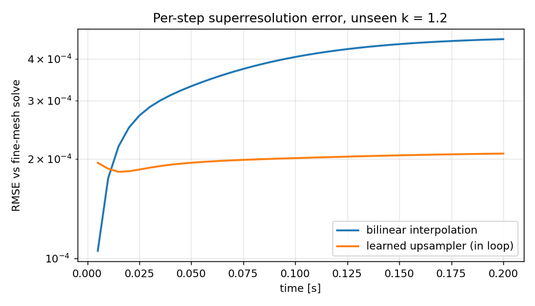
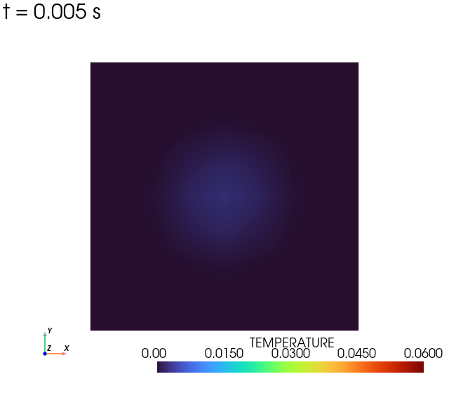
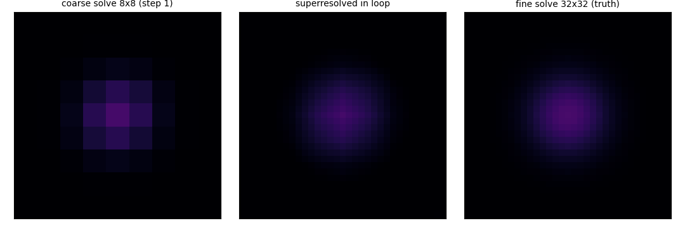
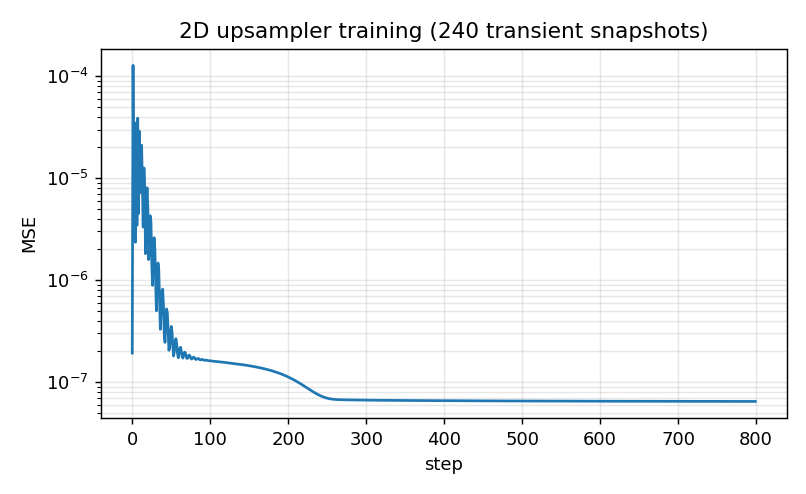

# Transient in-loop superresolution

**Author:** [Vicente Mataix Ferrándiz](https://github.com/loumalouomega)

**Kratos version:** 10.4 (with `PhysicsNeMoApplication`)

**Source files:** [transient_superresolution](https://github.com/KratosMultiphysics/Examples/tree/master/physics_nemo_application/use_cases/transient_superresolution/source)

**Extra dependencies:** `nvidia-physicsnemo`, `torch`, `matplotlib`

## Case Specification

The deployment mode the steady-state examples do not show: `SuperResolutionProcess` attached to a **running transient analysis**, upscaling every converged step like an output process.

The physics is the thermal plate heated from zero by a Gaussian source, run by ConvectionDiffusion's *transient* solver (θ-scheme). Training pairs come from transients, not steady states: six conductivities, each solved on the coarse 8×8 mesh and the fine 32×32 mesh, every time step contributing one (coarse grid → fine grid) pair — 240 snapshots spanning the whole heating history.

Two design decisions carry the example:

* **The model is bilinear + a learned correction.** `Upsampler2D` computes the bilinear upsample first and a zero-initialized convolutional net adds a residual: untrained, the model *is* the classical baseline, so training can only improve on it. What the correction learns is precisely what interpolation cannot know — the coarse *solve's* discretization error against the fine solve. (The first version of this example skipped that and lost to bilinear; the README of the record keeps the lesson.)
* **The checkpoint is plain TorchScript**, deployed with `model_interface: "grid"` and `squeeze_axis: 2` (the thin-axis idiom for 2D problems): the process is not restricted to PhysicsNeMo-native models.

`01_train_upsampler.py` (12 transient solves + training, ~2 min); `02_deploy_in_transient.py` runs the coarse transient with the process inside the real time loop against a fine-transient truth (~1 min).

## Results

On an unseen conductivity (k = 1.2), the in-loop upsampler halves the bilinear baseline's error — mean RMSE **2.0·10⁻⁴ vs 3.8·10⁻⁴** over the 40 steps, the gap widening as the field develops structure:

  

The superresolved field, **recorded live by core Kratos' new `PyVistaAnimationOutputProcess`** — the animation process is attached to the fine target part inside the running loop, rendering each frame the moment the upsampler writes it:

  

The transient, superresolved as it runs — coarse solve, in-loop superresolution, fine truth:

  

  

## References

- [PhysicsNeMoApplication documentation — Super Resolution](https://kratosmultiphysics.github.io/Kratos/pages/Applications/PhysicsNeMo_Application/Super_Resolution/Super_Resolution.html)
