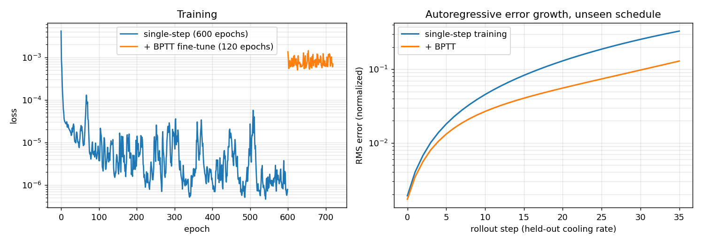
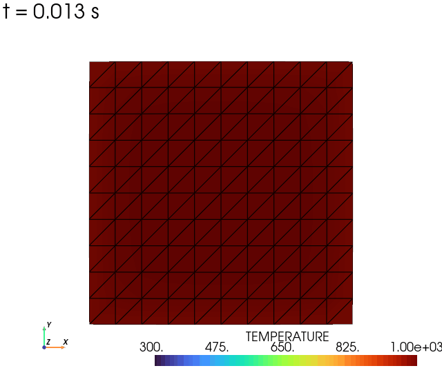
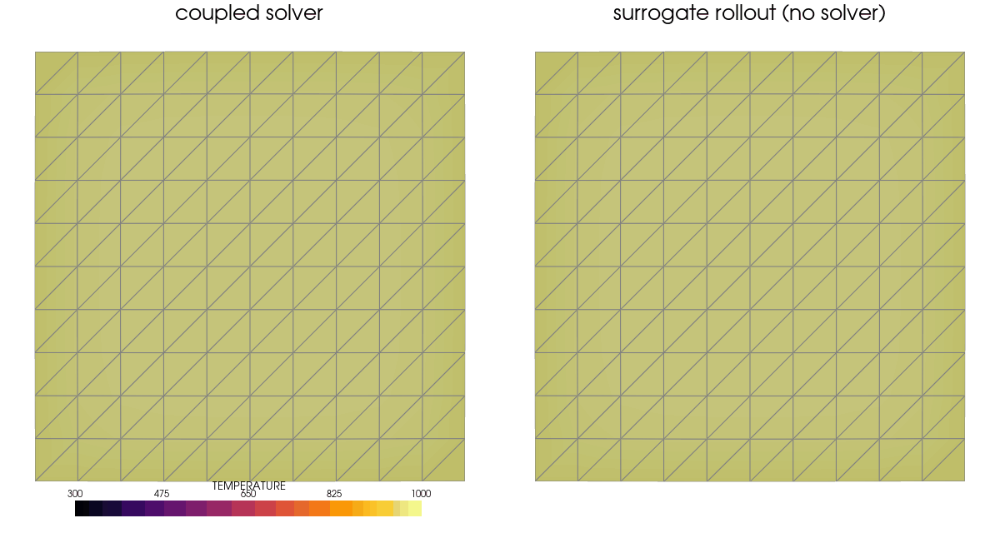
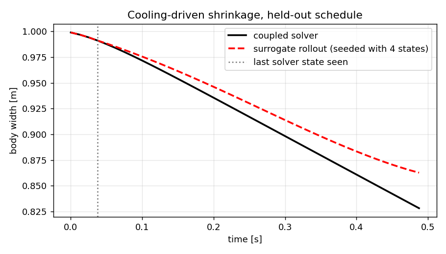

# Transient thermo-mechanical surrogate — BPTT against compounding error

**Author:** [Vicente Mataix Ferrándiz](https://github.com/loumalouomega)

**Kratos version:** 10.4 (with `PhysicsNeMoApplication`)

**Source files:** [transient_thermomechanical_surrogate](https://github.com/KratosMultiphysics/Examples/tree/master/physics_nemo_application/use_cases/transient_thermomechanical_surrogate/source)

**Extra dependencies:** `nvidia-physicsnemo`, `torch`, `pyvista`, `matplotlib`

## Case Specification

A genuinely **coupled multiphysics** transient drives this example: a unit square held at 1000 K is cooled through its skin at a prescribed rate, solved by `ConvectionDiffusionApplication`'s `CoupledThermoMechanicalSolver` — a staggered thermal-then-structural step per time step, the two sub-solvers sharing nodes so the nodal temperature becomes thermal strain through a thermal constitutive law (`ConstitutiveLawsApplication`). Cooling below the reference temperature makes the body contract: a sintering-style signal, spatially non-uniform because the skin cools first.

The surrogate is autoregressive: a per-node model maps a window of the last 4 states (displacement x/y + temperature per node) to the next state, then **feeds itself**. Three cooling rates (1200, 1600, 2000 K/s) provide the training trajectories, 40 steps each; a held-out rate (1400 K/s) is the test. Two training regimes are compared on identical architectures:

1. **single-step** (`CreateTrajectoryWindowDataset`, scheme `single_step`): supervised windows, the standard setup;
2. **+ BPTT** (`TrainAutoregressive`): the same trained model fine-tuned *through its own 24-step rollout*, at a learning rate two orders of magnitude smaller — the rollout objective only nudges the weights against compounding error.

Two modelling details matter and are documented in the scripts:

* **Per-channel normalization.** Temperatures are O(1000), displacements O(0.1). One global scale pushes the displacement channels to noise level — the loss optimizes temperature only and the rolled-out displacement is junk. Each channel is scaled by its own maximum.
* **Residual parameterization.** The model returns `last state + net(window)`. Without the identity part, a next-state MLP that is 99.9 % accurate per step still compounds into a useless 38-step rollout; with it, the network learns the small per-step *increment*. The wrapper is a plain `torch.nn.Module`, so every stock API (`TrainModel`, `TrainAutoregressive`, `EvaluateRollout`, `RolloutPredictions`) consumes it unchanged.

Scripts: `01_simulate_and_train.py` (4 coupled transient solves, both trainings, error-growth evaluation — ~2 min), `02_rollout_and_visualize.py` (rollout, animation, shrinkage curve — under a minute).

## Results

### Single-step vs BPTT on the unseen cooling rate

Left: training. Right: autoregressive error growth along the held-out schedule. The single-step model is excellent per step (MSE 8·10⁻⁷) and still drifts — mean rollout error 0.127, final 0.330. BPTT fine-tuning **halves the mean error (0.053) and cuts the final error 2.6×** (0.129): controlling the feedback loop is a different objective than fitting individual steps, which is the point of this example.

  

### The ground truth, recorded by Kratos' animation output process

The coupled solve itself, rendered live by core Kratos' new `PyVistaAnimationOutputProcess` (`kratos/python_scripts/pyvista_animation_output_process.py`): one frame per step straight from the model part — temperature-colored, displacement-warped (3×), GIF encoded at finalize. No hand-rolled frame loop; this is the recommended way to animate any Kratos transient:

  

### The rollout, animated

Seeded with the first four solver states of the unseen schedule, the surrogate feeds itself for the remaining 36 steps — no solver in the loop. Displacements are exaggerated 3× in the animation; the temperature scale is shared between the panels.

  

### Shrinkage tracking

The engineering quantity: the body's width over time. The surrogate follows the cooling-driven contraction of a schedule it never saw with a maximum width error of **3.5·10⁻² m against a total shrinkage of 1.7·10⁻¹ m** (~20 %), all of it accumulated in the second half of the rollout — visible in the error-growth curve above. More trajectories and longer BPTT horizons are the levers.

  

## References

- Sanchez-Gonzalez et al., *Learning to Simulate Complex Physics with Graph Networks*, ICML 2020 (the compounding-error / rollout-training discussion). [arXiv:2002.09405](https://arxiv.org/abs/2002.09405)
- [PhysicsNeMoApplication documentation](https://kratosmultiphysics.github.io/Kratos/pages/Applications/PhysicsNeMo_Application/General/Overview.html)
