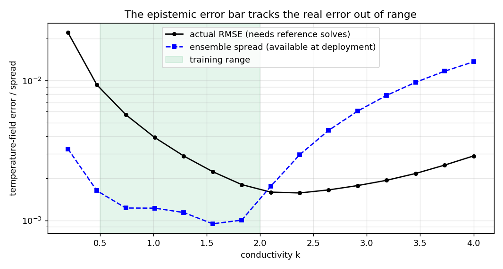
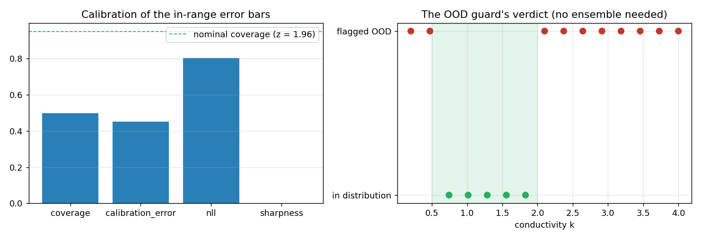

# Uncertainty and trust — three views of the same surrogate

**Author:** [Vicente Mataix Ferrándiz](https://github.com/loumalouomega)

**Kratos version:** 10.4 (with `PhysicsNeMoApplication`)

**Source files:** [uncertainty_and_trust](https://github.com/KratosMultiphysics/Examples/tree/master/physics_nemo_application/use_cases/uncertainty_and_trust/source)

**Extra dependencies:** `nvidia-physicsnemo`, `torch`, `matplotlib`

## Case Specification

One surrogate family — a four-seed ensemble of *(x, y, k) → T* MLPs trained on thermal solves with *k* ∈ [0.5, 2.0] — interrogated three ways along a sweep that walks far outside its training range:

1. **Ensemble spread** as the epistemic error bar, compared against the actual error (which requires the reference solves a surrogate user does not have).
2. **Calibration metrics** (`ComputeCalibrationMetricValues`: coverage, calibration error, NLL, sharpness) on held-out in-range cases.
3. **The OOD guard**: a binary tripwire needing no ensemble at all.

## Results — the honest readings

**The spread's direction is right; its magnitude is not guaranteed.** Above the training range the ensemble spread grows steeply and would flag the extrapolation. *Below* it — where the field blows up as *T* ∼ *f/k* — the actual error grows 10× while the spread barely moves: all four members extrapolate wrongly *together*. An error bar built from disagreement can only see disagreement.

  

**The calibration metrics catch what RMSE hides.** In-range, the surrogate's RMSE is excellent — and its 95 % error bars cover only **50 %** of the truth (calibration error 0.45): the four-member ensemble is over-confident by a factor of ~2, the textbook small-ensemble failure. A user acting on these bars without checking coverage would systematically under-budget the risk.

**The OOD guard** flags the sweep outside the training range with no ensemble, no calibration, and no reference — the cheap tripwire that backs up both fancier signals, including the low-*k* region where the spread stayed silent:

  

The three views compose: spread for *where is it roughly worse*, calibration for *can I act on the numbers*, the guard for *should this input be trusted at all*.

## References

- Lakshminarayanan et al., *Simple and Scalable Predictive Uncertainty Estimation using Deep Ensembles*, NeurIPS 2017.
- Kuleshov et al., *Accurate Uncertainties for Deep Learning Using Calibrated Regression*, ICML 2018.
- [PhysicsNeMoApplication documentation — Uncertainty](https://kratosmultiphysics.github.io/Kratos/pages/Applications/PhysicsNeMo_Application/Uncertainty/Uncertainty.html)
