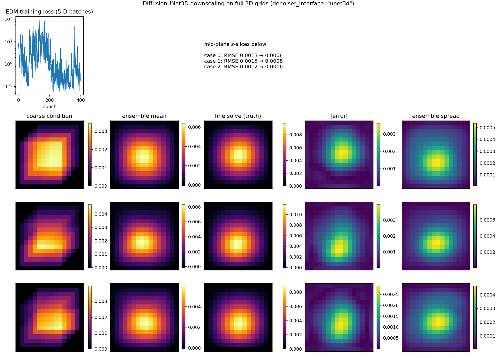

# Volumetric diffusion downscaling — DiffusionUNet3D on full 3D grids

**Author:** [Vicente Mataix Ferrándiz](https://github.com/loumalouomega)

**Kratos version:** 10.4 (with `PhysicsNeMoApplication` and `ConvectionDiffusionApplication`)

**Source files:** [volumetric_diffusion](https://github.com/KratosMultiphysics/Examples/tree/master/physics_nemo_application/use_cases/volumetric_diffusion/source)

**Extra dependencies:** `nvidia-physicsnemo`, `torch`, `matplotlib`

## Case Specification

The `denoiser_interface: "unet3d"` recipe end to end — CorrDiff-style downscaling with **no thin-axis squeeze anywhere**. Thirty-one 3D heat-conduction cases (random conductivity, source strength and 3D source position) are each solved twice, on a deliberately under-resolving coarse tetrahedral mesh (3³ cells) and a fine one (14³), and both solutions sampled onto full 16×16×16 voxel grids by the grid bridge.

`physicsnemo.experimental.models.diffusion_unets.DiffusionUNet3D` — the genuinely volumetric denoiser, new to the bridge — is wrapped by `WrapDenoiser(..., "unet3d")`: conditioning enters natively as the model's `TensorDict` `"volume"` key rather than channel concatenation. `TrainDiffusionModel` detects the 5-D volumetric batches and swaps in the application's rank-generalized EDM loss (upstream's legacy loss hard-codes the 4-D image rank and cannot broadcast against a `(B, C, D, H, W)` batch).

One lesson carried over from the application's de-normalization bug hunts, applied in the training direction: EDM's loss and sampler assume the data's standard deviation is `sigma_data` (0.5). These thermal fields have std ≈ 3e-3 — fed raw, the trained denoiser drowns under the sampler's own noise and the ensemble mean is *worse* than the coarse condition (measured: 0.0005 → 0.0011). Scaling the fields to the EDM contract (×178.6 here) and undoing the same factor on everything reported turns the recipe around.

## Results

On all three held-out cases (seeded and asserted), the reverse-diffusion ensemble mean roughly **halves** the coarse condition's error — RMSE 0.0013/0.0015/0.0012 → **0.0008/0.0008/0.0006** — and the ensemble spread lands where the actual error is (spread/error correlation **0.65/0.89/0.84**), concentrated at the under-resolved hot spot.

  

## References

- Mardani et al., *Generative Residual Diffusion Modeling for Km-scale Atmospheric Downscaling* (CorrDiff), arXiv:2309.15214 — the 2D recipe this example lifts to 3D.
- [PhysicsNeMoApplication documentation](https://kratosmultiphysics.github.io/Kratos/pages/Applications/PhysicsNeMo_Application/General/Overview.html) — the volumetric denoiser is documented on the Diffusion page.
