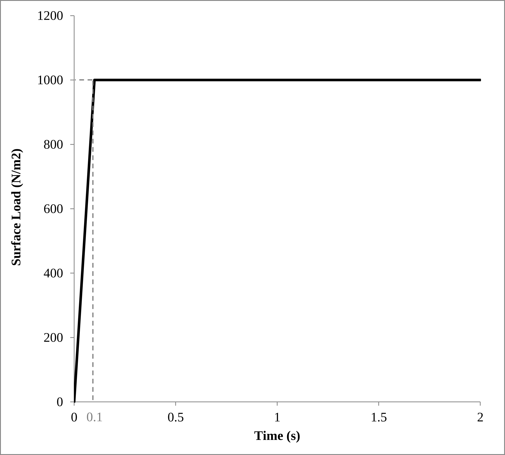
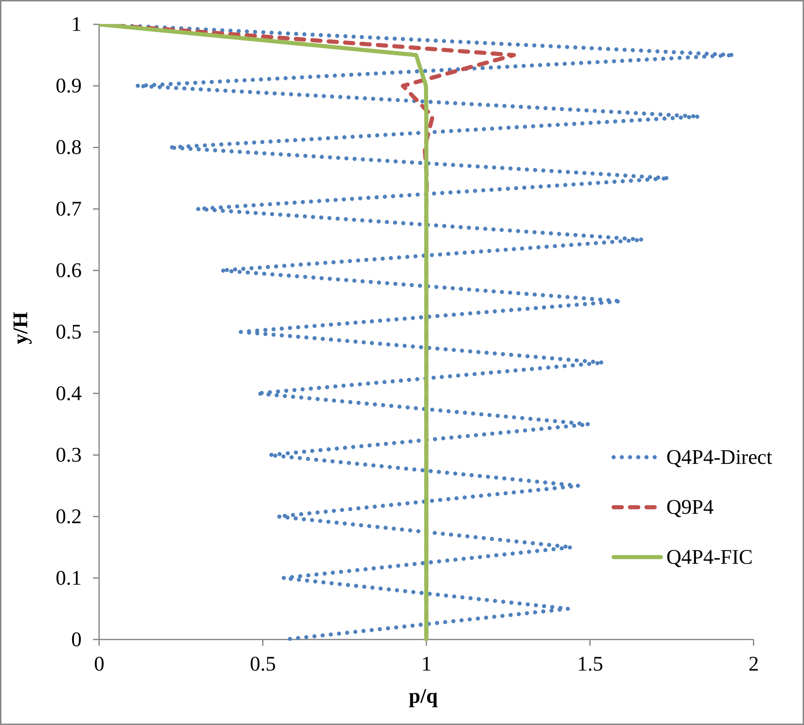

# Undrained-incompressible soil column test

**Author:** Ignasi de Pouplana

**Kratos version:** 5.2

**Kratos Applications used**
* ExternalSolversApplication
* FluidDynamicsApplication
* PoromechanicsApplication
* SolidMechanicsApplication

**Source files** [2D undrained soil column source files](https://github.com/KratosMultiphysics/Examples/tree/master/poromechanics/validation/undrained_soil_column_2D/source)

## Case Specification

This example consists on a 1 x 30m column of saturated soil subjected to a surface loading that lies on a rigid rock bed. The objective of the test is to capture the pressure distribution along the soil column which, near the undrained-incompressible limit, should equal the applied load. The main challenge is that, under such conditions, the direct formulation for the displacement-pore pressure element exhibits locking of the pressure field due to the violation of Babuska-Brezzi conditions. The reference solution is taken from [1].

The problem geometry and boundary conditions are shown below.
<!--  -->

The material properties of the soil column are the following:
* Young's modulus (E): 2.5E+7 _N/m2_
* Poisson's ratio (&nu;): 0.2
* Solid density (&rho;s): 2000 _Kg/m3_
* Fluid density (&rho;f): 1000 _Kg/m3_
* Porosity (&phi;): 0.3
* Dynamic viscosity (&mu;): 0.001 _s·N/m2_
* Solid bulk modulus (Ks): 1.5E+17 _N/m2_
* Fluid bulk modulus (Kf): 3.0E+14 _N/m2_
* Intrinsic permeability (k): 1.0E-14 _m2_

This problem is solved in a 2D configuration under plane strain conditions. The geometry is discretized with a structured mesh of 20 quadrilateral elements. Three different types of elements have been used here: 4-noded quadrilateral elements with bilinear shape functions for both the pressure and the displacements (Q4P4-Direct), 9-noded quadrilateral elements with biquadratic shape functions for the displacements and bilinear shape functions for the pressure (Q9P4), and also FIC-stabilized 4-noded quadrilateral elements of equal order interpolation for the displacements and pore pressure (Q4P4-FIC). The formulation of the latter element is thoroughly described in [2].

The considered load is represented in the next figure:

The time step is 0.02 seconds.

## Results

The next graph shows the normalized pore pressure along the normalized height of the soil column for each type of element at a time t = 2 s.

## References

[1] O.C. Zienkiewicz, C.T. Chang and P. Bettess. Drained, undrained, consolidating dynamic behaviour assumptions in soils. Géotechnique, vol. 30, pp. 385-395, 1980. DOI: 10.1680/geot.1980.30.4.385. [https://doi.org/10.1680/geot.1980.30.4.385](https://doi.org/10.1680/geot.1980.30.4.385)

[2] I. de Pouplana and E. Oñate. A FIC-based stabilized mixed finite element method with equal order interpolation for solid-pore fluid interaction problems. International Journal for Numerical and Analytical Methods in Geomechanics, vol. 41, pp. 110-134, 2016. DOI: 10.1002/nag.2550. [http://onlinelibrary.wiley.com/doi/10.1002/nag.2550/full](http://onlinelibrary.wiley.com/doi/10.1002/nag.2550/full)
