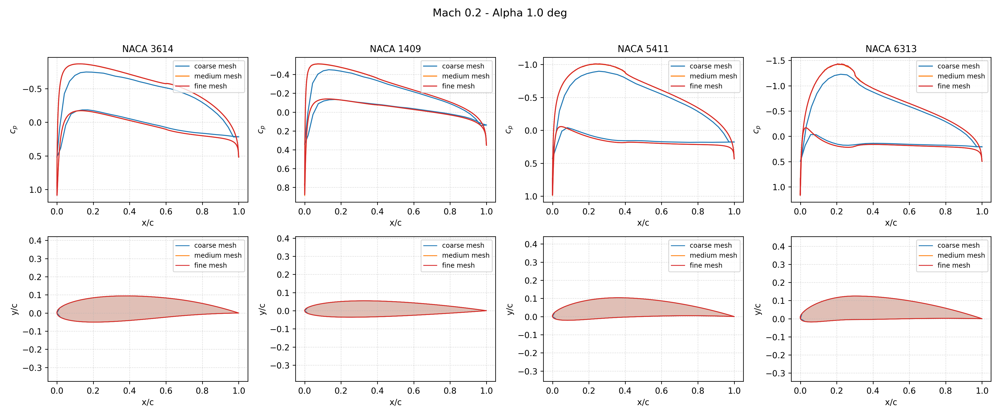
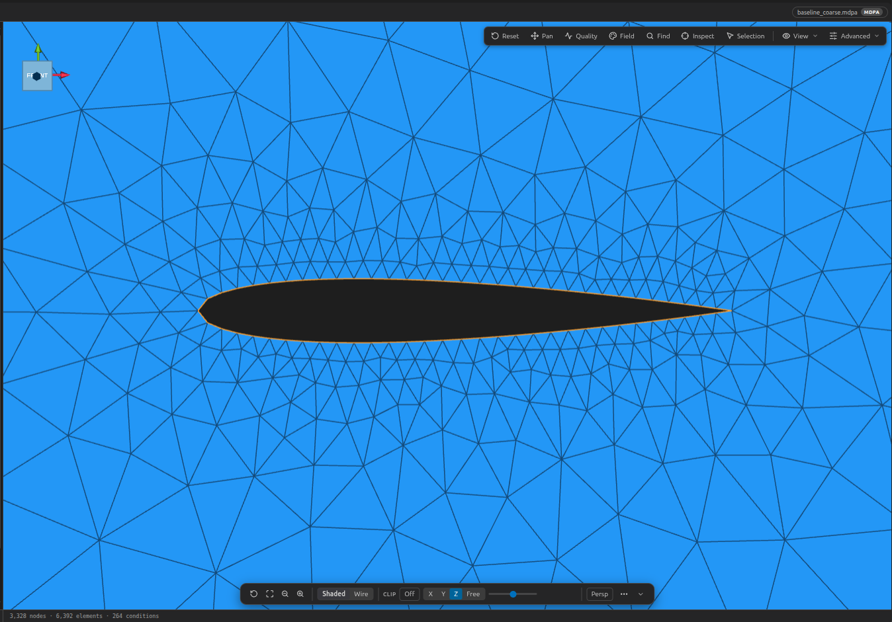
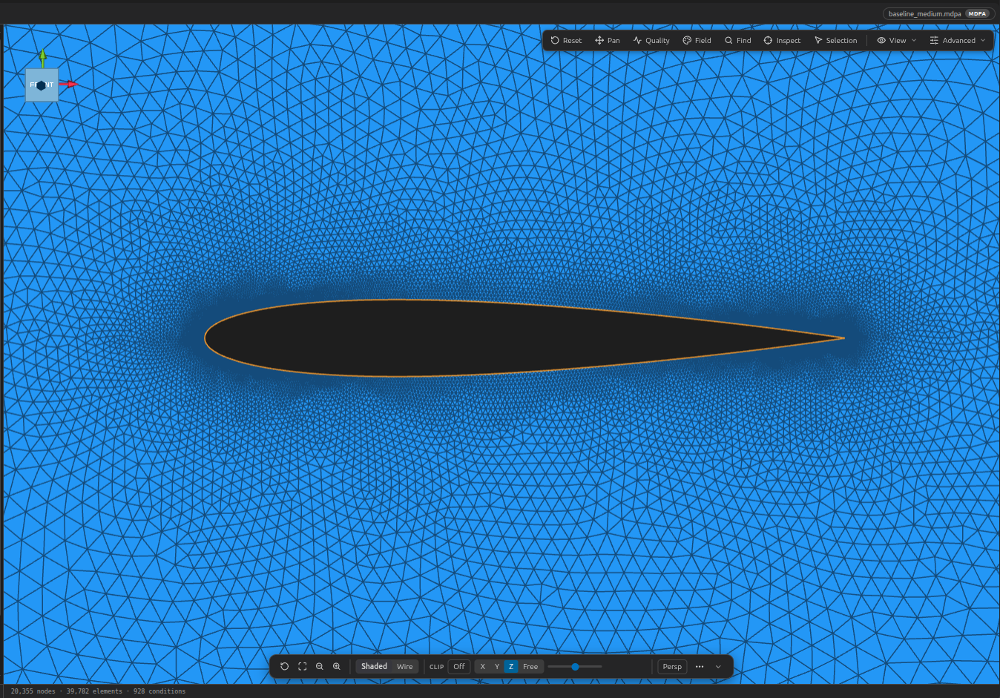
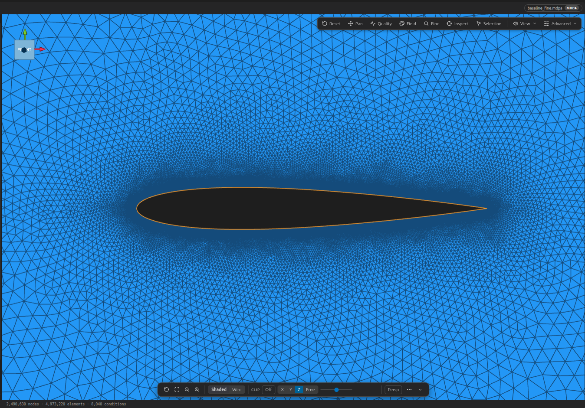
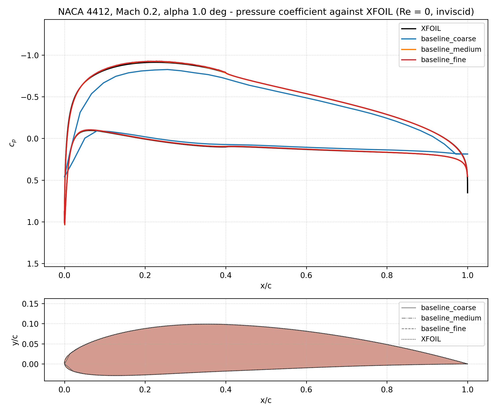

# Compressible Potential Flow 
# NACA 4-Digit Airfoil Morphing with Kratos Multiphysics

**Author:** [Marco Antonio Zuñiga Perez](https://github.com/marco1410)

**Kratos version:** 10.4

**Source files:** [Naca morphing case](https://github.com/KratosMultiphysics/Examples/tree/master/potential_flow/use_cases/naca_morphing_case/source)

## Case Specification

This example demonstrates how to exploit Kratos Multiphysics capabilities to generate aerodynamic databases of varying fidelity for NACA 4-digit airfoils using the **CompressiblePotentialFlowApplication**. It showcases mesh morphing, multi-fidelity evaluation, and validation against XFOIL — ideal for optimization, control, and reduced-order modeling studies.

---

## Overview

This example evaluates a parametric space of NACA 4-digit airfoils at subsonic compressible conditions using Kratos' **potential flow solver** with ALE mesh morphing. The workflow:

1. **Parametric geometry**: NACA 4-digit airfoils defined by (max_camber, camber_position, thickness)
2. **Mesh morphing**: A single base mesh is deformed to match each airfoil shape (no remeshing)
3. **Multi-fidelity solves**: Coarse / Medium / Fine meshes for cost/accuracy trade-offs
4. **Outputs**: Lift coefficient (Cl), solve time, surface pressure coefficient (Cp) distribution
5. **Validation**: Quantitative comparison against XFOIL (inviscid panel method with Karman Tsien correction)

---

## Physics & Solver

### Governing Equations

The solver implements the **compressible potential flow** equations:

$$
\nabla \cdot (\rho \nabla \phi) = 0
$$

where $\phi$ is the velocity potential and density $\rho$ follows the isentropic relation:

$$
\rho = \left( 1 - \frac{\gamma-1}{2} |\nabla \phi|^2 \right)^{\frac{1}{\gamma-1}}
$$

with $\gamma = 1.4$ for air.

### Numerical Method

- **ALE formulation** with **structural similarity** mesh motion (avoids remeshing)
- **Compressible potential flow element** (2D)
- **AMGCL** linear solver (algebraic multigrid)
- **Far-field boundary condition** with **wake definition** (2D trailing-edge wake)
- **Lift computation** via far-field integration (moment reference at quarter-chord)

### References for Physics

The potential flow formulation and its implementation in Kratos are described in:

> **[1]** Zuñiga, M., Ares, S., Zorrilla, R., & Rossi, R. (2026). *Non-Linear reduced order modelling of transonic potential flows for fast aerodynamic analysis*. **International Journal for Numerical Methods in Engineering**, 127(2), e70251. https://doi.org/10.1002/nme.70251

> **[2]** López Canalejo, Iñigo Pablo. (2022). <em>A finite-element transonic potential flow solver with an embedded wake approach for aircraft conceptual design</em>. [Doctoral thesis, TUM School of Engineering and Design]. TUM-Technische Universität München. [https://nbn-resolving.de/urn/resolver.pl?urn:nbn:de:bvb:91-diss-20220505-1633175-1-3] (https://mediatum.ub.tum.de/?id=1633175)

---

## Project Structure

```
naca_morphing_case/
├── run_example.py              # Main parametric study script
├── validation.py               # Validation against XFOIL
├── kratos_lib/
    ├── MainKratos.py           # Core Kratos integration (mesh morphing, solve, extraction)
    ├── ProjectParameters.json  # Kratos problem settings
    ├── baseline_coarse.mdpa    # Coarse mesh (~3.7e5 nodes)
    ├── baseline_medium.mdpa    # Medium mesh (~2.4e6 nodes)
    └── baseline_fine.mdpa      # Fine mesh (~3.6e8 nodes)
```

---

### Mesh Morphing Strategy

The `NacaMeshDeformer` class (in `MainKratos.py`) imposes the NACA shape on the surface nodes:

1. **Restore reference mesh** — reset displacements to zero
2. **Fix leading/trailing edge nodes** — anchor chord endpoints
3. **Compute chord position** — for each surface node
4. **Evaluate NACA surface point** — analytic NACA 4-digit formula
5. **Apply MESH_DISPLACEMENT** — move node to target position, fix DOFs

This avoids remeshing entirely; a single mesh serves the entire parametric space.

---

## Running the Example

### Prerequisites

- Kratos Multiphysics compiled with **CompressiblePotentialFlowApplication**

### Example Output

```
NACA 4-Digit Profiles - Coarse / Medium / Fine Comparison:
   Airfoil   Cl coarse   Cl medium     Cl fine     error c-f [%]  error c-m [%]  error m-f [%]  t coarse [s]  t medium [s]  t fine [s]
    3614     0.50947496  0.61662081    0.61605409     17.300         17.376         0.092           0.20         0.82         353.77
    1409     0.20927309  0.24523980    0.24515392     14.636         14.666         0.035           0.09         0.85         416.15
    5411     0.66972021  0.76916961    0.76867719     12.874         12.929         0.064           0.14         0.71         319.55
    6313     0.76709195  0.86394055    0.86352528     11.167         11.210         0.048           0.12         0.64         463.51

Mean error: 9.367 %, worst error: 17.376 %

Figure written to data/run_example_cp_profile.png
```

<div align="center">
  
  <p><i>Figure: Pressure coefficient distributions for 4 NACA airfoils at Mach 0.2, α=1° on coarse (blue), medium (orange), and fine (red) meshes. Top row: Cp vs x/c. Bottom row: Airfoil shapes.</i></p>
</div>


### Mesh Visualizations

| Coarse | Medium | Fine |
|--------|--------|------|
|  |  |  |

---

## Running the Validation

### Prerequisites

Additional: `xfoil-python` (compiled Fortran binding)

```bash
python3 -m venv --system-site-packages venv
./venv/bin/pip install https://github.com/DARcorporation/xfoil-python
# Note: Remove '-fbounds-check' and '-ffpe-trap=invalid,zero' from CMakeLists.txt
#       during XFOIL build to avoid internal indexing aborts
```

### Validation Output

```
XFOIL reference over 401 surface points (Re = 0, 201 points per surface, inviscid):
  Cl = 0.638952

NACA 4412, Mach 0.2, alpha 1.0 deg - coarse / medium / fine comparison:
             Mesh            Cl   t solve [s]
  baseline_coarse      0.562500          0.19
  baseline_medium      0.646981          0.89
    baseline_fine      0.646470        499.81

Figure written to data/validation_naca4412.png
```

<div align="center">
  
  <p><i>Figure: Validation of Kratos potential flow solver against XFOIL for NACA 4412. Top: Cp distribution comparison. Bottom: Mesh convergence of airfoil geometry.</i></p>
</div>

---

## Results & Mesh Convergence

| Mesh | Nodes (approx.) | Cl (NACA 4412) | Error vs XFOIL | Solve Time |
|------|-----------------|----------------|----------------|------------|
| Coarse | ~3.7 × 10⁵ | 0.5625 | -11.9% | 0.19 s |
| Medium | ~2.4 × 10⁶ | 0.6470 | +1.3% | 0.89 s |
| Fine | ~3.6 × 10⁸ | 0.6465 | +1.2% | 499.81 s |
| **XFOIL** | 401 panels | **0.6390** | — | <0.1 s |

**Key observations**:
- **Medium mesh** achieves <2% Cl error with ~1s solve time
- **Coarse mesh** is 10× faster but ~12% error (useful for low-fidelity database)
- **Fine mesh** is ~500× costlier than medium for marginal gain
- **Mesh convergence** is demonstrated: medium → fine shows <0.1% Cl difference

---