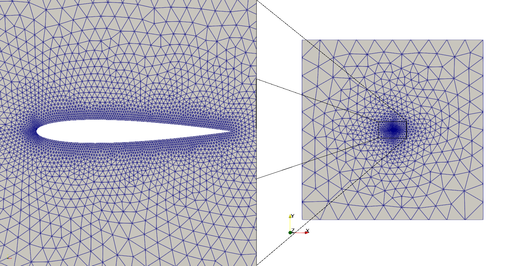
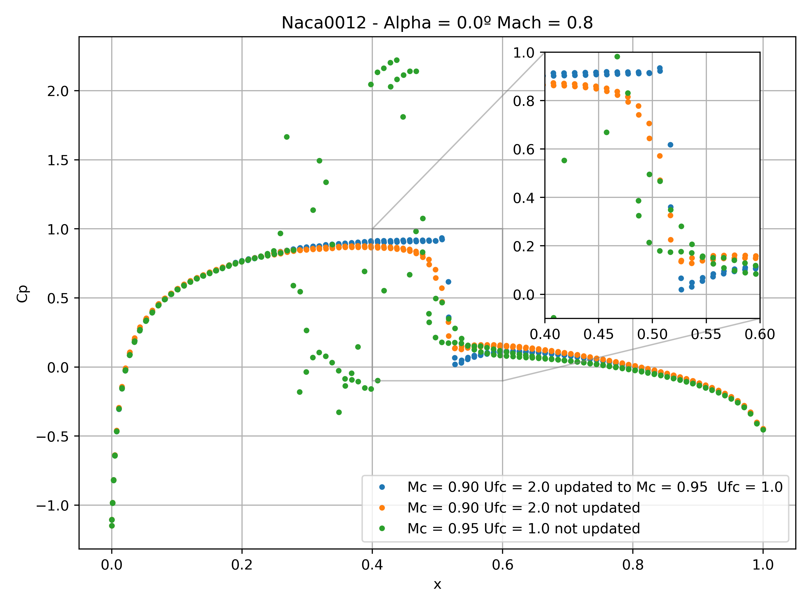
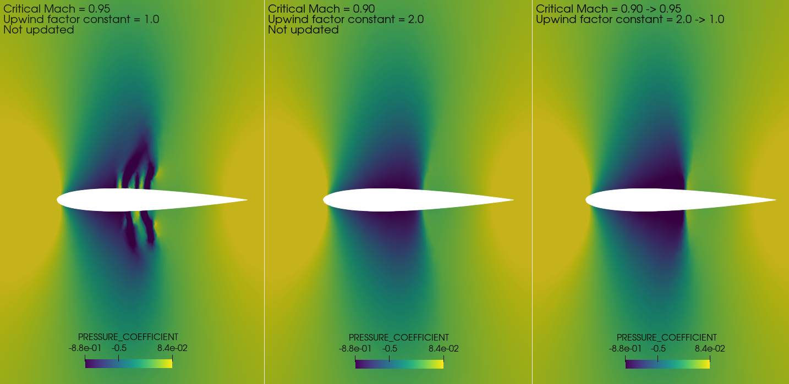
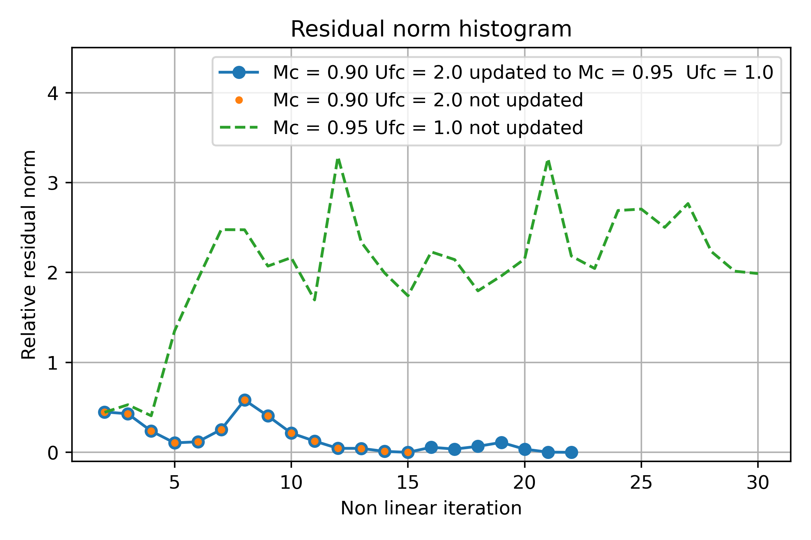

# Transonic Potential Flow 
# Naca 0012 airfoil - Mach number = 0.8, Angle of attack = 0º

**Author:** [Marco Antonio Zuñiga Perez](https://github.com/marco1410)

**Kratos version:** 9.5

**Source files:** [Naca 0012 transonic potential flow scheme](https://github.com/KratosMultiphysics/Examples/tree/master/potential_flow/validation/naca0012_transonic_scheme/source)

## Case Specification
This is a 2D simulation of a NACA 0012 airfoil under inviscid transonic flow conditions (Ma = 0.8).  An adaptative upwind density scheme (1) is used as artificial compressibility method in order to stabilize the problem in supersonic flow regions.

The flow around the airfoil is computed at zero angle of attack and Mach 0.8 to illustrate the effect of using variable parameters to bias the density. 

The problem geometry consists in a 100[m]x100[m] domain and an airfoil with a chord length of 1[m] at zero degrees angle of attack. The computational domain was meshed with 7920 linear triangular elements (Figure 1).

  
  <figcaption align="center"> Figure 1: NACA0012 airfoil geometry and domain. </figcaption align="center">

### Boundary Conditions
The boundary conditions imposed in the far field are:

* Free stream density = 1.225 _kg/m3_
* Angle of attack = 0º
* Mach infinity = 0.8
* Wake condition is computed automatically by the app.

### General Solving Settings
The problem is solved with a finite - element transonic potential flow solver with and embedded wake approach (2). 

Settings:

* Maximum non-linear iterations = 30
* Convergence criterion = "residual_criterion"
* Relative and absolute tolerances = 1e-8
* Non-Linear solver: Newton Raphson with a Line search strategy
* Linear solver: "sparse_lu"

### Transonic Scheme Settings
In the current test, for the first case, the upwind factor constant and the critical mach are initialized to 2 and 0.90 to produce strong stabilization over a large portion of the flow. As the solution converges, below of a certain residual tolerance, these parameters are set to 1 and 0.95. These final values ​​were chosen because they are suitable for most cases. The second case is the same but here the parameters are not updated, and in the last case, the parameters are only initialized to 1.0 and 0.95.

In summary, the _perturbation_transonic_ potential flow element is selected and the transonic scheme configurations used were:

* **Case 1:**
    * Initial critical mach = 0.90
    * Initial upwind factor constant = 2.0
    * Update relative residual norm = 1e-3
    * Target critical mach = 0.95
    * Target upwind factor constant = 1.0

* **Case 2:**
    * Initial critical mach = 0.90
    * Initial upwind factor constant = 2.0
    * The values are not updated

* **Case 3:**
    * Initial critical mach = 0.95
    * Initial upwind factor constant = 1.0
    * The values are not updated

## Results
Below three snapshots depicting the Cp distributions over the airfoil skin, Cp distributions over the whole domain and the relative residual norm convergence histogram obteined with three sets of parameters. As it can be observed, the expected symmetric solution and shocks are obtained.

The Figure 2 shows the coefficient of pressure (Cp) distribution along the chord of the airfoil. It is observed how the solution is affected by the different parameters tested. A really sharp solution (blue curve), a smoothed solution (orange curve) and a solution with not-converged shock region solution (green curve). 

  
  <figcaption align="center"> Figure 2: Effect of varying the upwind parameters during the solution procedure. </figcaption>

The Figure 3 shows the Cp distribution over the whole domain for different final values of the parameters. For a given grid density, changing the values of the parameters allows to fine tune the strength and the location of the shock.

  
  <figcaption align="center"> Figure 3: Pressure distributions around the NACA 0012 airfoil at zero angle of attack and Mach 0.8 for the three cases. </figcaption>

The Figure 4 shows the evolution of the relative residual, computed as the L2 norm of the unknown potential vector, as a function of the iteration count. The Figure shows that the algorithm converges quite fast to a solution in which the shock is smeared and displaced upstream. On the other hand, setting the parameters directly to 1 and 0.95 to produce a low amount of bias (green curve) prevents the scheme from converging, and the obtained solution is oscillatory near the shock. Varying the parameters (blue curve) allows the solution procedure to converge and yields to a sharp solution.

  
  <figcaption align="center"> Figure 4: Transonic flow around a NACA0012 airfoil: Relative residual norm convergence histogram. </figcaption>

In practice, the optimal values of the parameters ​​are often case-dependent and sensitive to the grid density, making them difficult to choose a priori. Additionally, changing the grid density has a similar effect on the results.

## References
(1) Crovato, A. (2020). <em>Steady Transonic Aerodynamic and Aeroelastic Modeling for Preliminary Aircraft Design</em>. [Doctoral thesis, ULiège - Université de Liège]. ORBi-University of Liège. [https://hdl.handle.net/2268/251906] (https://orbi.uliege.be/handle/2268/251906)

(2) López Canalejo, Iñigo Pablo. (2022). <em>A finite-element transonic potential flow solver with an embedded wake approach for aircraft conceptual design</em>. [Doctoral thesis, TUM School of Engineering and Design]. TUM-Technische Universität München. [https://nbn-resolving.de/urn/resolver.pl?urn:nbn:de:bvb:91-diss-20220505-1633175-1-3] (https://mediatum.ub.tum.de/?id=1633175)

