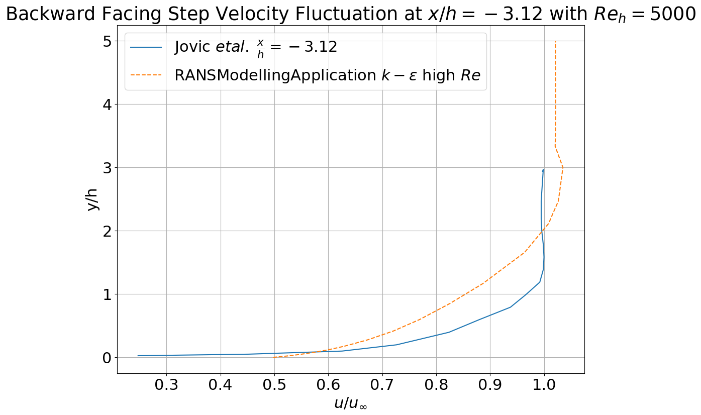
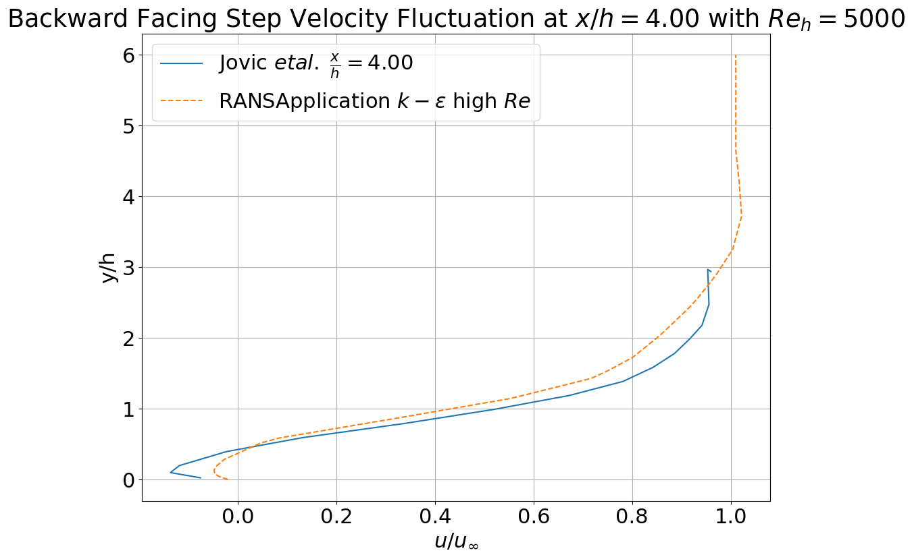
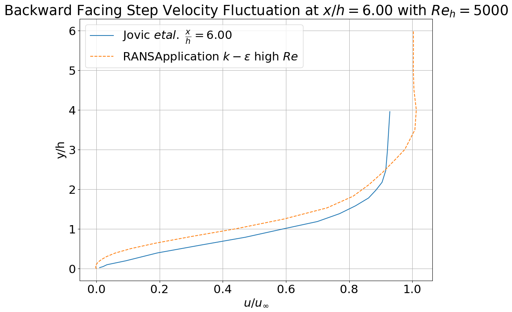
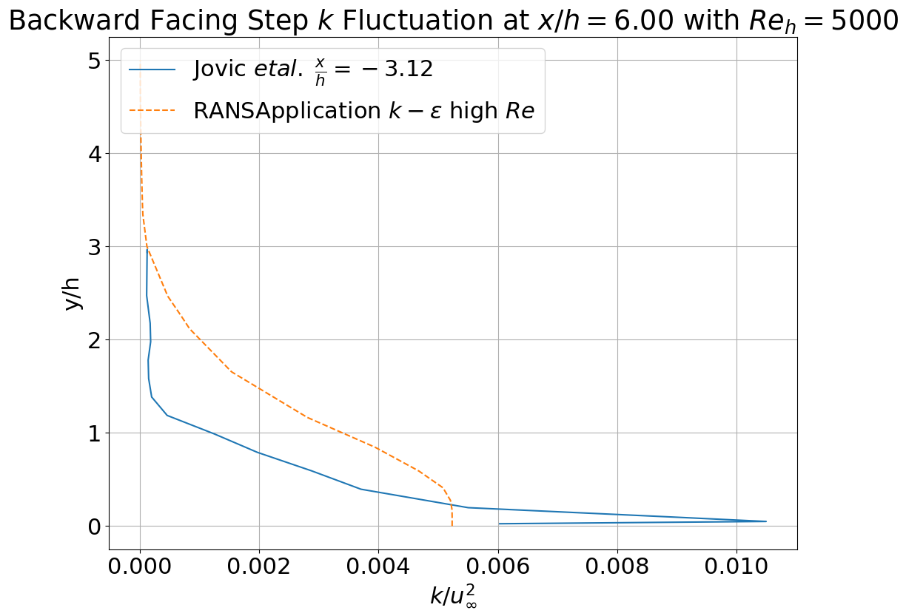
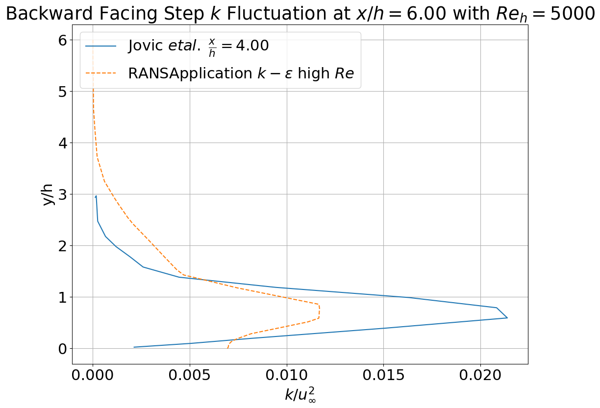
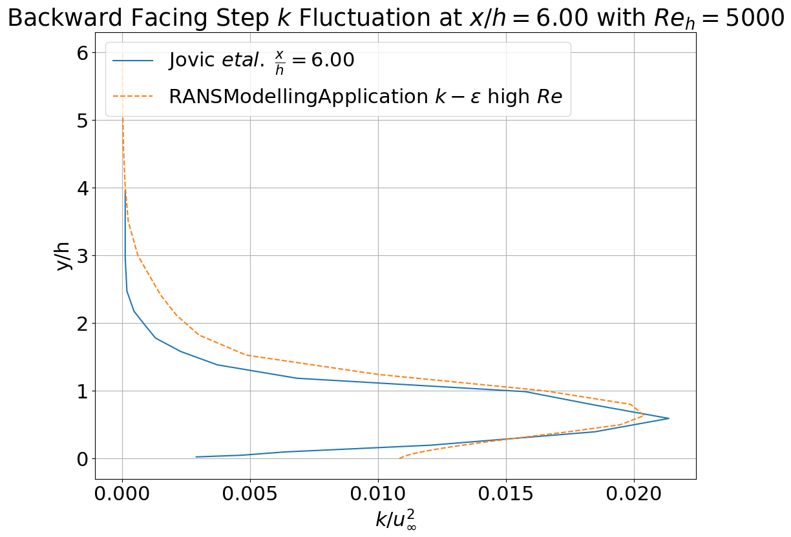

# Backward Facing Step

**Author:** [Suneth Warnakulasuriya](https://github.com/sunethwarna)

**Kratos version:** 7.0.0-11d8e3e31f

**Source files:**

## Case Specification
This is steady backward facing step problem with material parameters which corresponds to flow of Reh = 5000.

The geometry has an entry length of channel is 1.47 _m_. The step height(_h_) is 9.8 _mm_. The inlet is _10h_, and outlet is _12h_. Inlet velocity is prescribed with 7.72 _ms-1_ velocity, and outlet is prescribed with 0 _Pa_. Turbulent kinetic energy (_k_) is also prescribed at inlet with turbulent intensity of 6.1x10-4. Turbulent energy dissipation rate(_&epsilon;_) is prescribed with mixing length of 0.0588 _m_. Outlet for _k_ and _&epsilon;_ is prescribed with zero gradient boundary conditions. Wall functions are applied near wall regions with y+ = 12.0

### Material Properties
* Density (&rho;): 1.0 _Kgm-3_
* Viscosity (&nu;): 1.51312x10-5 _m2s-2_

## Results
The plots hereafter illustrates variation of different non-dimensioned quantities along the line at specified x.
<table style="width:100%">
  <tr>
    <th>  </th>
    <th>  </th>
    <th>  </th>
  </tr>
  <tr>
    <th>  </th>
    <th>  </th>
    <th>  </th>
  </tr>
</table>

## References
Jovic and Driver (1994), Backward-Facing Step Measurements at Low Reynolds Number, Re_h=5000, NASA TM 108807. [Link to the publication](https://ntrs.nasa.gov/archive/nasa/casi.ntrs.nasa.gov/19940028784.pdf)

