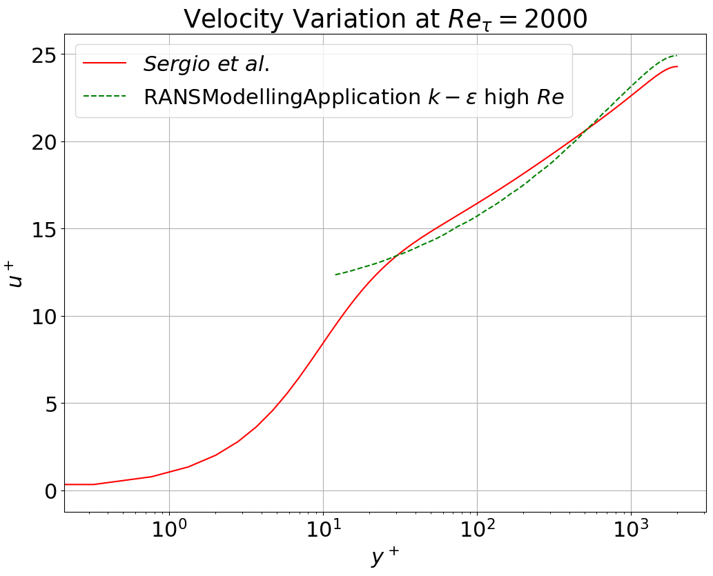
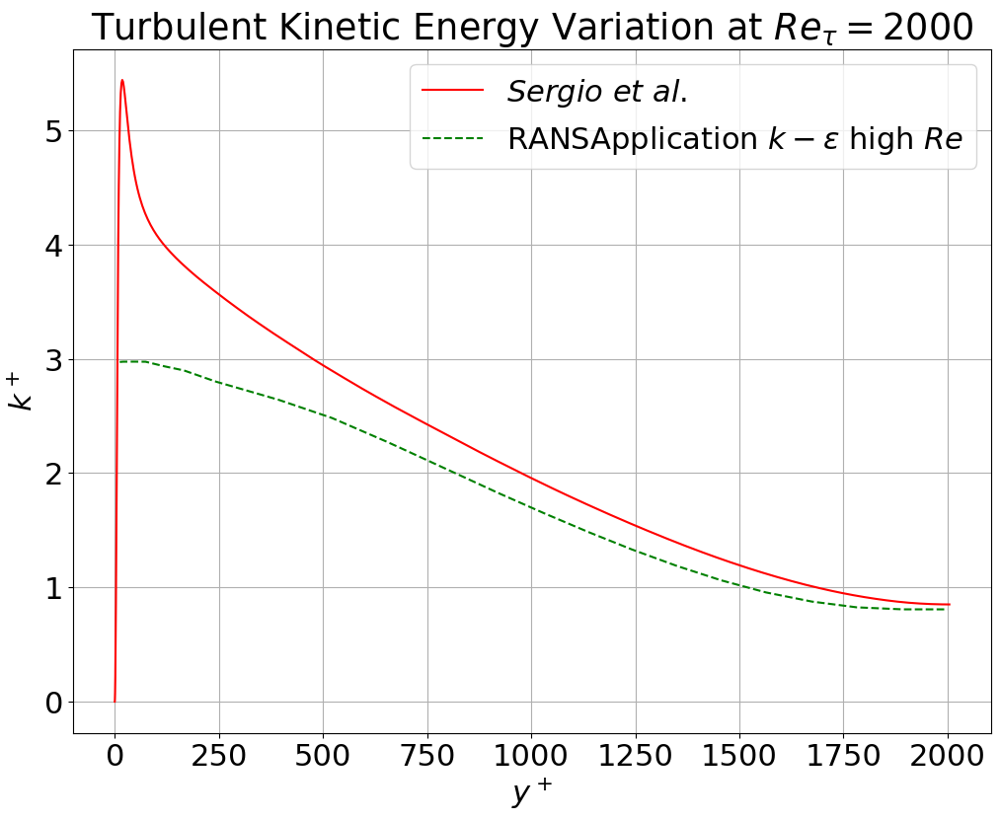
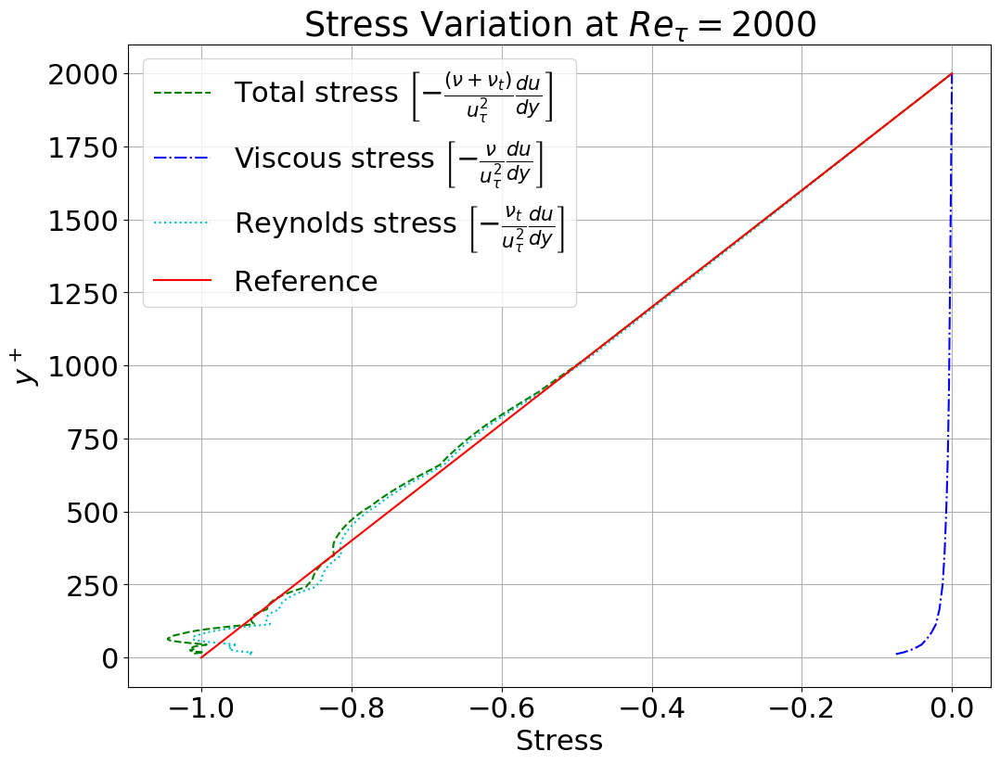

# Channel Flow Re&tau; = 2000

**Author:** [Suneth Warnakulasuriya](https://github.com/sunethwarna)

**Kratos version:** 7.0.0-11d8e3e31f

**Source files:**

## Case Specification
This is a steady 2D channel flow problem with material parameters which corresponds to flow Re&tau;=2000.

The geometry is 6.28 x 2 m channel with matching grids in the inlet and outlet. A boundary layer mesh is applied to top and bottom boundaries. For the CFD problem, top and bottom boundaries are considered as walls, but wall functions are used to model the near wall reagions, rather than resolving them. Since periodic conditions are used to avoid solving for the entry region of the flow, a body force is applied to whole domain which is calculated based on Re&tau;.

### Material Properties
* Density (&rho;): 1.0 _Kgm-3_
* Viscosity (&nu;): 1x10-2 _m2s-2_

## Results
The plots hereafter illustrates variation of different non-dimensioned quantities along the line at x = 3.14 _m_ in the domain.
<table style="width:100%">
  <tr>
    <th>  </th>
    <th>  </th>
    <th>  </th>
  </tr>
</table>

## References
Sergio Hoyas and Javier Jimenez, (2008). Reynolds number effects on the Reynolds-stress budgets in turbulent channels, (Physics of Fluids, Vol. 20, pg 101511 doi:10.1063/1.3005862) [Link to the publication](https://aip.scitation.org/doi/10.1063/1.3005862)

[DNS Data](https://torroja.dmt.upm.es/channels/data/statistics/)