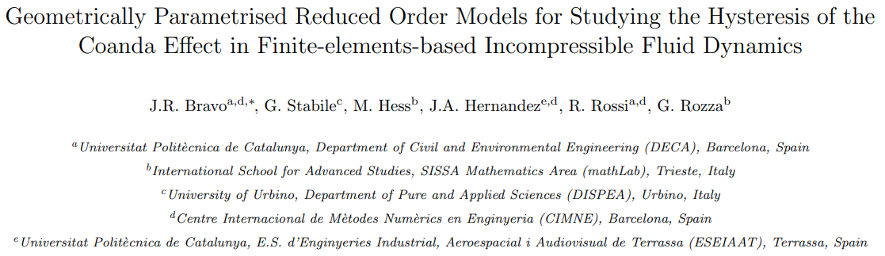
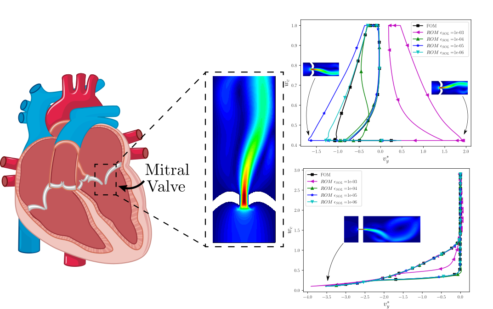

# Overview

This folder contains the scripts for reproducing the examples shown in [this paper](https://arxiv.org/abs/2307.05227) .





# Requirements

## Kratos

This example requires the RomApplication and the FluidDynamicsApplication.

If you compiled Kratos, add both these application to the Kratos configure file. 

Linux:
```shell
add_app ${KRATOS_APP_DIR}/FluidDynamicsApplication
add_app ${KRATOS_APP_DIR}/RomApplication
```

Windows:
```shell
CALL :add_app %KRATOS_APP_DIR%/FluidDynamicsApplication
CALL :add_app %KRATOS_APP_DIR%/RomApplication
```

If on the other hand, you are using the precompiled version of Kratos, do

pip:
```shell
pip install KratosRomApplication KratosFluidDynamicsApplication
```
## PyGeM

The official distribution of PyGeM can be obtained [here](https://github.com/mathLab/PyGeM)


