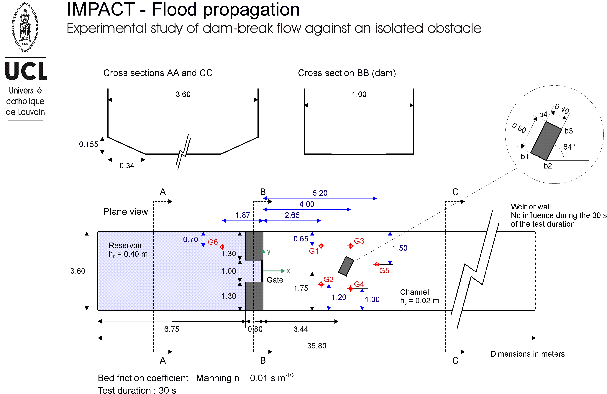
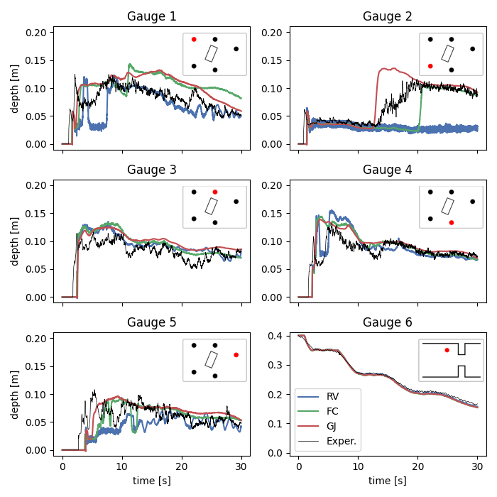
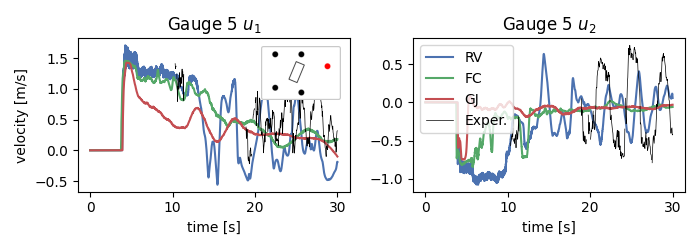

# Experimental dam break

**Author:** [Miguel Maso Sotomayor](https://github.com/miguelmaso)

**Kratos version:** 9.0

## Case Specification
This example reproduces the experiment carried out by Soares-Frazao (2007). The experiment consist on a dam break scenario. There is a reservoir with 0.4m water depth and the channel is 30m length and is empty. After the initial time, the gate is released and the water begins to flow and passes around an isolated building. There are five gauges placed in the channel and one gauge at the reservoir. Figure 1 shows a schematic of the experimental setup.

<figure align="center">
  
  <figcaption>
    Figure 1. Experimental setup.
  </figcaption>
</figure>

## Results
The following pictures collect the obtained results obtained at several time steps using a 150.000 elements mesh

<figure align="center">
  
  <figcaption>
    Figure 2. Water depth recording at all gauges. Comparison of different shock capturing method, Residual Viscosity (RV), Flux Correction (FC) and Gradient Jump Viscosity (GJ).
  </figcaption>
</figure>

<figure align="center">
  
  <figcaption>
    Figure 3. Velocity recorded at gauge 5. Comparison of different shock capturing method, Residual Viscosity (RV), Flux Correction (FC) and Gradient Jump Viscosity (GJ).
  </figcaption>
</figure>

## References

Soares-Frazao et al. in “Experimental study of dam-break flow against an isolated obstacle”. *Journal of Hydraulic Research* 45.sup1 (2007), pp. 27–36. DOI : 10.1080/00221686.2007.9521830.
