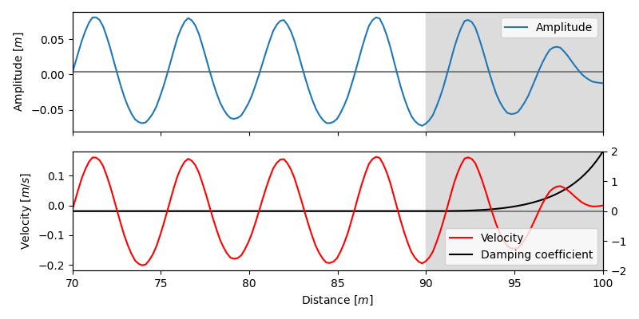
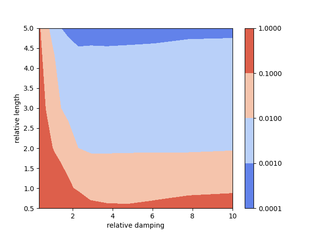

# Absorbing boundary

**Author:** [Miguel Maso Sotomayor](https://github.com/miguelmaso)

**Kratos version:** 9.0

## Case Specification
This examples analyzes the accuracy of the absorbing boundary conditions.

## Results

<figure align="center">
  
  <figcaption>
    Figure 1. Absorption of a wave near the right end of a channel. The gray region represents the absorbing layer.
  </figcaption>
</figure>

<figure align="center">
  
  <figcaption>
    Figure 2. Sensitivity analysis of the sponge layer. The length is proportional to the wavelength and the absorption is proportional to the frequency.
  </figcaption>
</figure>
