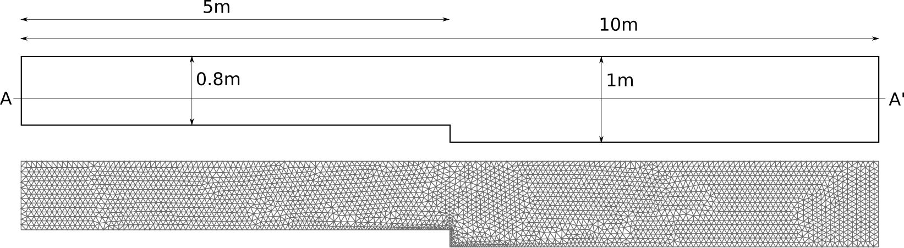
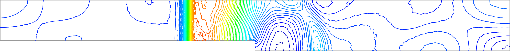
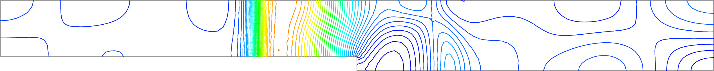
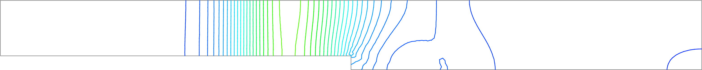
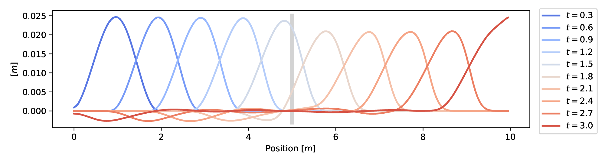
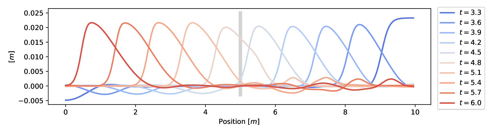

# Wave past a backward step

**Author:** [Miguel Maso Sotomayor](https://github.com/miguelmaso)

**Kratos version:** 9.0

## Case Specification
This examples analyzes the accuracy of the linear stabilization.

<figure align="center">
  
  <figcaption>
    Figure 1. Sketch of the geometry and the mesh.
  </figcaption>
</figure>

## Results
The simulation have been executed with different stabilization parameters of 0.001, 0.01 and 0.1. Figure 2 shows the contour lines at time 5s. The smaller stabilization value shows the need of streamline stabilization, the higher ones produces an extra diffusion. With the intermediate stabilization factor the best results are obtained.

<figure align="center">
  
  
  
  <figcaption>
    Figure 2. Results at time 5s obtained with different stabilization parameters. Top: 0.001; Middle: 0.01; Bottom: 0.1
  </figcaption>
</figure>

<figure align="center">
  
  
  <figcaption>
    Figure 3. Overview of the wave propagation along section AA' (see Figure 1). Top: time 0 to 3sec; Bottom: 3 to 6sec.
  </figcaption>
</figure>
