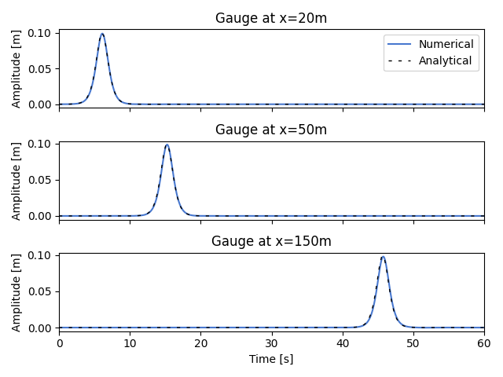

# Propagation of a solitary wave

**Author:** [Miguel Maso Sotomayor](https://github.com/miguelmaso)

**Kratos version:** 9.0

## Case Specification
This examples analyzes the propagation of a solitary wave along a 200m long and 1m width channel. The  The analytical solution can be found in Nwogu (1993) and Wei and Kirby (1995).

The solitary wave is characterized by a water depth of 1m and an amplitude about 0.1m. It has been generated by imposing the analytical solution at the left end of the channel.

## Results
The water depth is monitored at several points from the left boundary, at x=20m, 50m and 150m. The time series of the wave at those points can be seen at Figure 1.

<figure align="center">
  
  <figcaption>
    Figure 1. Time series of the solitary wave.
  </figcaption>
</figure>

## References

Okey Nwogu. “Alternative Form of Boussinesq Equations for Nearshore Wave Propagation”. *Journal of Waterway, Port, Coastal, and Ocean Engineering* 119.6 (1993), pp. 618–638. DOI: 10.1061/(ASCE)0733-950X(1993)119:6(618).

Ge Wei and James T. Kirby. “Time-Dependent Numerical Code for Extended Boussinesq Equations”. *Journal of Waterway, Port, Coastal, and Ocean Engineering* 121.5 (1995), pp. 251–261. DOI: 10.1061/(ASCE)0733-950X(1995)121:5(251) .
