# Bead Optimization of a Plate

A bead optimization problem to minimize the strain energy of a plate.

> **Author**: Armin Geiser
>
> **Kratos version**: 9.0

## Optimization Problem

### Objective
- Minimize strain energy

### Constraints
- No constraints

  

    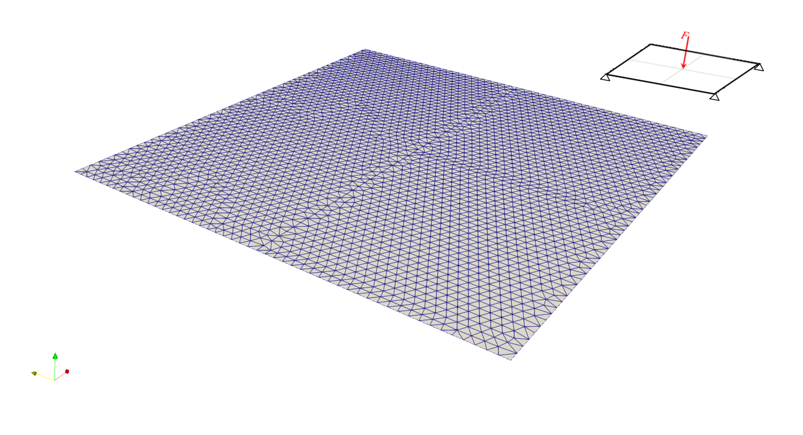
  

## Optimization settings
- Algorithm type : `bead_optimization`
- Number of steps : `300`
- Step size : `0.25`
- Filter radius : `0.075`
- Mesh motion : `False`

## Results

### Shape Evolution
The below images shows the shape evolution of the bead pattern on a plate during the optimization iterations. In the table further below, a comparison with manual solutions shows that the bead pattern obtained from the optimized solutions perform better. 

    

|             Manual_Solution 1              |             Manual_Solution 2              |             Manual_Solution 3              |             Manual_Solution 4              |             Manual_Solution 5              |          Optimized_solution           |
| :----------------------------------------: | :----------------------------------------: | :----------------------------------------: | :----------------------------------------: | :----------------------------------------: | :-----------------------------------: |
| 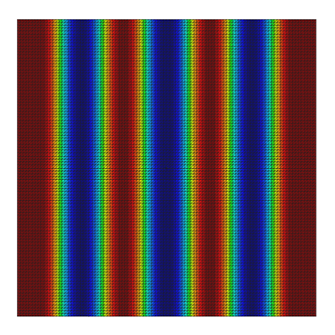 | 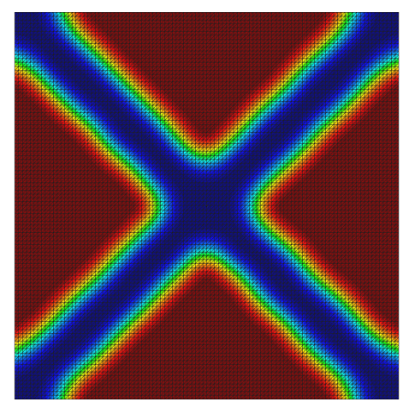 | 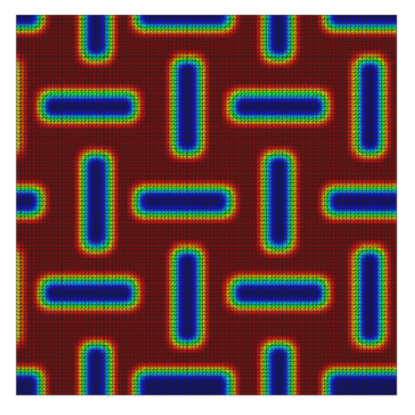 | 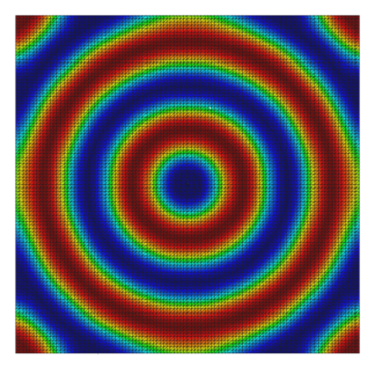 | 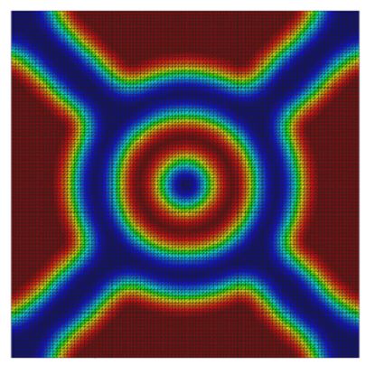 | 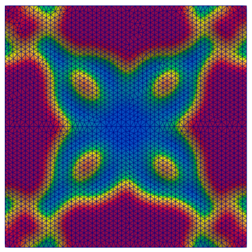 |
| 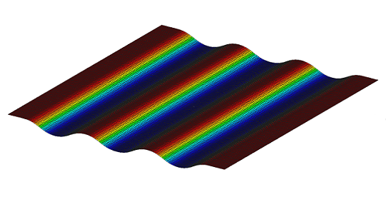 | 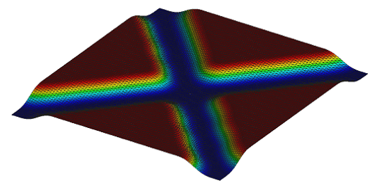 | 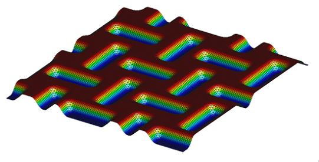 | 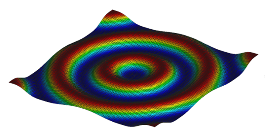 | 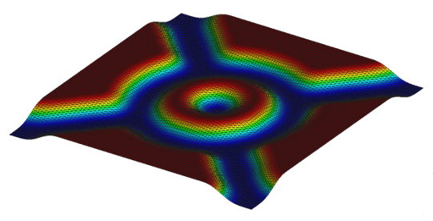 | 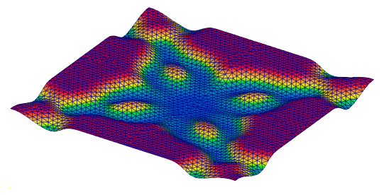 |
|                  2.46e-3                   |                  1.56e-3                   |                  1.17e-3                   |                  1.06e-3                   |                  7.86e-4                   |                4.23e-4                |
*Note: the last column indicates the value of objective function (here strain energy) at the end of the solution.*

### Convergence
The below plots shows the evolution of the objective function over the bead optimization iterations.

    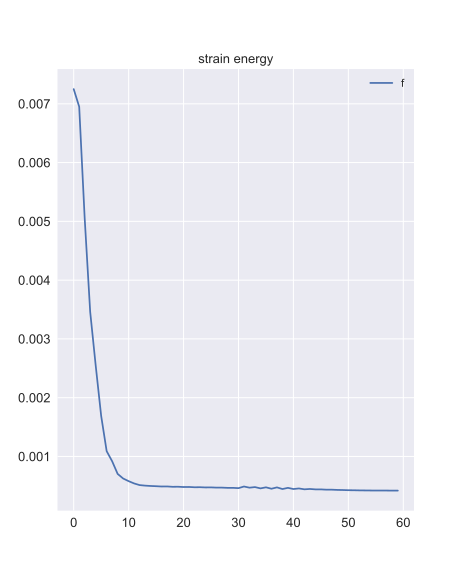

