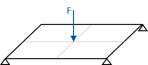

# Bead Optimization of a Plate

A bead optimization problem to minimize the strain energy of a plate.

> **Author**: Armin Geiser
>
> **Kratos version**: 9.0

## Optimization Problem

### Objective
- Minimize strain energy

### Constraints
- No constraints

  

    
  

## Optimization settings
- Algorithm type : `bead_optimization`
- Number of steps : `300`
- Step size : `0.3`
- Filter radius : `0.075`
- Mesh motion : `False`

## Results

### Shape Evolution
The below images shows the shape evolution of the plate during the bead optimization iterations.

    

|                alpha                 |              Z shape_change 2D               |              Z shape_change 3D               |
| :----------------------------------: | :------------------------------------------: | :------------------------------------------: |
|  |  |  |

### Convergence
The below plots shows the evolution of the objective function (i.e. strain energy) over the bead optimization iterations.

    

