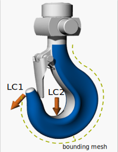
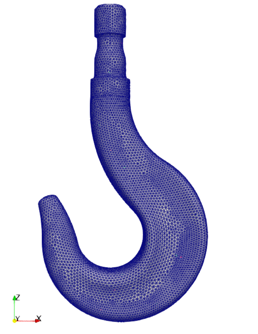
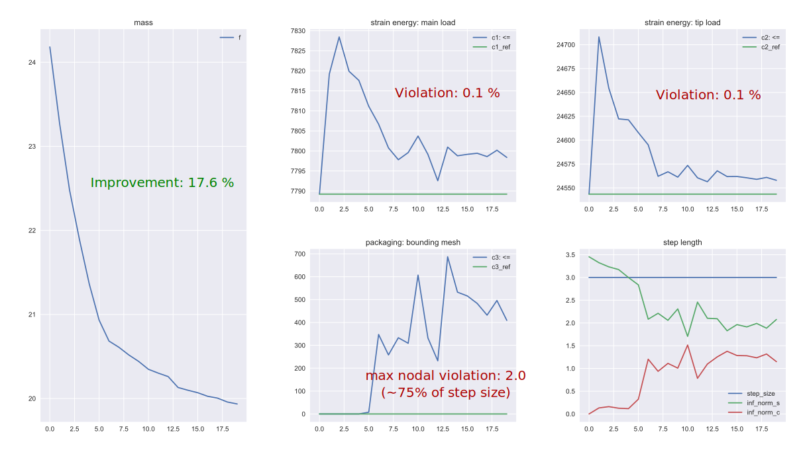

# Optimization of a Solid Hook
Optimization of a solid 3D Hook subjected to multiple constraints. 

**Author**: Armin Geiser  

**Kratos version**: 9.0

----------------------------------------------------------------------------------
## Optimization Problem

- Objective
    - Minimize mass

- Constraints
    1. strain energy of main load (LC1) &le; initial value
    2. strain energy of tip load (LC2) &le; initial value
    3. no penetration of packaging (bounding) mesh

    

      
    

- Filter Radius : 25.0

- Mesh motion : YES 
----------------------------------------------------------------------------------
## Optimization algorithm
- type : gradient_projection
- number of steps : 20
- step size : 3.0
----------------------------------------------------------------------------------
## Results
- Shape Evolution
  - The below image shows the result of evolution of objective function (i.e. mass) over time

    

      
    
  
    
- Convergence Plots
  - The below plots show the evolution of objective function (i.e. mass) and the constraints over number of iterations.  
*Note*: Packaging response has an increasing value because more and more nodes are bounded by the constraint.   

----------------------------------------------------------------------------------

