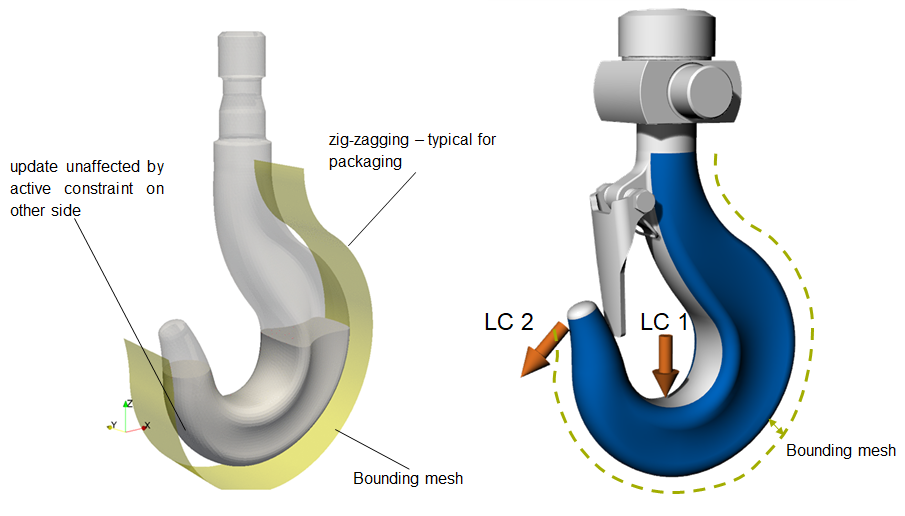
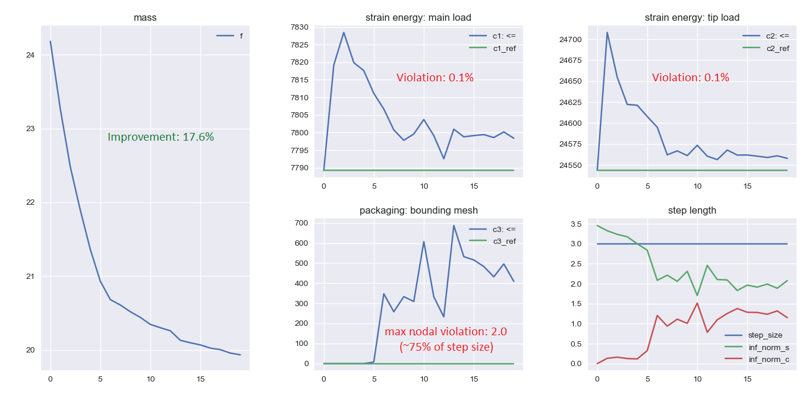
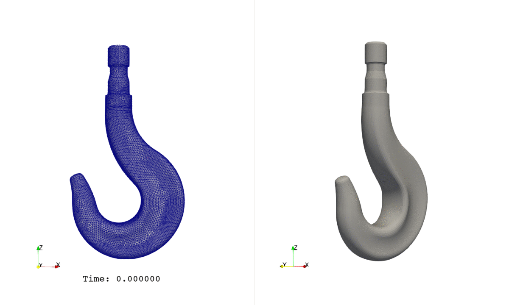

# Optimization of a Solid Hook
Optimization of a solid 3D Hook subjected to multiple constraints. 

**Author**: Armin Geiser  

**Kratos version**: 9.0

## Optimization Problem
- Objective
    - Minimize mass

- Constraints
    - constraint 1  &nbsp; : &nbsp; strain energy of main &le; initial value for load case 1
    - constraint 2  &nbsp; : &nbsp; strain energy of tip &le; initial value for load case 2
    - constraint 3  &nbsp; : &nbsp; mesh based packaging &le; specified value (use of bounding mesh)  

            

- Filter Radius &nbsp; &nbsp; : &nbsp; 25.0

- Mesh motion &nbsp; : &nbsp; YES 

## Optimization algorithm
- type &nbsp; &nbsp; &nbsp; &nbsp; &nbsp; &nbsp; &nbsp; &nbsp; &nbsp; &nbsp; : &nbsp; gradient_projection
- number of steps &nbsp;: &nbsp; 20 &nbsp;
- step size &nbsp; &nbsp;&nbsp; &nbsp; &nbsp; &nbsp; &nbsp; : &nbsp; 3.0

## Results
- The below plots show the evolution of objective function (i.e. mass) and the constraints over number of iterations.
- Packaging response has an increasing value because more and more nodes are bounded by the constraint.

    
    
  
- Below is the evolution of the geometry during mass minimization subject to above mentioned constraints.

    

