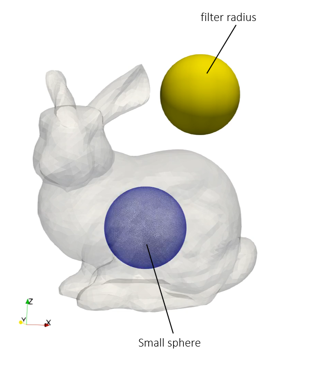
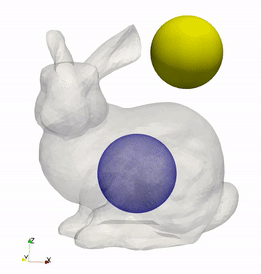
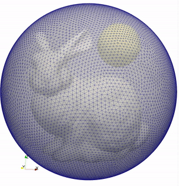

# Smooth surface wrapping

A pure geometric optimization problem of a wrapping surface smoothly arround a complex object, which in this example is a Stanford bunny.

> **Author**: Armin Geiser
>
> **Kratos version**: 9.0

## Optimization Problem

### Objective
- Shape update maximization

### Constraints
- No penetration of packaging - bounding mesh (*Standford bunny*)

  

    
  

## Optimization settings
- Algorithm type : `gradient_projection`
- Number of steps : `150`
- Step size : `0.001`
- Filter radius : `0.015`
- Mesh motion : `False`

## Results

### Shape Evolution
The below image shows the shape evolution of the wrapping surface during the optimization iterations. The small sphere *grows* inside the bounding geoemtry. Using the relatively large filter radius, a verx smooth local optimum is found. Details smaller than the filter radius (e.g. the ears) are not captured.

    

## Alternative problem setup

The bounding geoemtry of the Stanford bunny can be approached (wrapped) from the opposite site as well. For such a *shrinking* optimization we start from a large sphere. Compared to the example described above, the starting geometry is exchanged, the feasible side for the bounding geometry is switched and the objective is swtiched as well - see the setup in the [shrink folder](shrink) for details.

  

    
  

