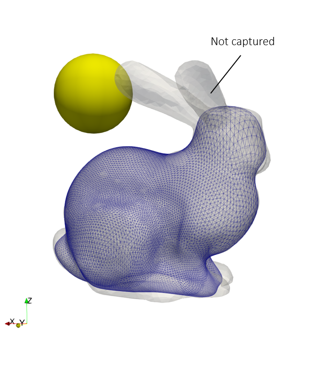

# Shape Optimization
Shape update of a wrapping surface to generate a smooth representation of a complex object, which in this example is a Stanford bunny.

> **Author**: Armin Geiser
>
> **Kratos version**: 9.0

## Optimization Problem
The shape update optimization is carried out for two distinct wrapping surfaces: Large sphere and Small sphere

### Objective
- Large sphere: shape_update minimization 
- Small sphere: shape_update maximization

### Constraints
- No penetration of packaging (bounding) mesh (*standford bunny*)

  

    
  

## Optimization settings
- Algorithm type : `gradient_projection`
- Number of steps : `150`
- Step size : `0.001`
- Filter radius : `0.015`
- Mesh motion : `False`

## Results

### Shape Evolution
The below image shows the evolution (shape) of the wrapping surface during the optimization iterations.

    

In the case of large sphere, the object (bunny) is wrapped almost completely, but, around the ears of the bunny the mesh has high aspect ratio resulting in poor quality. In small sphere case, the mesh quality is not compromised , however,  small details such as the ears are not captured by the wrapping surface.

  

    
  

