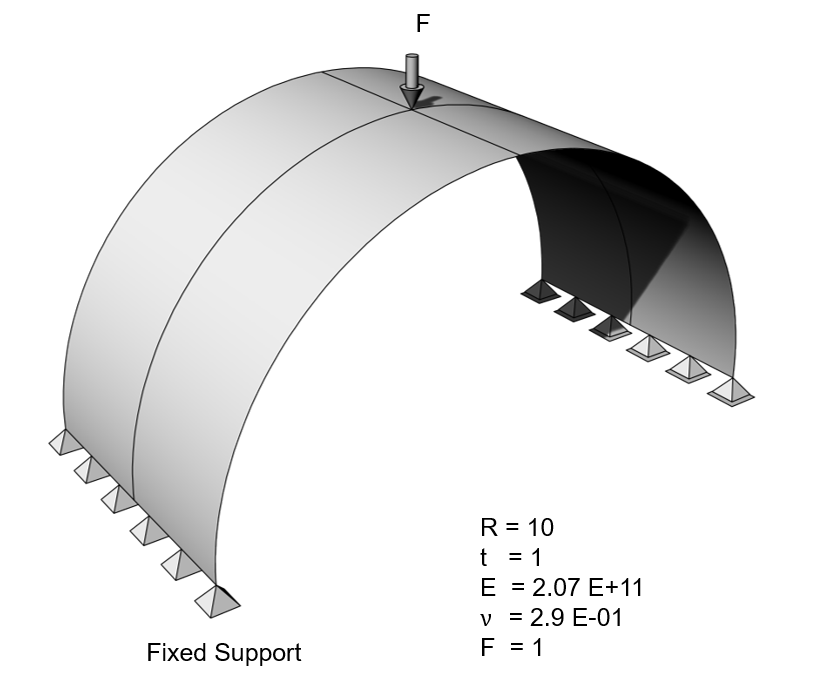
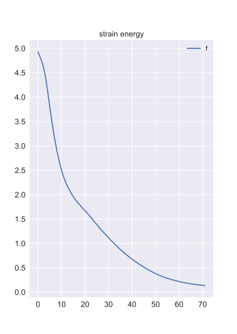

# Shape Optimization
Unconstrained strain energy minimization of a 3D Shell

> **Author**: Armin Geiser
>
> **Kratos version**: 9.0

## Optimization Problem

### Objective
- Minimize strain energy

### Constraints
- no constraints

  

    
  

## Optimization settings
- Algorithm type : `steepest_descent`
- Number of steps : `100`
- Step size : `0.1`
- Filter radius : `3.0`
- Mesh motion : `False`

## Results

### Shape Evolution
The below image shows the evolution (shape) of the 3D Shell during the optimization iterations.

    

### Convergence
The below plots shows the evolution of the objective function (i.e. strain energy) over the bead optimization iterations.

    

